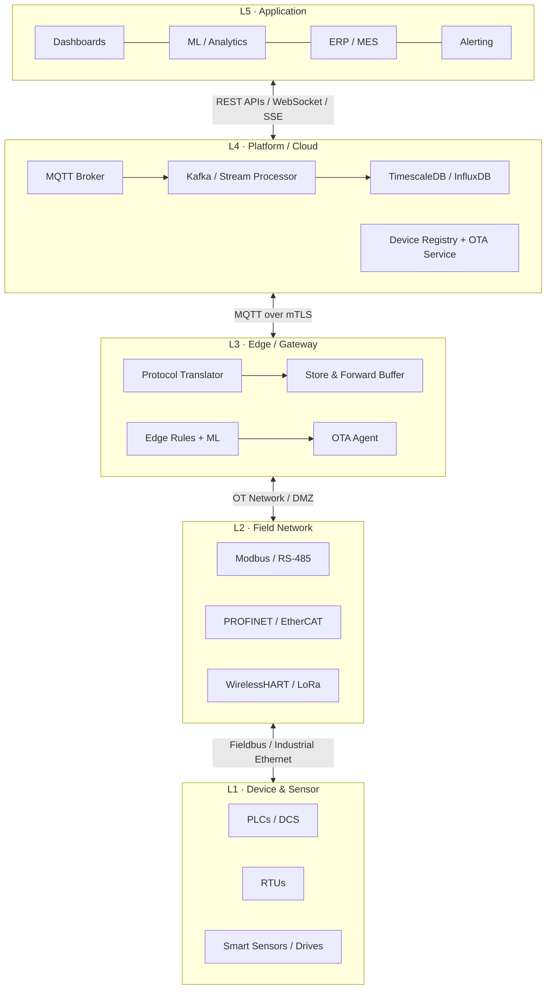
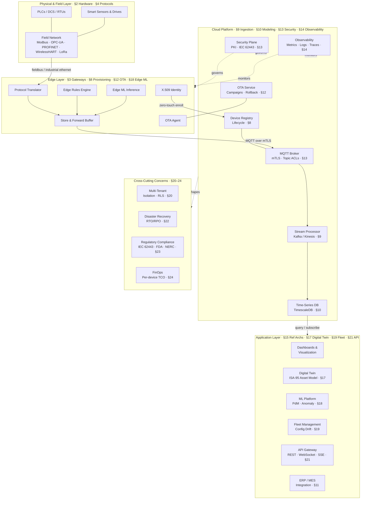
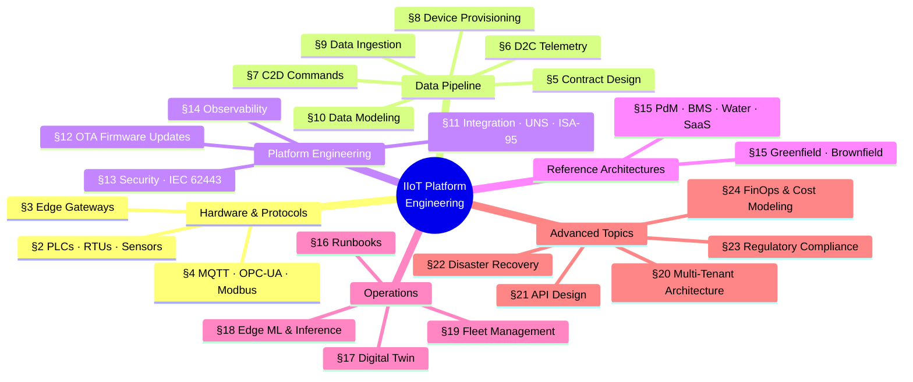

<div align="center">

# Industrial IoT Platform Engineering

### The production-grade reference for engineers building connected industrial systems

[](https://gauravs19.github.io/iiot-reference-architecture/)
[](https://github.com/gauravs19/iiot-reference-architecture/actions/workflows/deploy.yml)
[](LICENSE)
[](https://github.com/gauravs19/iiot-reference-architecture/stargazers)

**24 sections · Full stack coverage · Production-derived patterns · Platform-agnostic**

[**Read the Guide**](https://gauravs19.github.io/iiot-reference-architecture/) · [Browse Sections](#whats-inside) · [Run Locally](#running-locally) · [Contribute](#contributing)

</div>

---

## Why This Exists

Most IIoT guides are either vendor documentation or theoretical whitepapers. This is neither.

Every pattern here was derived from **real production deployments** — factory floors, remote oil & gas sites, water utilities, and cold-chain logistics. The failures are real. The tradeoffs are real. The recommendations are opinionated because wishy-washy option lists don't help when you're on call at 2am debugging why 300 devices went dark.

**If you're designing, building, or operating an industrial IoT platform, this is the guide you'll wish existed when you started.**

---

## The Full Stack at a Glance



> **The most common architectural mistake:** collapsing the edge and cloud layers into one "IoT platform" — until the factory loses internet for 4 hours and all sensor data disappears.

---

## What's Inside

### Hardware & Protocols
| Section | What It Covers |
|---|---|
| **Hardware Layer** | PLCs, RTUs, smart sensors, analog vs. digital signals, top hardware choices by industry |
| **Edge Layer & Gateways** | Store-and-forward design, OSS (Balena, WasmEdge) vs. managed (Greengrass, IoT Edge) |
| **Communication Protocols** | MQTT deep dive, OPC-UA security model, Modbus RTU/TCP, WirelessHART, LoRaWAN, BACnet |

### Data & Contracts
| Section | What It Covers |
|---|---|
| **Contract Design** | Schema versioning, Protobuf evolution rules, backward compatibility guarantees |
| **D2C Data Exchange** | Telemetry payload design, OPC-UA quality codes, waveform/burst data, compression |
| **C2D Commands** | Command lifecycle, idempotency tokens, offline queue management, ack patterns |
| **Device Provisioning** | PKI hierarchy, X.509 zero-touch provisioning, device registry design |
| **Data Ingestion** | Broker → Kafka → TSDB pipeline, throughput sizing, backpressure handling |
| **Data Modeling** | TimescaleDB schema, continuous aggregates, alarm state machine, asset hierarchy |

### Platform Engineering
| Section | What It Covers |
|---|---|
| **Integration Patterns** | Unified Namespace (UNS), ISA-95 hierarchy, OT/IT DMZ, historian bridge patterns |
| **OTA Firmware** | A/B partition scheme, signing pipeline, staged rollout campaigns, delta OTA, brick recovery |
| **Security Architecture** | IEC 62443 zones, mTLS everywhere, topic ACLs, certificate lifecycle automation |
| **Observability** | Four golden signals for IoT, fleet health scoring, anomaly detection, alerting runbooks |

### Operations & Advanced
| Section | What It Covers |
|---|---|
| **Reference Architectures** | Greenfield, brownfield, remote assets, PdM, BMS, water utility, SaaS multi-tenant |
| **Operational Runbooks** | Device offline diagnosis, data gap investigation, cert expiry, broker overload response |
| **Digital Twin** | ISA-95 asset hierarchy, twin state model, AWS IoT TwinMaker vs. Azure DT vs. open source |
| **Edge ML & Inference** | Anomaly detection at edge, model packaging, OTA model updates, runtime comparison |
| **Fleet Management** | Config drift detection, remote diagnostics, bulk operations, device lifecycle states |
| **Multi-Tenant Architecture** | Isolation levels, per-tenant broker ACLs, TimescaleDB RLS, SaaS onboarding patterns |
| **API Design** | REST resource model, cursor pagination, WebSocket vs. SSE for live telemetry, rate limits |
| **Disaster Recovery** | RTO/RPO targets per component, multi-region failover, edge-buffered recovery |
| **Regulatory Compliance** | IEC 62443, FDA 21 CFR Part 11, NERC CIP, GDPR for device data |
| **Cost Modeling & FinOps** | Per-device cost breakdown, AWS IoT vs. self-hosted TCO, storage tier strategy |

---

## Reference Architecture — Full System View



## Guide Coverage Map



---

## Design Principles

| Principle | What It Means in Practice |
|---|---|
| **Platform-agnostic** | Patterns apply to AWS IoT, Azure IoT Hub, EMQX, or a fully self-hosted stack |
| **Production-proven** | Every pattern reflects real deployment experience — failures included |
| **Brownfield-first** | Assumes legacy PLCs, Modbus RTUs, and 1990s historians — because that's the real world |
| **Opinionated** | Specific recommendations with reasoning, not just option lists |
| **Operability over elegance** | If you can't monitor it and recover from failures, it doesn't belong in the design |

---

## Who This Is For

- **Platform engineers** designing the cloud-side ingestion, storage, and API layer
- **Edge/embedded engineers** building gateway firmware, OTA agents, and protocol drivers
- **Architects** evaluating build vs. buy, platform choices, and long-term IIoT strategy
- **OT/IT integration teams** bridging SCADA/historian systems into modern cloud platforms
- **Anyone inheriting** an existing IIoT deployment and trying to understand what they have

---

## Running Locally

```bash
pip install mkdocs-material mkdocs-minify-plugin
git clone https://github.com/gauravs19/iiot-reference-architecture.git
cd iiot-reference-architecture
mkdocs serve
```

Open [localhost:8000](http://localhost:8000). Full search, dark mode, and Mermaid diagrams work locally.

---

## Contributing

Real-world corrections are the most valuable contributions to this guide.

If you have production experience that **contradicts, extends, or adds nuance** to a pattern here — open an issue. Vendor experience, deployment failures, protocol edge cases, and compliance gotchas are all welcome.

**What makes a good contribution:**
- A pattern that failed in production and why
- A better tradeoff analysis for a specific industry vertical
- A missing section (check the [extension roadmap](docs/appendix/index.md))
- Corrections to protocol details, schema examples, or cost figures

PRs welcome. Issues are even more welcome — discussion is how the guide gets better.

---

## License

MIT — use freely in your own architecture work, internal docs, or presentations. Attribution appreciated.
