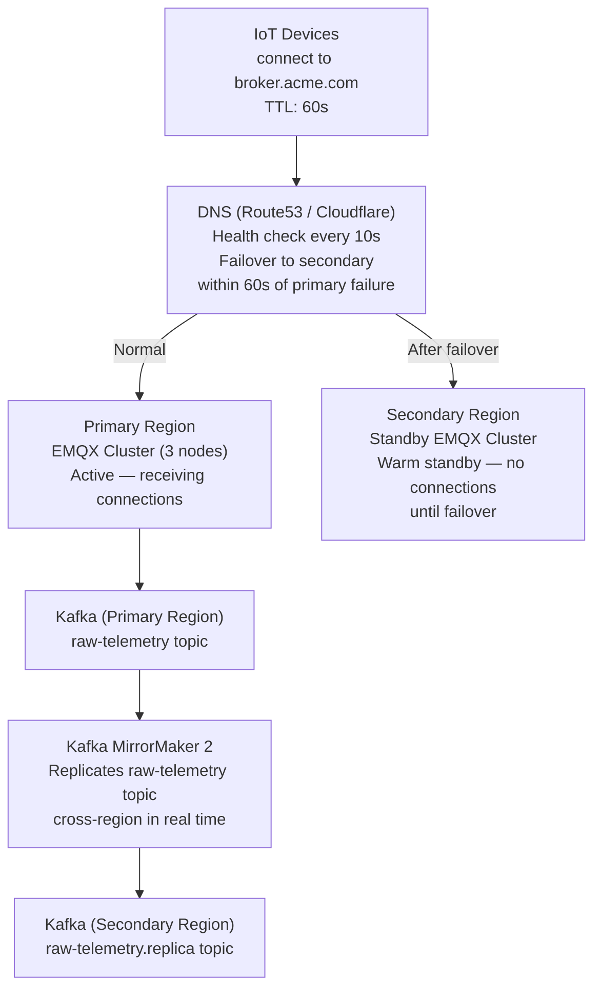

# Disaster Recovery & Business Continuity

IoT platforms monitor physical processes. An outage is not just a service disruption — in industrial contexts, it may mean no visibility into plant operations, loss of alarm monitoring, or inability to issue commands to field devices. RTO and RPO targets must be defined per component based on business impact, not assumed to be "as low as possible." The broker is the most critical component — all devices are connected to it. The time-series database is important but not immediately safety-critical — stale dashboards are acceptable for 30 minutes; missing alarms are not.

### 22.1 Component RTO/RPO Targets

| Component | RTO Target | RPO Target | Failure Impact | Recovery Approach |
|---|---|---|---|---|
| MQTT Broker cluster | 5 min | 0 (persistent sessions, no state loss) | All devices disconnect; no telemetry ingested | Active-passive cluster with DNS failover (§22.2) |
| Ingestion workers | 15 min | 0 (Kafka retains messages during downtime) | Data delayed, not lost — Kafka buffers during outage | Auto-restart via Kubernetes; scale up on lag |
| Time-series DB | 30 min | 5 min (streaming replication lag) | Dashboards show stale data; alarms may miss recent events | Streaming replica promoted to primary; WAL replay |
| Device Registry | 1 hr | 15 min | New device provisioning fails; existing devices unaffected | Read replica promoted; registry is low-write |
| OTA Service | 4 hr | 1 hr | Firmware rollouts paused — not safety-critical | Not on critical path; manual rollout possible |
| API Gateway | 15 min | N/A (stateless) | Dashboards and integrations lose API access | Auto-restart; stateless — no data recovery needed |

### 22.2 Multi-Region Broker Failover

Broker failover is the most complex recovery scenario because thousands of devices must reconnect within minutes without operator intervention. The architecture uses active-passive with DNS-based failover:

**Device reconnection during failover:** Devices detect connection drop via keepalive timeout (typically 60–120 seconds). They reconnect using exponential backoff starting at 1 second, doubling up to a maximum of 60 seconds. By the time the first reconnect attempt is made (at the 1-second backoff), the DNS record has already been updated (DNS TTL is 60 seconds, health check detects failure within 10 seconds, TTL is honoured). Devices resolve the DNS name fresh on each connection attempt — they do not cache the resolved IP. This means the device reconnects to the secondary region without any device-side configuration change.

**Persistent sessions:** Devices connecting with `clean_session=false` have their session state (subscription list, QoS 1/2 unacknowledged messages) stored in the broker. The secondary broker does not have this state — session persistence across broker failover requires external session storage (Redis cluster replicated cross-region) or accepting that sessions are re-established from scratch. For most industrial IoT deployments, accepting clean session on reconnect is acceptable because devices immediately re-subscribe to their command topics.

### 22.3 Time-Series Database Backup Strategy

TimescaleDB (Postgres) backup is a three-tier strategy balancing RPO against storage cost:

**Tier 1 — Continuous WAL archival (5-minute RPO):**
PostgreSQL WAL (Write-Ahead Log) is streamed continuously to S3. Point-in-time recovery to any point within the retention window is possible. Retention: 7 days of WAL. Cost: approximately 2–5 GB/day for a 10,000-device deployment at 1-message/second average.

**Tier 2 — Hypertable chunk export to Parquet:**
When TimescaleDB closes a hypertable chunk (typically daily or weekly depending on chunk interval), export it to Parquet on S3 cold storage. This is immutable, queryable with Athena/DuckDB, and stored indefinitely. Cost: S3 standard ($0.023/GB/month) dropping to S3 Glacier ($0.004/GB/month) after 90 days.

**Tier 3 — Aggregate table pg_dump:**
The 1-minute and 1-hour aggregate tables are small (a few GB per year for most deployments) and can be pg_dumped nightly. These are the tables dashboards query most — fast recovery of aggregates means dashboards recover quickly even if raw data recovery takes longer.

**Recovery drill:** Conduct a monthly point-in-time recovery drill — restore the last 24 hours of data to a test TimescaleDB instance, run `SELECT COUNT(*) FROM telemetry WHERE ts > NOW() - INTERVAL '24 hours'` and compare against the production count. Document the drill result. This is required for ISO 27001 and most regulated industry audits.

### 22.4 Incident Severity Levels

| Severity | Definition | Response Time | Escalation Path | Communication |
|---|---|---|---|---|
| **P0** | Broker down, >50% of fleet offline | Immediate (on-call paged) | CTO within 15 min | Customer status page updated within 5 min |
| **P1** | Ingestion lag >5 min, data gap risk; single region degraded | 15 min | Engineering lead within 30 min | Status page updated; affected customers notified |
| **P2** | Single site offline; OTA service unavailable; API latency elevated | 1 hr | On-call engineer | Status page note; no individual customer notification |
| **P3** | Individual device offline; cert expiry warning; non-critical service degraded | Next business day | Ticket assigned | Internal only |

---
