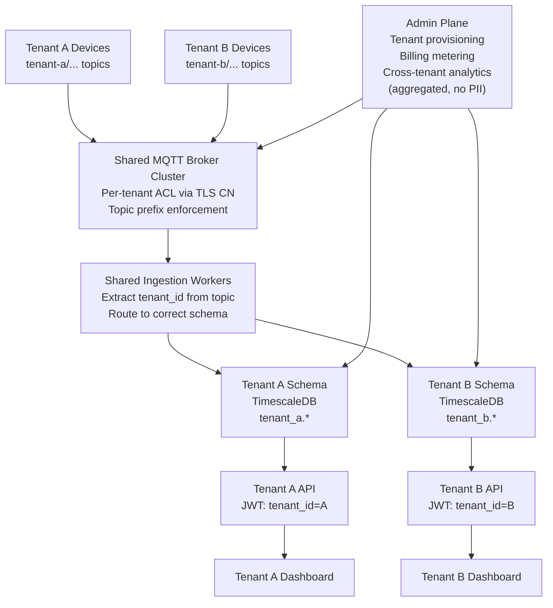

# Multi-Site & Multi-Tenant Architecture

Single-tenant architectures assume one enterprise operating one platform. Multi-tenant is required when: (a) an ISV sells IoT-as-a-service to multiple customers, or (b) a large enterprise needs to isolate divisions or regions with separate data ownership. The isolation level required (logical vs. physical) drives the cost significantly — a factor of 3–10× between shared-everything and dedicated-per-tenant. Getting this decision wrong in either direction is expensive: under-isolating causes a data breach incident; over-isolating makes the unit economics unviable.

### 20.1 Isolation Levels

| Isolation Model | Cost | Isolation Strength | Notes |
|---|---|---|---|
| Shared everything (topic prefix only) | Lowest | Weakest — single broker failure affects all tenants | Acceptable for internal enterprise divisions with shared IT ownership |
| Shared platform, dedicated broker per tenant | Moderate | Strong — broker failure affects one tenant only | Good for regulated industries (one tenant cannot see another's traffic) |
| Dedicated platform per tenant | Highest (3–5× shared) | Full — complete infrastructure separation | Required for government, defense, and some financial services contracts |
| Hybrid: shared ingestion, dedicated storage | Moderate | Strong data isolation; weaker transport isolation | Common balance — most tenants care more about data than transport isolation |

### 20.2 Multi-Tenant MQTT Topic Design

Topic structure encodes the tenant ID as the first path element, making ACL enforcement at the broker straightforward:

```
{tenant_id}/{site}/{area}/{device_type}/{device_id}/telemetry
{tenant_id}/{site}/{area}/{device_type}/{device_id}/status
{tenant_id}/{site}/{area}/{device_type}/{device_id}/commands
```

Broker ACL rule (EMQX format): each device's TLS certificate Common Name (CN) encodes the tenant ID. The auth plugin maps CN → tenant_id and enforces that the device can only publish or subscribe to topics beginning with their own `tenant_id`. A device with CN `tenant-a::GW-007` cannot publish to `tenant-b/...` regardless of what topic it attempts to use.

This design means a compromised device can only affect its own tenant's topics — it cannot inject data into another tenant's namespace.

### 20.3 Data Isolation in TimescaleDB

**Pattern 1: Row-Level Security (shared tables)**

All tenants share the same hypertables with a `tenant_id` column. Postgres RLS policies enforce that each application user (one per tenant) can only see rows with their own `tenant_id`.

```sql
-- Create the policy
CREATE POLICY tenant_isolation ON telemetry
    USING (tenant_id = current_setting('app.current_tenant_id')::uuid);

-- Enable RLS on the table
ALTER TABLE telemetry ENABLE ROW LEVEL SECURITY;

-- Set tenant context at connection time
SET app.current_tenant_id = 'tenant-a-uuid';
-- All subsequent queries on this connection only see tenant-a rows
```

Advantage: single schema migration affects all tenants simultaneously. Disadvantage: a schema bug or RLS misconfiguration could expose one tenant's data to another — test rigorously and audit quarterly.

**Pattern 2: Schema-per-tenant**

Each tenant gets their own Postgres schema (`tenant_a.telemetry`, `tenant_b.telemetry`). The application user for each tenant has USAGE rights only on their own schema.

```sql
-- Create tenant schema
CREATE SCHEMA tenant_a;
CREATE TABLE tenant_a.telemetry (LIKE public.telemetry INCLUDING ALL);

-- Grant access only to tenant-a application user
GRANT USAGE ON SCHEMA tenant_a TO app_user_tenant_a;
GRANT SELECT, INSERT ON ALL TABLES IN SCHEMA tenant_a TO app_user_tenant_a;

-- Cross-tenant analytics (admin only, not exposed to tenants)
SELECT 'tenant_a' AS tenant, COUNT(*) FROM tenant_a.telemetry WHERE ts > NOW() - INTERVAL '1 day'
UNION ALL
SELECT 'tenant_b' AS tenant, COUNT(*) FROM tenant_b.telemetry WHERE ts > NOW() - INTERVAL '1 day';
```

### 20.4 Multi-Tenant Architecture Diagram



---
