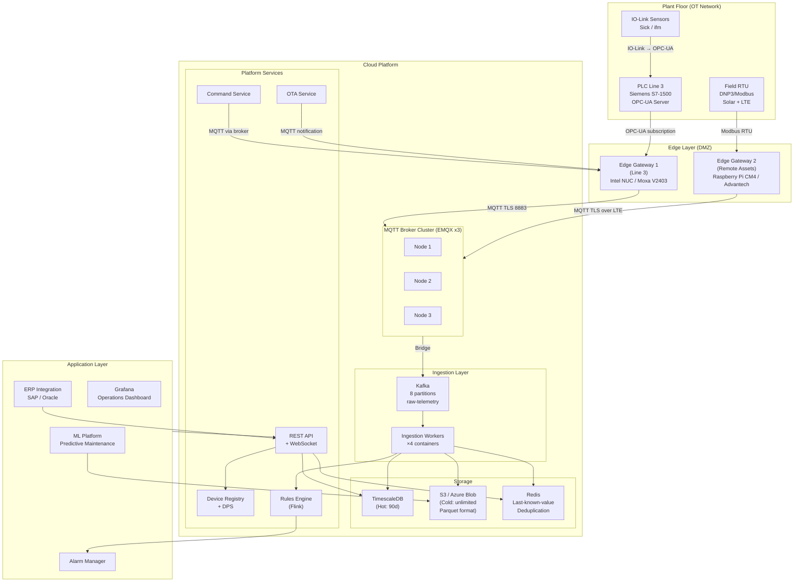
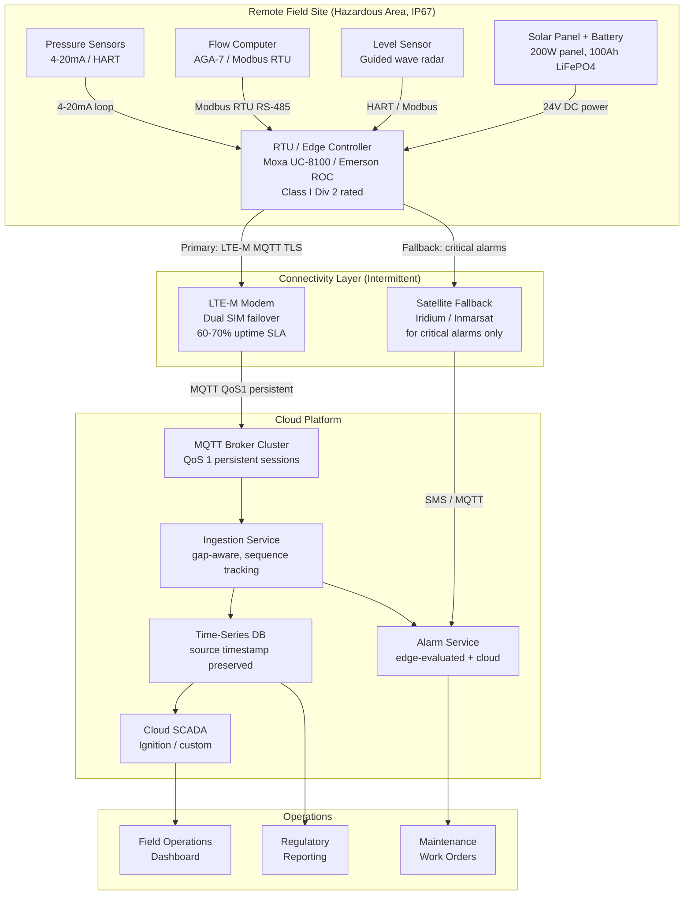
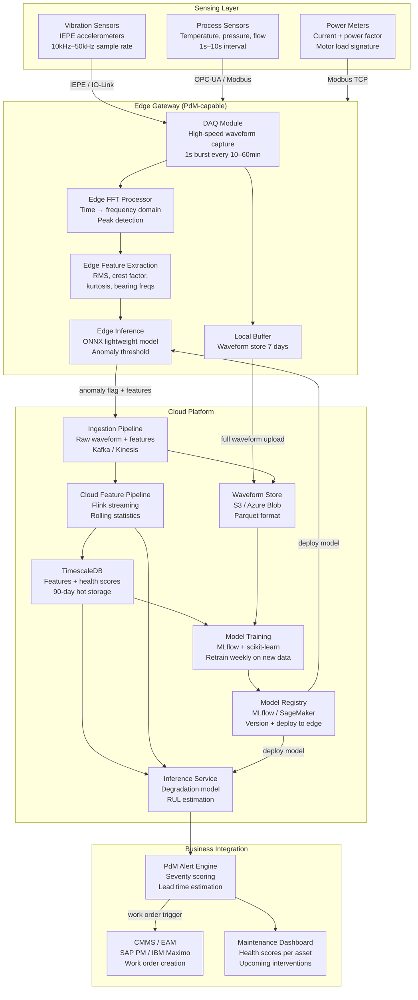
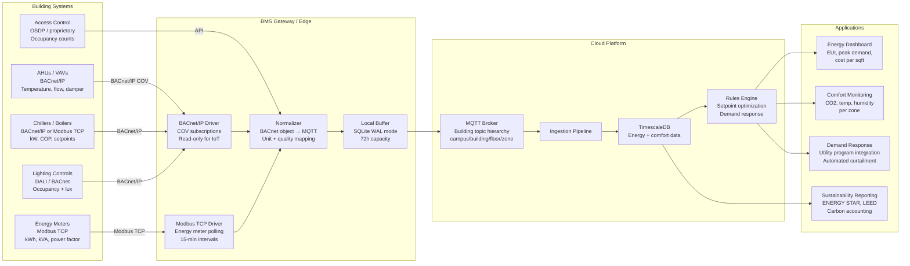
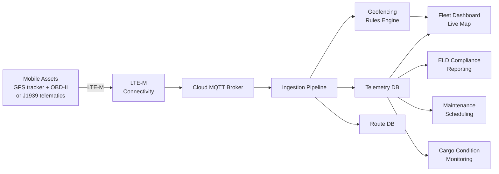
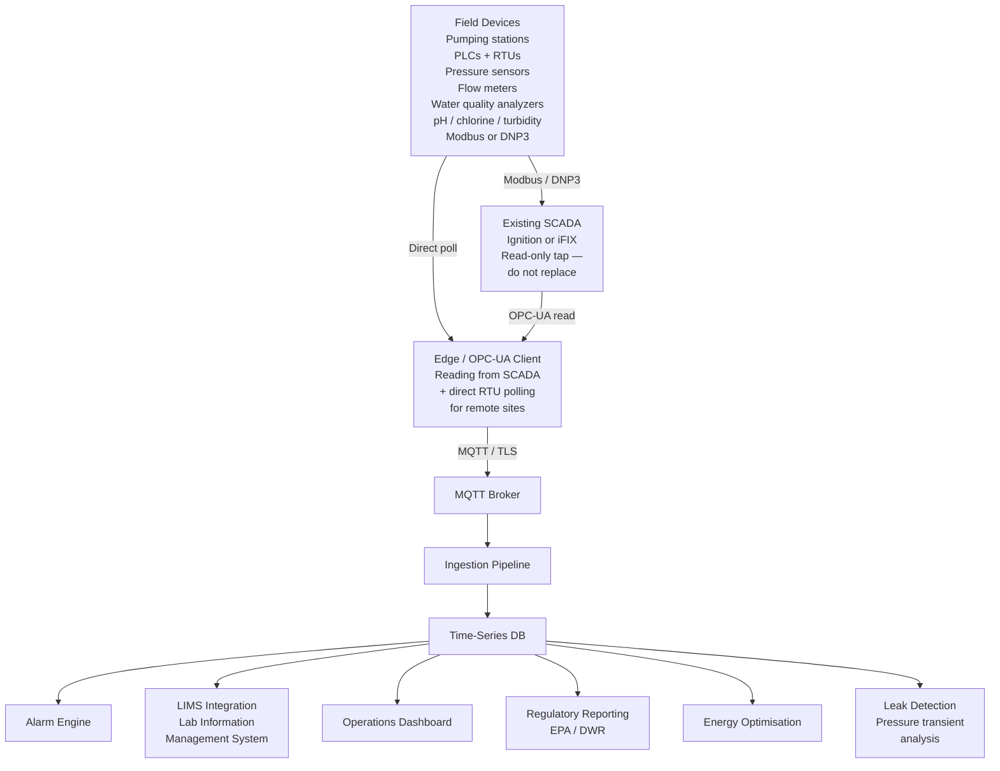
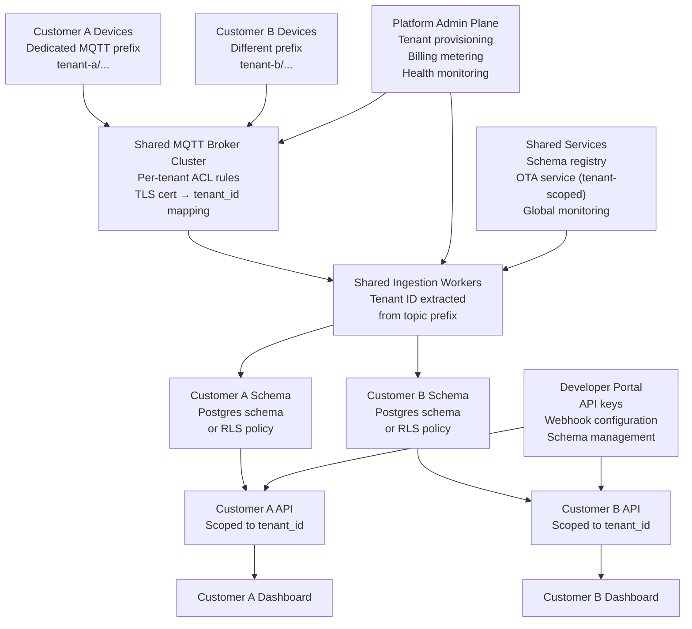

# Reference Architectures

### 15.1 Greenfield Industrial IoT — Complete Architecture



### 15.2 Brownfield Retrofit — SCADA + Historian + Cloud

```mermaid
graph LR
    subgraph OT["Existing OT (do not modify)"]
        PLC_EXIST[Existing PLCs<br/>All brands]
        SCADA_EXIST[Existing SCADA<br/>Inductrial / iFIX]
        HIST_EXIST[Existing Historian<br/>PI / Wonderware]
    end

    subgraph NEW_EDGE["New: Read-Only Edge Layer"]
        OPCUA_GW[OPC-UA Client<br/>on Edge Gateway<br/>Read-only subscription<br/>to SCADA tags]
        PI_CON[PI Connector<br/>(if PI Historian)<br/>Read OSIsoft tags]
    end

    subgraph NEW_CLOUD["New: Cloud Layer"]
        BROKER_NEW[MQTT Broker]
        PLATFORM[IoT Platform]
        ANALYTICS[Analytics / ML]
    end

    PLC_EXIST --> SCADA_EXIST --> HIST_EXIST
    SCADA_EXIST -->|OPC-UA read-only - no writes to SCADA| OPCUA_GW
    HIST_EXIST -->|PI-to-PI or JDBC read| PI_CON
    OPCUA_GW -->|MQTT TLS| BROKER_NEW
    PI_CON -->|MQTT TLS| BROKER_NEW
    BROKER_NEW --> PLATFORM --> ANALYTICS

    style SCADA_EXIST fill:#ffd700,color:#000
    style HIST_EXIST fill:#ffd700,color:#000
    style PLC_EXIST fill:#ffd700,color:#000
```

> **Golden rule for brownfield:** The existing OT system is the source of truth. The cloud is a copy. Never route commands through SCADA that wasn't designed for it. Any new C2D command path gets its own dedicated gateway and its own network path.

### 15.3 Remote Asset Monitoring — Oil & Gas / Utilities

Remote asset monitoring is the hardest class of IoT deployment. Devices operate in harsh environments with no reliable connectivity, limited power, cellular data costs, and 15–20 year asset lifespans. Every design decision has a direct cost — data sent costs money, power consumed shortens battery life, and a firmware bug deployed to 2,000 solar-powered RTUs in the field requires a truck roll to recover. This architecture is optimised for resilience and frugality over capability.

The key constraint that shapes all other decisions is **intermittent connectivity**. Unlike a factory gateway that loses internet for hours, a remote RTU on an oil pipeline may have LTE coverage for 30 minutes per hour and must operate correctly during the 30 minutes it does not. This mandates: store-and-forward on the device itself (not just the gateway), time-synchronised data with source timestamps, and commands that are safe to arrive late or not at all.



**Key design decisions specific to remote assets:**
- **Store-and-forward on the RTU itself** (not just the gateway) — size the local buffer for worst-case outage (72h at design data rate)
- **Source timestamps are mandatory** — RTU must have GPS or NTP sync; cloud cannot infer timestamps from receipt time when connectivity is intermittent
- **Edge-evaluated alarms** — do not rely on cloud for safety alarms; RTU must evaluate high/low limits locally and trigger local outputs (shutdowns, horns) regardless of connectivity
- **Satellite for critical alarms only** — satellite data costs $0.10–$0.50 per KB; reserve for emergency shutdowns, not telemetry
- **OTA in designated window only** — RTU must enforce maintenance window and reject OTA outside it; a firmware update during peak flow measurement creates regulatory reporting gaps

```
Design constraints for remote assets:
  Power:        Solar + battery → budget < 2W average
  Connectivity: LTE-M with 60-70% uptime SLA
  Data budget:  50 MB/month per device (cellular cost)
  Environment:  -40°C to +70°C, IP67, Class I Div 2 (hazardous area)
  Asset life:   15-20 years (no hardware replacement)
  Update window: 02:00-04:00 local time

Data budget calculation:
  Available: 50 MB/month = 50,000 KB = 50M bytes
  Overhead (TLS, MQTT, retries): ~15% → 42.5M bytes usable
  Per day: 42.5M / 30 = 1.42 MB/day

  At 5 tags, 5-minute interval, 80 bytes/msg (compact JSON):
  5 tags × 288 msgs/day × 80 bytes = 115,200 bytes/day → ✅ well within budget

  At 5 tags, 1-minute interval:
  5 × 1440 × 80 = 576,000 bytes/day → still within budget

  Protocol overhead for LTE-M:
  Use MQTT persistent sessions (clean_session=false)
  Reconnect without resending SUBSCRIBE (saves bandwidth)
  Use MQTT 5.0 message expiry to avoid delivering stale commands

Power budget (example RTU):
  MCU active (sampling + processing): 200mW × 0.05 duty cycle = 10mW avg
  LTE-M active (transmit burst):      500mW × 0.02 duty cycle = 10mW avg
  Sensors (4-20mA loop):              25mW × 3 sensors = 75mW
  Total: ~95mW → solar panel: 200mW sufficient (with 3× margin)
  Battery: 10Ah × 3.7V = 37Wh → ~16 days without sun
```

### 15.4 Predictive Maintenance Platform Architecture

Predictive maintenance (PdM) is the highest-value IoT application in discrete manufacturing — moving from time-based maintenance schedules to condition-based intervention reduces unplanned downtime by 30–50% in well-instrumented plants. The architecture differs from standard telemetry in three key ways: it generates burst high-frequency waveform data (vibration at 10–50kHz), it requires a feature engineering pipeline between raw data and model input, and the output is not a dashboard value but a work order trigger in a CMMS system. Model inference can run at the edge (lower latency, works offline) or in the cloud (easier retraining, larger models) — the typical production pattern runs a lightweight anomaly detection model at the edge and a more sophisticated degradation model in the cloud.



**Key design decisions for PdM:**

- **Vibration data handling:** Capture waveforms at the edge at the required sample rate (10–50kHz), compute FFT and statistical features locally, and send only features to the cloud during normal operation. Send full waveforms only on anomaly detection or for periodic model retraining. This keeps LTE bandwidth viable for remote assets.
- **Model serving at edge vs. cloud:** Run a lightweight threshold-based or AutoEncoder model at the edge for real-time anomaly flagging with zero cloud dependency. Run a more complex LSTM or random forest degradation model in the cloud for remaining-useful-life (RUL) estimation, which can tolerate minutes of latency. The edge model catches the acute failure; the cloud model catches the gradual trend.
- **Alert-to-work-order integration:** PdM value is only realized if the alert creates a maintenance action. Integrate the inference service output directly with your CMMS via REST API or message queue. Include estimated lead time (days to failure) in the work order so planners can schedule parts and labor. A PdM alert with no downstream action is a notification system, not a maintenance system.

### 15.5 Smart Building / BMS Architecture

Smart building IoT differs from industrial manufacturing IoT in its dominant protocols (BACnet and Modbus TCP rather than OPC-UA and PROFIBUS), its scale profile (hundreds of devices per building, thousands per campus), and its primary business metric (energy cost reduction and occupancy optimization rather than OEE). The BMS gateway is the critical integration point: it translates BACnet/IP device objects and Modbus registers into a normalized MQTT stream while maintaining the BMS's ability to continue managing local HVAC control loops without cloud dependency.



**BACnet specifics:** BACnet/IP uses Change-of-Value (COV) subscriptions rather than polling — subscribe to an object and the device pushes updates only when the value changes beyond a COV increment threshold. This is efficient but requires the gateway to manage subscription lifecycles (BACnet COV subscriptions expire and must be renewed). BACnet object model (Analog Input, Binary Output, etc.) maps cleanly to MQTT topics with some normalization. For large buildings with hundreds of devices, use a BACnet router or BBMD (BACnet Broadcast Management Device) to span subnets.

**Energy management context:** The primary analytics use case is energy use intensity (EUI) tracking and demand peak shaving. Meter data at 15-minute intervals aligns with utility billing intervals. Demand response integration with the utility requires automated setpoint commands from the cloud back through the BMS gateway — this is one of the few building IoT scenarios where C2D commands touch physical control systems, so the command contract patterns from §7 apply fully.

### 15.6 Fleet / Mobile Asset Tracking

Mobile asset tracking differs from fixed-sensor IoT in that the asset moves — vehicles, containers, mobile equipment. The primary data is GPS position, but industrial fleet tracking also includes: engine telemetry (J1939/OBD-II), driver behaviour, geofencing events, cargo condition (temperature, shock), and regulatory compliance (ELD for HGVs). Unlike fixed sensors, mobile assets experience variable and intermittent connectivity as they move through coverage gaps, tunnels, or remote areas, so store-and-forward and adaptive reporting intervals are essential design requirements rather than optional extras.



**GPS data volume management:** GPS at 1 Hz generates 86,400 position records per vehicle per day. For most fleet dashboards the useful update rate is every 10 seconds, or only when position changes by more than a configurable threshold (e.g., 50 metres). Apply a movement-threshold filter on-device before transmission — this reduces cellular data usage by 70–90% on vehicles that spend significant time stationary (loading docks, traffic). Transmit at full 1 Hz only when a safety or incident event is triggered.

**Geofencing:** Geofencing evaluation should be at the edge (device) for low-latency alerts, not cloud. A vehicle entering a restricted zone or exiting a delivery area should trigger an alert within 1–2 seconds — cloud round-trip for geofence evaluation adds 200–800ms and fails entirely during connectivity gaps. Store the geofence polygon set on-device and update via OTA config channel when geofences change.

**ELD compliance:** Electronic Logging Device (ELD) data has regulatory format requirements (FMCSA ELD mandate in the US). J1939 PGNs (Parameter Group Numbers) carry Hours of Service data. Store raw J1939 PGNs alongside derived values — auditors require the raw data, not just the formatted report. The PGN for engine hours is PGN 65253; total vehicle distance is PGN 65248. Parse and forward these at the edge; retain raw bytes in cold storage.

### 15.7 Water Utilities / SCADA Modernisation

Water utility IoT sits at the intersection of critical infrastructure, aging SCADA systems, and stringent regulatory requirements. The primary driver is SCADA modernisation — moving from proprietary closed SCADA to open, cloud-connected architectures while maintaining the safety and reliability that water distribution requires. Unlike manufacturing IoT, the operational philosophy is conservative: the SCADA system is not replaced but extended. Cloud connectivity is a read-only overlay on the existing control system, not a replacement for it.



**Water quality regulatory requirements:** pH, chlorine residual, and turbidity data has regulatory reporting requirements under the Safe Drinking Water Act (US) and Water Framework Directive (EU). Store raw analyser readings with timestamp, quality code, and calibration date for every sample. Regulators do not accept derived or aggregated values for compliance reporting — you need the original measurement exactly as the instrument produced it. Design your ingestion schema to carry `calibration_date` and `instrument_serial` alongside the measurement value.

**Leak detection:** Pressure transient analysis (water hammer signature detection) requires 100 ms sampling on pressure sensors at key nodes across the distribution network. This is edge-processed — a cloud round-trip is far too slow and the data volume at 10 Hz from 50 pressure loggers is impractical to forward continuously. The edge device runs a sliding-window FFT or matched-filter algorithm and publishes only detected events (location estimate, event type, confidence score) plus 10 seconds of raw waveform data for post-analysis.

**Safety architecture:** The existing SCADA is the control system and must remain in control. Cloud connectivity is read-only from the SCADA perspective. Never route a control command (pump start/stop, valve actuate) from cloud through the SCADA to a field device unless a full hazard analysis has been completed and an independent safety shutdown is in place. Water distribution failures can have public health consequences.

### 15.8 Multi-Site SaaS IoT Platform

Building an IoT SaaS platform — selling IoT capabilities to multiple enterprise customers — multiplies the complexity of every section in this document. Every architectural decision must be evaluated for its tenant isolation implications, and the operational model shifts from "operate one system" to "operate a platform that runs many systems." The economics also change fundamentally: you must be able to onboard a new customer without infrastructure changes, and your cost per customer must decrease as you scale.



**Broker isolation:** EMQX with per-tenant ACL rules (each device's TLS certificate CN maps to a `tenant_id`, and broker ACLs enforce that a device can only publish or subscribe to topics beginning with their `tenant_id`) is the most cost-effective approach. A separate broker instance per tenant provides stronger isolation at significantly higher cost — appropriate for enterprise customers in regulated industries who require dedicated infrastructure as a contractual guarantee.

**Schema isolation:** Shared Postgres schema with `tenant_id` column plus Row Level Security (RLS) policies is simplest operationally — one schema to migrate, one set of indexes. Per-tenant Postgres schema is harder to aggregate across (cross-tenant analytics requires dynamic SQL or a separate aggregation layer) but provides stronger isolation and easier per-tenant data export. Per-tenant database is reserved for high-value enterprise contracts with strict data sovereignty requirements.

**Billing metering:** Count messages and devices per tenant per billing period. Do not instrument the main telemetry Kafka topic for billing — create a dedicated `billing-events` topic where every ingest worker emits a lightweight event `{tenant_id, device_id, message_count, byte_count, ts}`. A separate billing consumer aggregates these and writes to the billing database. This keeps billing logic out of the hot path and allows replay if the billing consumer falls behind.

**Developer portal:** Multi-tenant SaaS requires an API-first approach with self-service onboarding. Each tenant gets: API keys scoped to their `tenant_id`, webhook configuration for real-time event push, schema management (defining their device type schemas), and a sandbox environment. The developer portal is the difference between a platform and a managed service.

---
