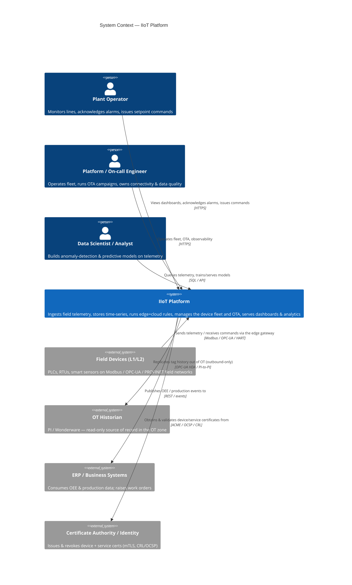
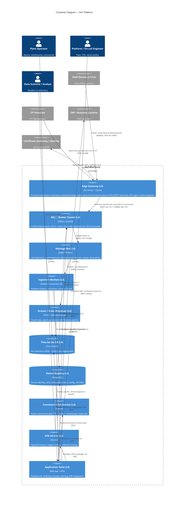

# Industrial IoT Platform — Architecture Artifacts

> Produced with the `enterprise-architecture` skill (C4 model + Structurizr DSL, ADR/MADR).
> Source of truth: the IIoT reference architecture docs (`docs/index.md`, `platform/*`, `data/ingestion.md`, `hardware/edge.md`).
> Scope: one software system — the **IIoT Platform** — spanning the 5-layer stack
> (L1 Device & Sensor → L2 Field Network → L3 Edge/Gateway → L4 Platform/Cloud → L5 Application).

This file contains three things:

1. A **C4 System Context** view (Mermaid) — the platform and the world around it.
2. A **C4 Container** view (Mermaid) — the runnable/deployable units inside the platform.
3. The same model as a **Structurizr DSL workspace** — the model-of-record that both views derive from.
4. One **ADR (MADR)** — store-and-forward at the edge (L3) vs. relying on cloud connectivity.

A short **element ID register** follows so every box has a stable, greppable identity reused across all three artifacts.

---

## Element ID register (traceability)

IDs follow the skill's URN scheme `ea:{org}:{system}:{kind}:{name}`. The same ID names the same
thing in the Mermaid views, the Structurizr DSL, and the ADR.

| ID | Kind | Element |
|---|---|---|
| `ea:acme:iiot:person:plant-operator` | person | Plant Operator |
| `ea:acme:iiot:person:ops-engineer` | person | Platform / On-call Engineer |
| `ea:acme:iiot:person:data-scientist` | person | Data Scientist / Analyst |
| `ea:acme:iiot:system:iiot-platform` | system | **IIoT Platform** (in scope) |
| `ea:acme:iiot:external:field-devices` | external | Field Devices (L1 PLCs/RTUs/sensors) |
| `ea:acme:iiot:external:erp` | external | ERP / Business Systems |
| `ea:acme:iiot:external:ot-historian` | external | OT Historian (PI / Wonderware) |
| `ea:acme:iiot:external:idp` | external | Certificate Authority / Identity |
| `ea:acme:iiot:container:edge-gateway` | container | Edge Gateway (L3) |
| `ea:acme:iiot:container:mqtt-broker` | container | MQTT Broker Cluster (L4) |
| `ea:acme:iiot:container:message-bus` | container | Message Bus / Kafka (L4) |
| `ea:acme:iiot:container:ingestion` | container | Ingestion Workers (L4) |
| `ea:acme:iiot:container:stream-processor` | container | Stream / Rules Processor (L4) |
| `ea:acme:iiot:container:tsdb` | container | Time-Series DB (L4) |
| `ea:acme:iiot:container:device-registry` | container | Device Registry (L4) |
| `ea:acme:iiot:container:command-service` | container | Command (C2D) Service (L4) |
| `ea:acme:iiot:container:ota-service` | container | OTA Service (L4) |
| `ea:acme:iiot:container:app-suite` | container | Application Suite — dashboards/alerting (L5) |

---

## 1. C4 — System Context (Mermaid)

*What the IIoT Platform is, who uses it, and the external systems/devices it depends on. Audience: everyone.*



**Notes / hygiene:** 8 elements, every relationship labelled with intent + protocol, all
externals shown. The OT/IT boundary is explicit in the relationships — the platform only ever
*reads out* of the historian and devices talk to it *through the edge gateway*, never the reverse
(consistent with the IEC 62443 zone model in `platform/security.md` §13.2).

---

## 2. C4 — Container (Mermaid)

*The runnable/deployable units inside the IIoT Platform, mapped onto L3–L5. Audience: technical staff.*



**Notes / hygiene:** 10 containers + 3 people + 4 externals. The edge gateway is deliberately a
*single* L3 container (its internals — protocol drivers, normalizer, rules engine, store-and-forward
outbox, OTA agent — would be a Component view, omitted here as it would exceed the 5–20 rule and
isn't needed to answer the structural question). Telemetry flows device → edge → broker → bus →
ingestion → TSDB; commands and OTA flow back only through the broker, never directly into OT.

---

## 3. Structurizr DSL workspace (model-of-record)

*The single source of truth. The two Mermaid views above are projections of this model. Save as `workspace.dsl` and render with Structurizr Lite.*

```text
workspace "Acme IIoT Platform" "Industrial IoT reference platform — 5-layer stack (device → edge → cloud → application)" {

    model {
        operator  = person "Plant Operator" "Monitors lines, acknowledges alarms, issues setpoint commands"
        opsEng    = person "Platform / On-call Engineer" "Operates the fleet, runs OTA, owns connectivity & data quality"
        dataSci   = person "Data Scientist / Analyst" "Builds anomaly-detection & predictive models on telemetry"

        devices   = softwareSystem "Field Devices (L1/L2)" "PLCs, RTUs, smart sensors on Modbus/OPC-UA/PROFINET field networks" {
            tags "External"
        }
        historian = softwareSystem "OT Historian" "PI / Wonderware — read-only source of record in the OT zone" {
            tags "External"
        }
        erp       = softwareSystem "ERP / Business Systems" "Consumes OEE & production data; raises work orders" {
            tags "External"
        }
        idp       = softwareSystem "Certificate Authority / Identity" "Issues & revokes device + service certificates (mTLS, CRL/OCSP)" {
            tags "External"
        }

        iiot = softwareSystem "IIoT Platform" "Ingests field telemetry, stores time-series, runs edge+cloud rules, manages fleet & OTA, serves dashboards & analytics" {

            edge     = container "Edge Gateway (L3)" "Protocol translation, normalize, deadband/edge rules, store-and-forward outbox (72h), MQTT pub/sub, OTA agent, health reporter" "Go + SQLite"
            broker   = container "MQTT Broker Cluster (L4)" "Unified Namespace; mTLS + topic ACLs; D2C telemetry & C2D commands" "EMQX / HiveMQ"
            bus      = container "Message Bus (L4)" "raw-telemetry, commands-ack, device-events; fan-out, replay, decoupling" "Kafka / Kinesis"
            ingest   = container "Ingestion Workers (L4)" "Validate schema, normalize, route to stores" "Stateless consumers x8"
            stream   = container "Stream / Rules Processor (L4)" "Cloud rules, alarm generation, ML feature pipeline" "Flink / Spark Streaming"
            tsdb     = container "Time-Series DB (L4)" "Hot telemetry (90d) + continuous aggregates" "TimescaleDB" {
                tags "Database"
            }
            registry = container "Device Registry (L4)" "Device identity, certs, firmware version, config, criticality" "PostgreSQL" {
                tags "Database"
            }
            cmd      = container "Command (C2D) Service (L4)" "Issues commands with TTL + nonce + timestamp; tracks ack" "Service"
            ota      = container "OTA Service (L4)" "Signed firmware, staged rollout, rollback tracking" "Service"
            apps     = container "Application Suite (L5)" "Dashboards, fleet/ops console, alerting, ERP integration" "Web app + APIs"

            # internal relationships
            edge   -> broker   "Publishes telemetry & subscribes to commands" "MQTT/TLS 1.3 (8883), QoS 1/2"
            broker -> bus      "Bridges topics to" "Broker rule / bridge"
            bus    -> ingest   "Streams raw telemetry to" "Kafka consumer"
            bus    -> stream   "Streams events to" "Kafka consumer"
            ingest -> tsdb     "Writes validated readings to" "SQL"
            ingest -> registry "Resolves device identity / last-seen" "SQL"
            stream -> apps     "Pushes alarms / derived signals to" "events"
            cmd    -> broker   "Publishes commands to" "MQTT"
            ota    -> broker   "Publishes signed firmware jobs to" "MQTT"
            apps   -> tsdb     "Queries telemetry & aggregates from" "SQL"
            apps   -> registry "Reads/writes device & fleet state" "SQL"
            apps   -> cmd      "Requests commands via" "API"
            apps   -> ota      "Schedules OTA campaigns via" "API"
        }

        # context-level relationships
        devices   -> edge "Polled / subscribed via field protocols" "Modbus / OPC-UA / HART"
        historian -> edge "Read-only tag replication out of OT (outbound-only)" "OPC-UA HDA / PI-to-PI"
        edge      -> idp  "Authenticates with / validates certificates" "mTLS, CRL/OCSP"
        operator  -> apps "Views dashboards, acknowledges alarms, issues commands" "HTTPS"
        opsEng    -> apps "Operates fleet, OTA, observability" "HTTPS"
        dataSci   -> tsdb "Queries telemetry for model training" "SQL"
        apps      -> erp  "Publishes OEE / production events to" "REST / events"
    }

    views {
        systemContext iiot "Context" "The IIoT Platform, its users, devices, and neighbouring systems" {
            include *
            autolayout lr
        }

        container iiot "Containers" "Runnable/deployable units inside the IIoT Platform (L3-L5)" {
            include *
            autolayout lr
        }

        styles {
            element "Person"   { shape person ; background #08427b ; color #ffffff }
            element "External" { background #999999 ; color #ffffff }
            element "Database" { shape cylinder }
        }
    }

    # Decisions can be attached to the workspace and rendered alongside the model:
    # !adrs decisions
}
```

---

## 4. ADR — 0001. Store-and-forward at the edge (L3) rather than relying on cloud connectivity

- **Status:** accepted
- **Date:** 2026-06-18
- **Deciders:** Platform Architecture, Edge/Embedded Engineering, OT Engineering
- **Tags:** edge, reliability, data-integrity, compliance
- **Affects element:** `ea:acme:iiot:container:edge-gateway`

### Context and Problem Statement

Industrial sites lose connectivity — factory floors routinely experience outages, and remote
oil/gas and utility sites run on intermittent cellular or satellite links. The reference
architecture's own failure analysis is blunt: a 3-hour internet outage at a 1,000-sensor site
generating 10 readings/min/sensor means **1.8 million readings lost** if data is not buffered,
and in pharma/utilities that is a regulatory-compliance failure, not just a gap in a chart
(`hardware/edge.md` §3.2). The question: **where does telemetry become durable — at the edge
(L3) before it ever needs the network, or in the cloud (L4) once it arrives?** This is
architecturally significant because it dictates the gateway's storage hardware, its data model
(an outbox), the L3↔L4 contract, and the platform's audit posture — all costly to retrofit.

### Decision Drivers

- **No data loss across connectivity outages** — must survive the worst-case historical outage
  for a site (the docs size buffers for **72h**, not the average).
- **Regulated industries** (pharma 21 CFR Part 11, utilities) require a *reconstructable,
  gap-free* time-series — an audit requirement, not a feature.
- **OT/IT trust boundary (IEC 62443):** higher-trust cloud must never be a dependency the OT side
  blocks on; the edge sits in the DMZ and must keep working autonomously.
- **Control-loop latency** stays local regardless of cloud reachability (edge rules/alarms must
  fire even when offline).
- **Burst on reconnect:** when the link returns, buffered data floods upstream — the design must
  absorb a 3× burst without melting the broker/ingestion tier.
- **Constrained, unattended hardware:** the buffer must run on an industrial gateway, not assume
  a datacenter.

### Considered Options

1. **Store-and-forward at the edge (L3)** — durable local outbox (SQLite WAL); always write
   locally first, forward as a background concern.
2. **Cloud-first / direct streaming** — gateway streams straight to the cloud broker; cloud is the
   first durable store; rely on MQTT QoS + reconnect for reliability.
3. **In-memory buffer with retry only** — keep unsent messages in RAM with backoff; no on-disk
   durability.

### Decision Outcome

Chosen option: **Option 1 — store-and-forward at the edge**, because it is the only option that
satisfies the non-negotiable drivers (zero loss across multi-hour outages + a gap-free auditable
record) while honouring the IEC 62443 principle that the edge must operate without a hard
dependency on the cloud. The gateway treats its **local outbox as the source of truth, not the
MQTT connection**; connectivity going up or down becomes a background concern and the data
pipeline never stalls or drops (`hardware/edge.md` §3.2). Implementation: SQLite in WAL mode with
an `outbox` table (unsent index, attempt/backoff tracking, retention that *logs* any >72h drop as
an explicit data-loss event), sized via `data_rate × outage_duration × 1.3` on an industrial SSD.
Deadband filtering (§3.3) cuts the volume the buffer must hold by 60–80%.

### Consequences

- **Good:** No silent data loss; complete time-series reconstructable across outages → passes
  pharma/utility audits.
- **Good:** Cloud, broker, and ingestion tier can be down or unreachable without losing a single
  reading — decouples L4 availability from L1/L3 data integrity.
- **Good:** Edge autonomy — local rules/alarms keep working offline; clean OT/IT separation.
- **Bad:** Every gateway needs durable, sized storage (industrial SSD, *not* an SD card) and a
  WAL-mode embedded DB — more BOM cost and firmware complexity per device.
- **Bad:** Reconnect produces a burst; the broker/ingestion pipeline must be sized with ≥3×
  headroom (called out in `data/ingestion.md` §9.2) or it will fall over right after recovery.
- **Neutral / follow-on:** Need fleet-wide monitoring of buffer depth, disk usage, and dropped-
  message counts (ties to the observability "data freshness" signal); define retention/overlap
  and the data-loss alerting threshold; revisit buffer sizing per-site as outage history changes.

### Pros and Cons of the Options

#### Option 1 — Store-and-forward at the edge (chosen)
- Good: Survives long outages; gap-free, auditable record; edge keeps working offline.
- Good: Outbox-as-source-of-truth makes connectivity a background concern; natural backoff/replay.
- Bad: Per-gateway durable storage + embedded DB ops; reconnect burst must be absorbed downstream.

#### Option 2 — Cloud-first / direct streaming
- Good: Simplest gateway; minimal local state; cloud-managed durability/replication once data lands.
- Bad: **Any** network gap loses data not yet delivered — MQTT QoS only helps an *established*
  session, not a multi-hour disconnect; fails the audit requirement. Makes OT data integrity
  depend on cloud reachability, violating the IEC 62443 trust-direction principle.

#### Option 3 — In-memory buffer with retry
- Good: No disk requirement; low latency; trivial to implement.
- Bad: A power cycle or crash during an outage loses the buffer; RAM caps the survivable outage to
  minutes, not 72h; unbounded growth risks OOM on constrained hardware.

### More Information

- Realizes durability behaviour of `ea:acme:iiot:container:edge-gateway` in the Container view (§2/§3).
- Sources: `hardware/edge.md` §3.2 (store-and-forward, SQLite outbox, buffer sizing) and §3.3
  (deadbanding); `data/ingestion.md` §9.2 (reconnect-burst 3× headroom); `platform/security.md`
  §13.2 (IEC 62443 zones, outbound-only OT→DMZ→cloud); `platform/integration.md` §11.2 (OT/IT
  bridge — cloud receives a copy, never the original).
- Related decisions (not yet written): broker selection (EMQX vs. managed IoT Core);
  message-bus-vs-direct-write at ingestion; schema validation early vs. late.
```

---

### Validation note

Per the skill, this artifact can be checked for cross-reference consistency with
`python scripts/ea_lint.py <this-file-or-its-dir>` (advisory). All element IDs in the register are
referenced by the views and the ADR; no relationship is unlabelled; both C4 views stay within the
5–20-element guidance and show all externals.
