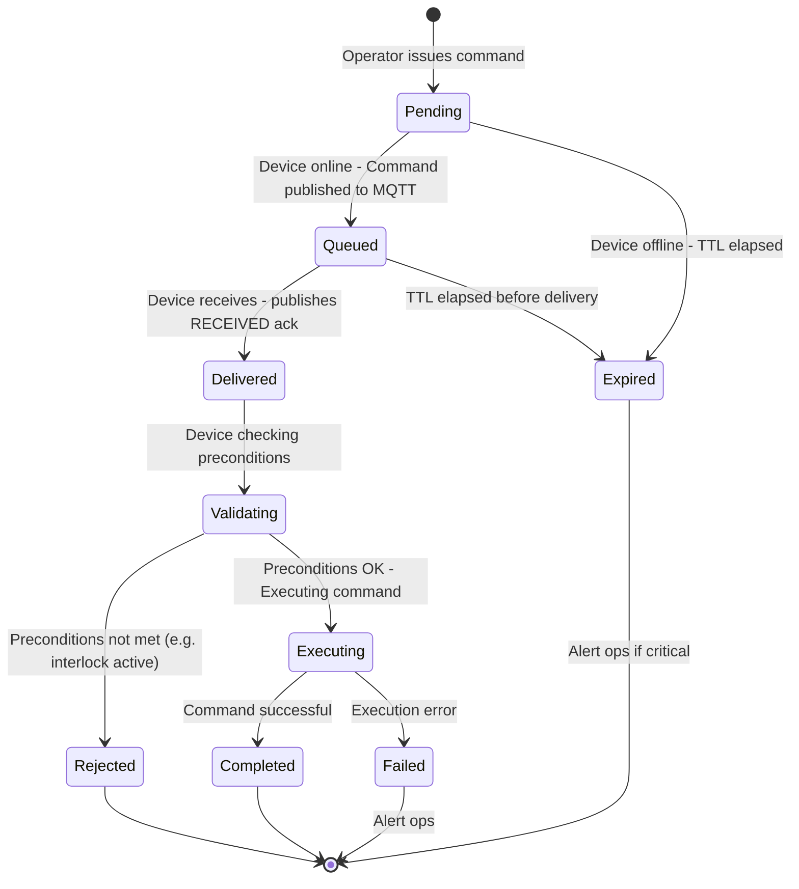
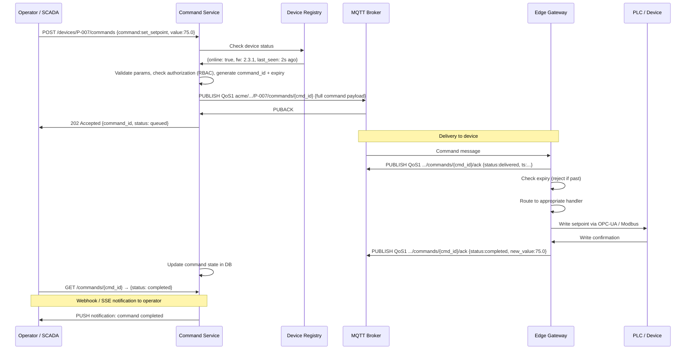
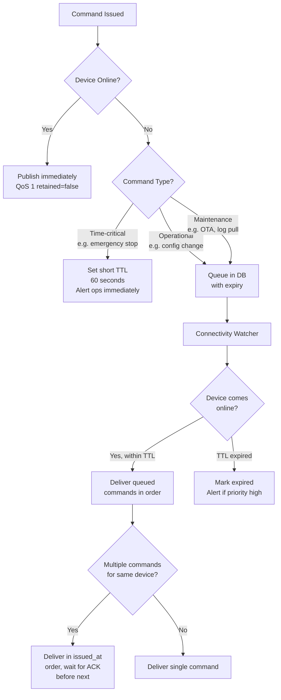

# Cloud-to-Device (C2D) Command Exchange

C2D is the reverse data flow — commands, configuration changes, and control signals flowing downward from the platform to devices. It is far less volume than D2C but far higher stakes. A telemetry message that is lost or delayed is a data gap. A command that is lost, delivered twice, or executed 10 minutes late can result in incorrect process states, product defects, or in extreme cases, safety incidents.

The gap between how web engineers think about C2D ("just POST to an endpoint") and how industrial IoT requires it to work is wide. A device may be offline for hours when a command is issued. The device may receive the same command twice due to QoS 1 retransmission. The command may have been issued by an operator based on process conditions that no longer exist by the time the device reconnects. None of these failure modes exist in a typical web service context, but all of them are daily reality in industrial IoT.

The patterns in this section — command TTL, idempotency, lifecycle state machine, offline queue management — address each of these failure modes specifically.

### 7.1 Command Lifecycle State Machine

Commands in industrial IoT are not fire-and-forget API calls. They have lifecycle, authorization, and real physical consequences.



### 7.2 C2D Command Contract

The command contract is more than a message format — it is the authorization and safety boundary for every operator action on a physical asset. Every field below has been added to address a specific failure mode observed in production: `expires_at` prevents stale commands executing after a device reconnects from a long outage, `constraints` gives the device a last line of defense against out-of-range values even if the backend validation had a bug, and `issued_by` provides the audit trail required by most regulated industries. Do not strip fields to save bytes here — command volume is low and the overhead is justified.

```json
{
  "schema_version": "1.0",
  "command_id": "01HX7K3NBVYD5V2Q3BZ8MNRZWK",
  "command": "set_setpoint",
  "device_id": "P-007",
  "params": {
    "tag": "temperature_setpoint_c",
    "value": 75.0,
    "unit": "celsius"
  },
  "constraints": {
    "min_value": 20.0,
    "max_value": 90.0,
    "requires_interlock_clear": true,
    "max_rate_of_change_per_min": 5.0
  },
  "meta": {
    "issued_by": "jsmith@acme.com",
    "issued_at": "2026-03-19T14:00:00Z",
    "expires_at": "2026-03-19T14:02:00Z",
    "priority": "normal",
    "reason": "Batch temperature adjustment per work order WO-4472"
  }
}
```

**Command acknowledgement:**
```json
{
  "command_id": "01HX7K3NBVYD5V2Q3BZ8MNRZWK",
  "status": "completed",
  "device_id": "P-007",
  "ts": "2026-03-19T14:00:00.412Z",
  "previous_value": 70.0,
  "new_value": 75.0,
  "execution_time_ms": 412,
  "message": "Setpoint updated to 75.0°C. Ramp active.",
  "executed_by_fw": "2.3.1"
}
```

### 7.3 C2D Full Message Exchange

The full sequence diagram below shows every hop a command takes from operator action to physical execution and back. The key design points to observe: the command service records state before publishing to the broker (not after), so a broker publish failure is recoverable; the gateway validates the expiry timestamp before touching the PLC, not after; and acknowledgements flow back through the same MQTT channel so the operator UI gets real-time status without polling. This bidirectional status flow is what separates industrial command handling from simple fire-and-forget REST calls.



### 7.4 Idempotency — Critical for C2D

Idempotency in C2D is not a theoretical concern — QoS 1 will deliver duplicate commands in normal operation, not just edge cases. The critical distinction is between absolute commands (naturally idempotent) and relative commands (dangerous when duplicated). This distinction should be enforced at the command contract level, not handled case-by-case in device firmware. Device-side deduplication using the `command_id` as a key provides the second layer of protection when command design is correct, and the only protection when it is not.

```
Problem: QoS 1 can deliver command twice. If command is "open valve":
  First delivery:  valve opens ✓
  Second delivery: valve opens again (already open — no harm)
  Third delivery:  fine

If command is "increase setpoint by 5°C":
  First delivery:  75°C → 80°C ✓
  Second delivery: 80°C → 85°C ✗ WRONG

Rule: Absolute commands are naturally idempotent. Relative commands are not.

Solution:
  1. Prefer absolute commands: {set_to: 80.0} not {increase_by: 5.0}
  2. Track command_id on device, reject duplicates:

     # Device-side deduplication
     def handle_command(cmd):
         if db.exists(f"cmd:{cmd['command_id']}"):
             # Already processed — re-send last ack
             ack = db.get(f"cmd:{cmd['command_id']}:ack")
             publish_ack(ack)
             return

         result = execute_command(cmd)
         ack = build_ack(cmd, result)
         db.set(f"cmd:{cmd['command_id']}", "processed", ttl=86400)
         db.set(f"cmd:{cmd['command_id']}:ack", ack, ttl=86400)
         publish_ack(ack)
```

### 7.5 Command Queue Management for Offline Devices

Industrial devices go offline regularly — planned maintenance windows, network outages, power cycles. Commands issued during these windows must be managed carefully, not simply dropped or blindly queued. The flowchart below encodes the decisions that depend on command type: time-critical commands (emergency stops, interlocks) should never wait — set a short TTL and alert immediately if the device is unreachable. Configuration and maintenance commands can safely queue for hours or days. The most important rule: when a device reconnects, do not deliver a burst of queued commands simultaneously. Deliver them in order, waiting for acknowledgement before sending the next.



**Stale command prevention — always enforce TTL on device:**
```c
// Device firmware command handler (C pseudocode)
void handle_command(Command* cmd) {
    uint64_t now_ms = get_epoch_ms();
    uint64_t expires_ms = parse_iso8601_ms(cmd->expires_at);

    if (now_ms > expires_ms) {
        LOG_WARN("Command %s expired %lums ago — rejecting",
                 cmd->command_id, now_ms - expires_ms);
        publish_ack(cmd->command_id, STATUS_EXPIRED,
                    "Command expired before execution");
        return;
    }

    // Execute...
}
```

---
