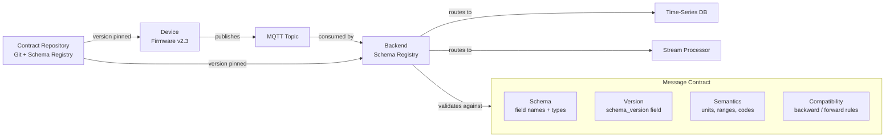
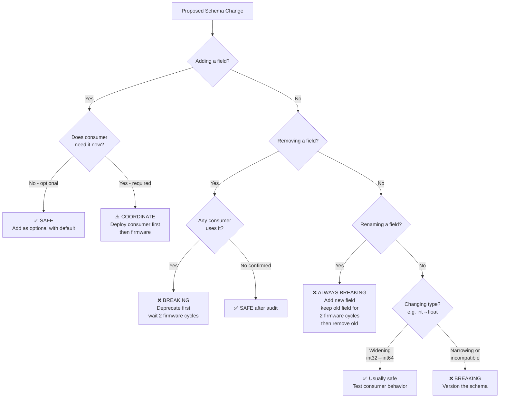
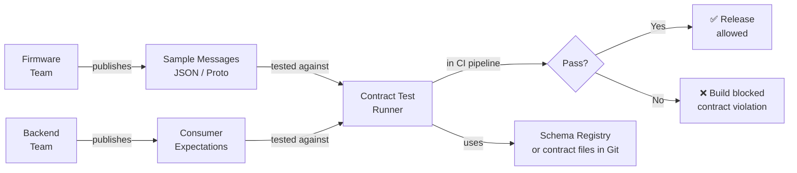

# Contract Design & Schema Evolution

This section is where most IoT projects fail quietly. A device ships with firmware v1 publishing JSON. Six months later firmware v2 adds fields. Firmware v3 renames a field. Now your backend silently drops half the data, and nobody notices for three months because the dashboard still shows numbers.

The core problem is that IoT devices are not servers. You cannot do a coordinated deploy where firmware and backend upgrade simultaneously. Devices in the field run dozens of different firmware versions. Devices go offline for weeks and reconnect with old firmware. A backend that cannot handle messages from firmware versions 2.1, 2.3, and 3.0 simultaneously is not production-ready.

Treat every message format your device publishes as a **public API contract** — even if the only consumers are internal. The cost of a breaking schema change in IoT is measured in field technician visits, support tickets, and lost data — not just a failed CI build.

### 5.1 What Is a Message Contract?

A message contract defines:
1. **Structure** — what fields exist, their types, required vs. optional
2. **Semantics** — what the fields mean (units, ranges, quality)
3. **Versioning** — how changes are communicated and handled
4. **Compatibility rules** — what changes are safe, what are breaking



### 5.2 Schema Versioning Strategy

#### Option A: Envelope Versioning (Recommended for MQTT/IoT)

Every message carries its own schema version. Backend routes based on version. This approach is preferred for MQTT/IoT because it requires no out-of-band schema negotiation — the decoder needed is self-described in every message. It handles fleet heterogeneity naturally: a backend receiving messages from firmware v1, v2, and v3 simultaneously routes each to its appropriate handler without needing to track which device is on which version at the time of processing.

```json
{
  "schema_version": "2.1",
  "device_id": "P-007",
  "ts": 1710844800000,
  "d": {
    "temp_inlet_c": 72.4,
    "temp_outlet_c": 81.2,
    "pressure_bar": 4.2,
    "flow_m3h": 142.7
  },
  "meta": {
    "fw_version": "2.3.1",
    "site": "plant-detroit"
  }
}
```

**Backend routing by version:**
```python
def route_message(payload: bytes, topic: str) -> None:
    msg = json.loads(payload)
    version = msg.get("schema_version", "1.0")  # default for legacy devices

    handler = VERSION_HANDLERS.get(version)
    if handler is None:
        # Unknown version — do not drop, route to dead letter queue for triage
        dlq.publish(topic, payload, reason=f"unknown_schema_version_{version}")
        return

    normalized = handler(msg)  # returns canonical internal format
    ingestion_pipeline.ingest(normalized)

VERSION_HANDLERS = {
    "1.0": handle_v1,   # legacy — field rename adapters
    "2.0": handle_v2,
    "2.1": handle_v2_1, # minor addition
}
```

#### Option B: Schema Registry (for high-scale, multi-team)

Use Confluent Schema Registry, AWS Glue, or Apicurio when:
- Multiple teams produce and consume messages
- You have > 50 message types
- Compliance requires schema audit trail

```
Schema Registry flow:
  1. Developer registers schema:
     POST /subjects/acme.pump.telemetry/versions
     Body: Avro / JSON Schema / Protobuf schema

  2. Registry returns schema_id: 42

  3. Producer (firmware/gateway) encodes:
     [0x00][schema_id 4 bytes][encoded payload]

  4. Consumer decodes:
     → reads schema_id from header
     → fetches schema from registry (cached locally)
     → deserializes with correct schema

  Compatibility modes (set per subject):
    BACKWARD:  new schema can read data written by old schema
    FORWARD:   old schema can read data written by new schema
    FULL:      both — recommended for IoT
    NONE:      no compatibility checks — dangerous
```

### 5.3 Backward Compatibility Rules — What You Can and Cannot Change

The decision tree below encodes hard-won rules for safe schema evolution in production IoT systems. The key insight is that IoT devices in the field cannot be updated atomically with the backend — there will always be a period during which old and new firmware coexist. Any schema change that breaks this coexistence causes silent data loss, not a clean error. Work through the decision tree for every proposed change before touching a message contract.



**The Field Rename Anti-Pattern — and the correct fix:**
```
Wrong approach (what teams do):
  v1: { "temp": 72.4 }   ← firmware v1
  v2: { "temperature_c": 72.4 }  ← firmware v2 renames it

  Backend receives v2: looks for "temp" → null
  Silent data loss. Alarm thresholds stop working.
  Discovered 2 months later when a sensor reads 0°C everywhere.

Correct approach:
  Step 1 (firmware v2): publish BOTH fields
    { "temp": 72.4, "temperature_c": 72.4, "schema_version": "2.0" }

  Step 2: deploy backend that reads "temperature_c", falls back to "temp"
    value = msg.get("temperature_c") or msg.get("temp")

  Step 3: wait until all devices are on firmware v2+ (check registry)
    query: SELECT COUNT(*) FROM devices WHERE fw_version < '2.0.0'
    Proceed only when = 0

  Step 4 (firmware v3): remove old field
    { "temperature_c": 72.4, "schema_version": "3.0" }
    Backend: still reads "temperature_c" — no change needed
```

### 5.4 Protobuf Schema Evolution — Production Rules

When you graduate from JSON to Protobuf for performance, schema evolution rules become more rigid and more consequential. Unlike JSON (where unknown fields are simply ignored), Protobuf encodes fields by number — and once a field number is assigned, it must never be reused, even if the field is deleted. Violating this rule causes silent data corruption on the receiving end. The schema below shows a real pump telemetry message evolved across three versions, with the critical reservation pattern for deleted fields. Pay attention to field number allocation: fields 1–15 consume one byte in the encoding and should be reserved for the most frequently transmitted values.

```protobuf
// pump_telemetry.proto
syntax = "proto3";
package acme.iot.v1;

message PumpTelemetry {
  string device_id = 1;
  int64  timestamp_ms = 2;
  float  temp_inlet_c = 3;
  float  temp_outlet_c = 4;
  float  pressure_bar = 5;
  float  flow_m3h = 6;

  // v2 additions — safe, optional, have defaults
  float  vibration_rms_mms = 7;  // added in schema v2
  float  power_kw = 8;            // added in schema v2

  // v3 — new nested message for quality
  DataQuality quality = 9;        // added in schema v3

  // NEVER reuse field numbers after deletion
  // reserved 10, 11;             // mark deleted fields as reserved
  // reserved "old_field_name";   // also reserve the name
}

message DataQuality {
  uint32 opc_quality_code = 1;  // 192 = Good, 0 = Bad
  bool   sensor_fault = 2;
  bool   out_of_range = 3;
}

/* Rules for field numbers in production IoT:
   1-15:  most frequently used fields (1-byte encoding)
   16-2047: less frequent
   Never delete a field — mark as reserved
   Never change a field's type
   Never change a field's number

   Adding enum values: safe (old decoders get UNKNOWN)
   Removing enum values: coordinate — receivers must handle unknown
*/
```

### 5.5 Contract Testing — How to Prevent Silent Breakage

Contract testing is the automated enforcement of the message contracts defined in this section. Without it, schema violations are discovered in production — typically weeks after the firmware that introduced the breaking change was deployed to thousands of devices. The pattern below requires both the firmware team and the backend team to publish sample messages and consumer expectations, then validates them against each other in CI. Any proposed firmware change that would break the current consumer, or any backend change that would reject current firmware output, is caught before it ships.



```python
# contract_test.py — run in CI for both firmware and backend changes
import pytest
import json
from jsonschema import validate, ValidationError

PUMP_TELEMETRY_SCHEMA_V2 = {
    "type": "object",
    "required": ["schema_version", "device_id", "ts", "d"],
    "properties": {
        "schema_version": {"type": "string", "pattern": "^2\\."},
        "device_id": {"type": "string", "minLength": 1},
        "ts": {"type": "integer", "minimum": 0},
        "d": {
            "type": "object",
            "required": ["temp_inlet_c", "pressure_bar"],  # truly required
            "properties": {
                "temp_inlet_c":  {"type": "number", "minimum": -50, "maximum": 500},
                "temp_outlet_c": {"type": "number", "minimum": -50, "maximum": 500},
                "pressure_bar":  {"type": "number", "minimum": 0, "maximum": 50},
                "flow_m3h":      {"type": "number", "minimum": 0},
                "vibration_rms_mms": {"type": "number", "minimum": 0},  # optional
                "power_kw":      {"type": "number", "minimum": 0}        # optional
            },
            "additionalProperties": False  # REJECT unknown fields to catch renames
        }
    }
}

def test_firmware_sample_messages_match_contract():
    """Firmware team provides sample messages; contract test validates them."""
    sample_messages = load_firmware_samples("tests/contracts/pump_telemetry_v2_samples.json")
    for i, msg in enumerate(sample_messages):
        try:
            validate(msg, PUMP_TELEMETRY_SCHEMA_V2)
        except ValidationError as e:
            pytest.fail(f"Sample message {i} violates contract: {e.message}")

def test_backward_compatibility_with_v1_messages():
    """Backend must handle v1 messages even after deploying v2 schema support."""
    v1_messages = load_firmware_samples("tests/contracts/pump_telemetry_v1_samples.json")
    for msg in v1_messages:
        result = normalize_message(msg)  # your backend normalization function
        assert result["temp_inlet_c"] is not None, "v1 'temp' field must be mapped"
```

---
