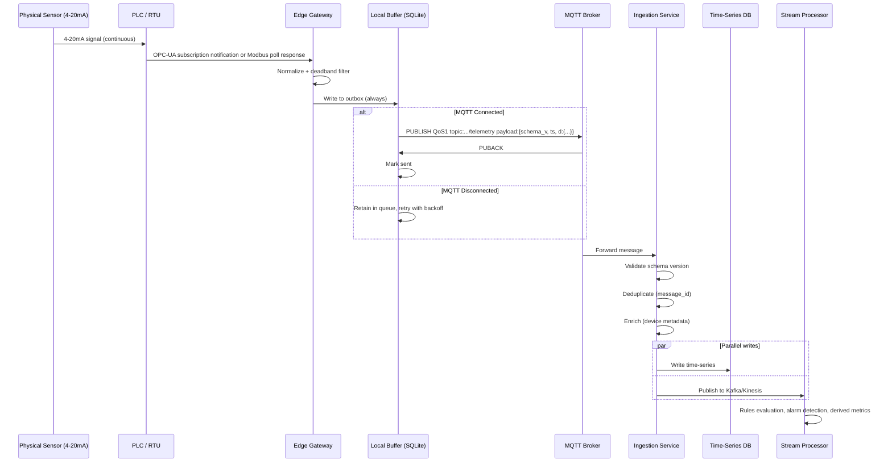

# Device-to-Cloud (D2C) Data Exchange

D2C is the primary data flow in any IoT system — the steady stream of telemetry, status, and events flowing upward from physical assets to the platform. It looks simple until you operate it at scale: 10,000 devices, each publishing every second, with varying firmware versions, intermittent connectivity, and a requirement that no data is silently lost.

The key design concerns for D2C are: **delivery reliability** (QoS + store-and-forward), **payload efficiency** (JSON vs binary, batching), **data quality propagation** (OPC-UA quality codes must travel with the value), and **backward-compatible schema evolution** (covered in §5). Get these right and D2C becomes a stable foundation. Get them wrong and you spend most of your time debugging data gaps and quality issues.

### 6.1 D2C Message Flow — Full Lifecycle



### 6.2 D2C Payload — Production-Grade Format

The payload format below represents a production-proven structure that satisfies the four key D2C concerns: every field earns its place. The nested `{v, q}` structure for each data point propagates OPC-UA quality codes alongside values — without quality codes, a dashboard cannot distinguish a genuine zero reading from a sensor failure. The `msg_id` (ULID) provides both deduplication and sortable traceability across the entire pipeline. The `seq` counter enables gap detection at the ingestion layer, which is the only reliable way to detect message loss that the broker-level QoS cannot catch.

```json
{
  "schema_version": "2.1",
  "msg_id": "01HX7K3NBVYD5V2Q3BZ8MNRZWK",
  "device_id": "P-007",
  "device_type": "centrifugal_pump",
  "ts": 1710844800123,
  "seq": 48291,
  "d": {
    "temp_inlet_c":   { "v": 72.4, "q": 192 },
    "temp_outlet_c":  { "v": 81.2, "q": 192 },
    "pressure_bar":   { "v": 4.2,  "q": 192 },
    "flow_m3h":       { "v": 142.7,"q": 192 },
    "vibration_rms":  { "v": 0.82, "q": 68  },
    "power_kw":       { "v": 18.4, "q": 192 }
  },
  "meta": {
    "fw_version": "2.3.1",
    "gw_id": "gw-detroit-l3-01",
    "source_ts": 1710844799980,
    "edge_latency_ms": 143
  }
}
```

**Why each field exists:**
```
msg_id:           ULID (sortable UUID) — deduplication, tracing, replay
schema_version:   Backend routes to correct decoder
seq:              Monotonic counter per device — detect gaps and reordering
ts:               Gateway timestamp (device may not have RTC)
source_ts:        PLC/sensor timestamp if available (better accuracy)
edge_latency_ms:  ts - source_ts — detect clock drift
d.v:              Value
d.q:              OPC-UA quality code — 192=Good, 0=Bad, 68=Uncertain
meta.gw_id:       Which gateway forwarded (useful for debugging)
```

**Flat format (for high-frequency / size-constrained):**
```json
{
  "v": "2.1",
  "id": "P-007",
  "t": 1710844800123,
  "ti": 72.4,
  "to": 81.2,
  "p":  4.2,
  "f":  142.7,
  "pw": 18.4
}
```
Use abbreviated keys when: payload size matters (LoRaWAN limit: 51-222 bytes) or message rate > 50k/s.

### 6.3 D2C Delivery Guarantees — Exactly What You Can Promise

Understanding what MQTT QoS actually guarantees — and what it explicitly does not — prevents a class of hard-to-debug production incidents. QoS 1 ("at least once") is often misread as "reliable delivery"; it means the broker received it, not that your database contains it. The gap between broker receipt and database write is where the real reliability work happens: deduplication by `msg_id`, gap detection by `seq`, and ingestion-layer retries. Design your guarantees at each hop independently rather than assuming end-to-end delivery from a single QoS setting.

```
QoS 1 (most IoT deployments):
  PROMISE: each message delivered at least once to the broker
  NOT PROMISED:
    - Delivery to the ingestion service (broker → consumer can fail)
    - No duplicates (must handle at consumer)
    - Order (MQTT does not guarantee cross-session ordering)

  Deduplication at ingestion:
    Redis SET with key: {device_id}:{msg_id}, TTL: 1 hour

    if redis.setnx(f"dedup:{device_id}:{msg_id}", "1", ex=3600):
        process(message)    # first time seen
    else:
        metrics.inc("duplicate_messages_dropped")

  Gap detection at ingestion:
    Track last_seq per device in Redis
    If msg.seq != last_seq + 1:
        gap = msg.seq - last_seq - 1
        log.warning(f"Gap detected: {gap} messages missing from {device_id}")
        metrics.inc("message_gaps", gap)
    redis.set(f"seq:{device_id}", msg.seq)
```

### 6.4 High-Frequency Telemetry — Waveform / Vibration Data

Some use cases (predictive maintenance, vibration analysis) require burst high-frequency data. This is a fundamentally different transport problem from steady-state telemetry: you are no longer sending individual readings but waveform captures that are orders of magnitude larger. MQTT is not designed for large binary payloads — broker limits are typically 256KB to a few MB, and chunking introduces reassembly complexity. The pattern below handles this with chunked MQTT for smaller captures and pre-signed URL direct upload for larger ones. In both cases, the MQTT channel remains for metadata and completion signals, while the bulk data takes a direct path to object storage.

```
Scenario: vibration sensor sampled at 10kHz for 1 second every minute
  Raw data: 10,000 samples × 4 bytes = 40KB per burst
  Cannot be sent as individual MQTT messages

Approach: chunked binary upload

Step 1: Device captures waveform
  samples = vibration_sensor.capture(duration_ms=1000, rate_hz=10000)
  # 10,000 float32 values

Step 2: Compress
  compressed = lz4.compress(struct.pack(f'{len(samples)}f', *samples))
  # typically 60-70% reduction

Step 3: Chunked upload via MQTT (if < 256KB total)
  chunk_size = 16384  # 16KB chunks
  total_chunks = ceil(len(compressed) / chunk_size)
  upload_id = str(uuid4())

  for i, chunk in enumerate(chunks(compressed, chunk_size)):
      broker.publish(
          topic=f"{base}/waveform/{upload_id}/chunk/{i}",
          payload=chunk,
          qos=1
      )

  broker.publish(
      topic=f"{base}/waveform/{upload_id}/complete",
      payload=json.dumps({
          "upload_id": upload_id,
          "total_chunks": total_chunks,
          "total_bytes": len(compressed),
          "sample_rate_hz": 10000,
          "sample_count": 10000,
          "format": "float32_le",
          "checksum_sha256": sha256(compressed)
      }),
      qos=1
  )

Step 4: Backend reassembles
  Collect chunks by upload_id
  Verify checksum
  Reassemble → store in blob storage (S3/Azure Blob)
  Write metadata (device, timestamp, sample_rate) to DB
  Trigger FFT analysis job

Alternative for large waveforms: pre-signed URL upload
  Device requests upload URL from backend API
  Device uploads directly to blob storage via HTTPS
  Sends completion notification via MQTT
```

---
