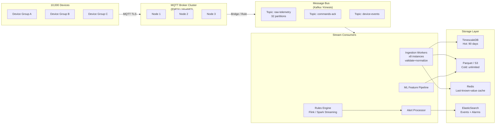

# Data Ingestion Pipelines

The ingestion pipeline is the path between "message arrives at the broker" and "data is queryable in the time-series database." It sounds like a simple write operation but at production scale it is a distributed system with its own failure modes, bottlenecks, and tuning surface.

The critical design decision is whether to write directly from MQTT to your database or to introduce a message bus (Kafka, Kinesis, Pulsar) in between. The message bus adds operational complexity but provides: consumer fan-out (multiple services processing the same stream independently), replay capability (re-process historical data after a bug fix), and decoupling (database can be down without losing messages). For deployments above ~5,000 devices or requiring multiple downstream consumers, the message bus is almost always worth it.

A second key decision is **schema validation at ingestion**. You can validate early (at the broker via auth hooks, or at the ingestion worker) or late (at query time). Validate early: bad data caught late costs more to remediate and may have already flowed into dashboards, alerts, and ML models.

### 9.1 Scalable Ingestion Architecture



### 9.2 Throughput Math — Sizing Your Pipeline

Pipeline sizing is one of the most common causes of production incidents in IoT platforms — not because engineers do not care, but because they use the wrong input numbers. The calculation below walks through a realistic mid-size plant deployment with all the factors that are typically forgotten: deadband filtering (which typically reduces traffic 60–80% from the raw poll rate), payload format choice (Protobuf vs JSON matters at this scale), and the distinction between broker capacity and database capacity. Run this calculation before committing to infrastructure, and add at least 3× headroom for burst traffic during connectivity restoration events.

```
Real-world calculation for a mid-size plant deployment:

  Devices:          2,000
  Tags per device:  15 (mix of fast and slow)
  Fast tags (temp, pressure, flow): 10 tags, 1s interval
  Slow tags (totals, setpoints):     5 tags, 60s interval

  Raw message rate:
    Fast: 2,000 × 10 × 1 msg/s  = 20,000 msg/s
    Slow: 2,000 × 5 / 60 msg/s  =    167 msg/s
    Total: ≈ 20,167 msg/s

  After deadband filtering (assume 70% reduction in steady state):
    Effective: ≈ 6,050 msg/s to broker

  Payload size:
    JSON (verbose): 350 bytes avg → 2.1 MB/s ingress
    JSON (compact):  200 bytes avg → 1.2 MB/s ingress
    Protobuf:         80 bytes avg → 0.48 MB/s ingress

  Daily volume (compact JSON):
    1.2 MB/s × 86,400s = 103 GB/day uncompressed
    With LZ4 compression: ≈ 25-35 GB/day on disk

  Kafka partition sizing:
    Target: 50,000 msg/s per partition (conservative)
    Partitions needed: ceil(6,050 / 50,000) = 2 → use 8 (for consumer parallelism)

  TimescaleDB sizing:
    6,050 rows/s × 86,400s = 522M rows/day
    At 50 bytes/row (compressed): ≈ 26 GB/day
    90-day hot storage: ≈ 2.3 TB

  Chunk interval for hypertable:
    time_bucket = '1 day' for 90-day retention
    chunk_time_interval = INTERVAL '1 day'
```

---
