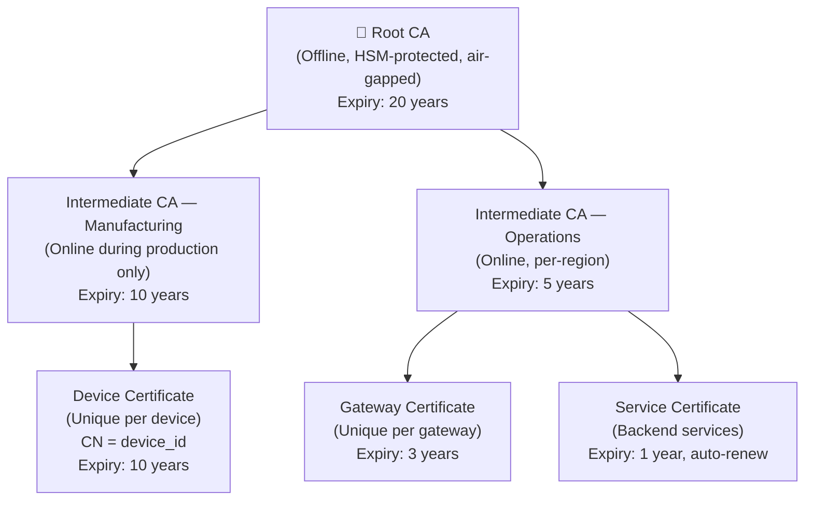
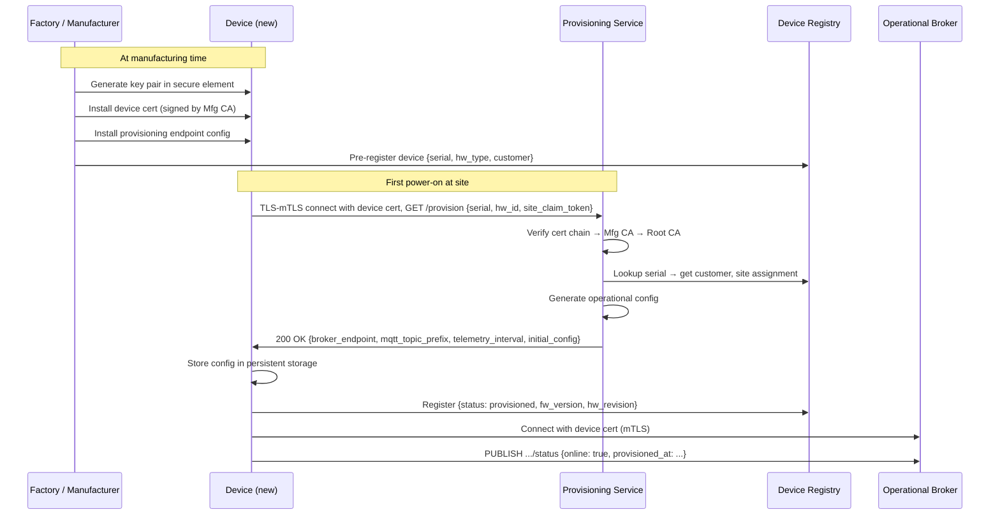

# Device Provisioning & Identity

### 8.1 PKI Hierarchy

The PKI hierarchy below is the trust foundation for the entire platform. Every device certificate, gateway certificate, and service certificate chains up to a single offline root CA. The separation into manufacturing and operations intermediate CAs is deliberate: the manufacturing CA is only online during device production, limiting the blast radius of a compromise. The operations CA issues shorter-lived certificates with automatic renewal, accepting that some operational complexity is the price of reducing the impact of a compromised certificate.

### 8.2 Zero-Touch Provisioning Flow

Zero-touch provisioning means a device can go from factory floor to operational state without a technician manually entering credentials, IP addresses, or certificates on site. This matters at scale: configuring 5,000 devices manually at deployment is a months-long project with high error rates. The sequence below splits provisioning into two phases: manufacturing time (key generation, certificate installation, pre-registration) and first-power-on (automated enrollment using the manufacturing certificate as the proof of identity). The site claim token is a one-time secret that links the device to the correct customer and site during enrollment.

---
