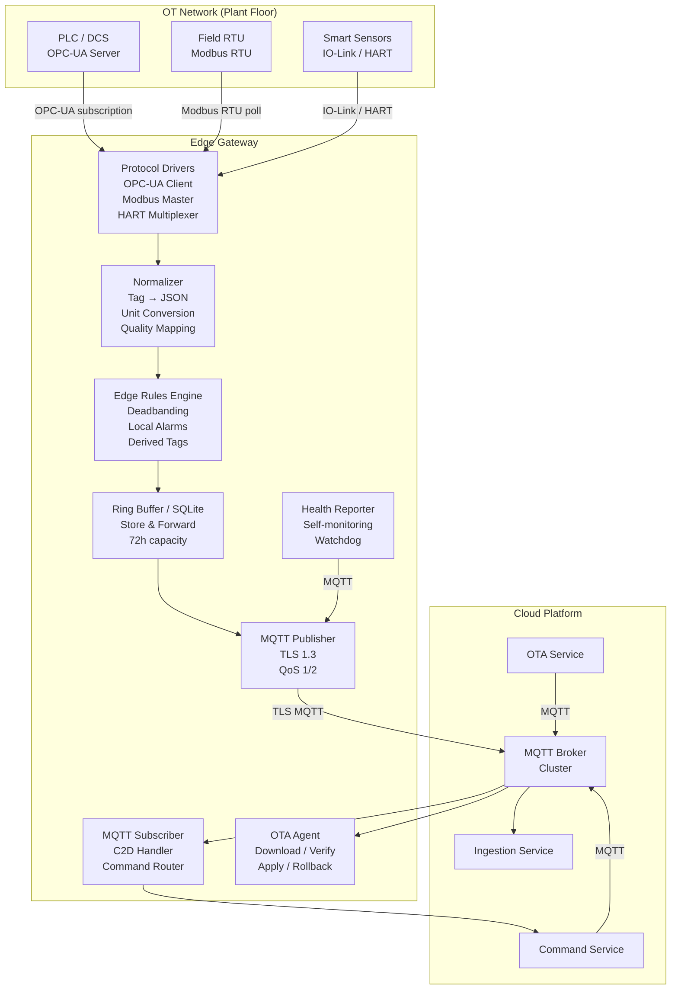

# Edge Layer: Gateways & Local Processing

### 3.1 Gateway Architecture — What It Actually Does



### 3.2 Store & Forward — Production Implementation

This is the feature most teams skip and regret. A gateway without store-and-forward is not an industrial gateway. The architectural principle is simple: **always write to local storage first, then forward**. The gateway treats the outbox as the source of truth, not the MQTT connection. This means connectivity becoming available or unavailable is a background concern — the data pipeline never stalls or drops messages because of it. In regulated industries (pharma, utilities), the ability to reconstruct a complete time-series across a connectivity outage is not optional — it is an audit requirement. Size your buffer for the worst-case outage your site has historically experienced, not the average.

```
Failure scenario without S&F:
  Factory loses internet for 3 hours.
  1,000 sensors generating 10 readings/minute.
  = 1,800,000 readings lost.
  Process engineers cannot reconstruct what happened during the outage.
  Regulatory compliance failure if this is pharma or utilities.

Implementation using SQLite WAL mode:

  Schema:
  CREATE TABLE outbox (
    id          INTEGER PRIMARY KEY AUTOINCREMENT,
    topic       TEXT NOT NULL,
    payload     BLOB NOT NULL,
    qos         INTEGER DEFAULT 1,
    created_at  INTEGER NOT NULL,  -- Unix milliseconds
    attempts    INTEGER DEFAULT 0,
    sent_at     INTEGER            -- NULL until sent
  );
  CREATE INDEX idx_outbox_unsent ON outbox(sent_at) WHERE sent_at IS NULL;

  Write path (always write to outbox first):
    BEGIN IMMEDIATE;
    INSERT INTO outbox (topic, payload, qos, created_at) VALUES (?, ?, ?, ?);
    COMMIT;

  Send path (background worker):
    SELECT id, topic, payload FROM outbox
    WHERE sent_at IS NULL
    ORDER BY created_at ASC
    LIMIT 100;                     -- batch for efficiency

    On MQTT publish ACK:
      UPDATE outbox SET sent_at = ? WHERE id = ?;

    On failure:
      UPDATE outbox SET attempts = attempts + 1 WHERE id = ?;
      -- Backoff: min(30s * 2^attempts, 3600s)

  Retention policy (avoid disk full):
    DELETE FROM outbox
    WHERE sent_at IS NOT NULL
    AND sent_at < (unixepoch() - 86400) * 1000;  -- keep sent for 24h

    DELETE FROM outbox
    WHERE sent_at IS NULL
    AND created_at < (unixepoch() - 259200) * 1000;  -- drop unsent > 72h
    -- LOG this as a data loss event with count

  Buffer sizing:
    required_bytes = data_rate_bytes_per_sec × outage_duration_sec × 1.3
    e.g., 500 devices × 200 bytes/msg × 1 msg/sec × 259200s × 1.3 = ~33 GB
    Use appropriate hardware: industrial SSD, not SD card
```

### 3.3 Edge Deadbanding — Reduce Cloud Traffic by 60-80%

Raw polling sends data every cycle regardless of change. Deadband filtering is essential at scale.

```python
class DeadbandFilter:
    """
    Only forward a value if it has changed by more than the deadband threshold
    or the max_interval has elapsed (ensures liveness even in stable processes).
    """
    def __init__(self, deadband_pct: float, max_interval_s: float = 60.0):
        self.deadband_pct = deadband_pct  # e.g., 0.5 = 0.5% of engineering range
        self.max_interval_s = max_interval_s
        self._last_sent: dict[str, tuple[float, float]] = {}  # tag -> (value, timestamp)

    def should_forward(self, tag: str, value: float, eng_range: float, now: float) -> bool:
        if tag not in self._last_sent:
            self._last_sent[tag] = (value, now)
            return True

        last_value, last_ts = self._last_sent[tag]
        deadband_abs = self.deadband_pct / 100.0 * eng_range
        value_changed = abs(value - last_value) >= deadband_abs
        interval_exceeded = (now - last_ts) >= self.max_interval_s

        if value_changed or interval_exceeded:
            self._last_sent[tag] = (value, now)
            return True
        return False

# Usage:
# filter = DeadbandFilter(deadband_pct=0.5, max_interval_s=60)
# if filter.should_forward("pump.temperature", 72.4, eng_range=200.0, now=time.time()):
#     publish_to_mqtt(...)
```

### 3.4 Platform Software Stack: Open Source vs. Cloud Managed

One of the most consequential early decisions in an IoT platform build is where to draw the line between self-managed open source and cloud-managed services. There is no universally correct answer — the right choice depends on your team's operational maturity, data sovereignty requirements, and scale. The table below reflects real-world tradeoffs, not marketing claims.

#### MQTT Brokers

The broker is the nervous system of your IoT platform. Choose carefully — migrating brokers is painful.

| Broker | Type | Strengths | Weaknesses | Scale | Best For |
|---|---|---|---|---|---|
| **Eclipse Mosquitto** | OSS, self-hosted | Lightweight, battle-tested, simple | No clustering (single node), limited auth plugins | ~100k connections | Dev/test, small deployments, edge broker |
| **EMQX** | OSS + Enterprise, self-hosted | Full clustering, MQTT 5.0, rule engine, rich plugins, Kubernetes-native | Enterprise features paid, complex ops at scale | 10M+ connections | Production at scale, Kubernetes-native stacks |
| **HiveMQ** | Enterprise, self-hosted / cloud | Enterprise-grade, excellent extensions, strong MQTT 5.0 | Expensive licensing | Millions of connections | Large enterprise, regulated industries |
| **VerneMQ** | OSS, self-hosted | Erlang/OTP clustering, strong consistency | Smaller community, harder to operate | ~1M connections | Telecom-grade reliability requirements |
| **AWS IoT Core** | Fully managed | Zero ops, deep AWS integration, scales infinitely | Vendor lock-in, per-message pricing adds up at scale, data stays in AWS | Unlimited | AWS-committed teams, variable workloads |
| **Azure IoT Hub** | Fully managed | Deep Azure integration, D2C/C2D built-in, DPS, excellent enterprise features | Lock-in, pricing at scale | Unlimited | Azure-committed, enterprise Microsoft shops |
| **Google Cloud IoT Core** | ⚠️ Deprecated Aug 2023 | — | Shut down — do not use | — | Migrate off |
| **Solace PubSub+** | Enterprise | Multi-protocol (MQTT, AMQP, JMS, REST), guaranteed delivery | Very expensive | High | Financial services, mission-critical |

> **Recommendation for most greenfield industrial projects:** Start with EMQX Community Edition (self-hosted, Kubernetes). If you are fully committed to AWS, use AWS IoT Core but budget for per-message costs at scale and plan your egress costs early.

#### Time-Series Databases

| Database | Type | Strengths | Weaknesses | Best For |
|---|---|---|---|---|
| **TimescaleDB** | OSS (PostgreSQL extension) | Full SQL, continuous aggregates, excellent compression, Postgres ecosystem | Requires Postgres ops expertise | General industrial IoT, complex queries |
| **InfluxDB v3 (IOx)** | OSS + Cloud | Purpose-built for time-series, line protocol, Flux/SQL, good UI | v2→v3 migration disruption, cloud pricing | Metrics-heavy, simpler data models |
| **QuestDB** | OSS | Extremely fast ingestion (1.6M rows/sec), SQL, low resource usage | Smaller community, fewer integrations | Ultra-high-frequency data |
| **Apache IoTDB** | OSS | Designed for IoT, hierarchical model, good compression | Newer ecosystem, less enterprise tooling | Large-scale industrial telemetry |
| **AWS Timestream** | Fully managed | Zero ops, scales automatically, integrates with QuickSight | Expensive at scale, limited SQL | AWS shops that want zero DB ops |
| **Azure Data Explorer (ADX)** | Fully managed | Extremely fast at petabyte scale, KQL powerful, good for analytics | Learning curve (KQL), cost at high write rates | Analytics-heavy, large Azure deployments |
| **OSIsoft PI / AVEVA PI** | Enterprise, licensed | Industry standard in process industries, PIMS ecosystem | Expensive, proprietary, historian-centric model | Brownfield process industries already using PI |

> **Recommendation:** TimescaleDB for most production deployments — it gives you the full power of PostgreSQL (JOINs, window functions, foreign keys) while handling time-series scale. Use continuous aggregates to pre-compute roll-ups and avoid raw-data queries on dashboards.

#### Edge Runtimes & Frameworks

| Runtime | Type | Strengths | Weaknesses | Best For |
|---|---|---|---|---|
| **Node-RED** | OSS | Rapid visual wiring, huge node library, quick to prototype | Not suitable for high-throughput, logic gets unwieldy at scale | Protocol bridging, low-volume, rapid PoC |
| **Eclipse Kura** | OSS (Java/OSGi) | Enterprise-grade plugin system, device management, remote config | Heavy Java footprint, slower to develop | Structured enterprise edge deployments |
| **AWS IoT Greengrass v2** | Managed (OSS core) | Managed OTA, Lambda + Docker components, cloud-synced | AWS lock-in, complex setup, resource-heavy | AWS-committed, managed fleet OTA critical |
| **Azure IoT Edge** | Managed (OSS core) | Module marketplace, managed OTA, tight Azure integration | Azure lock-in, Docker required (heavy for small devices) | Azure-committed, containerized workloads |
| **EdgeX Foundry** | OSS | Microservice architecture, vendor-neutral, device service abstraction | Complex to deploy, many moving parts | Flexible multi-vendor edge architectures |
| **Custom Go/Rust daemon** | Custom | Maximum performance, minimal footprint, full control | Development time, maintenance burden | High-throughput production with specific requirements |

> **Recommendation:** For production industrial gateways, a custom Go service (or Go + Node-RED for protocol bridging) typically outperforms framework-heavy options. Use AWS Greengrass or Azure IoT Edge if managed OTA and cloud integration justify the operational overhead. Avoid Node-RED in the critical path for production data flows above ~1k msg/s.

#### Schema Registries

| Tool | Type | Protocol Support | Best For |
|---|---|---|---|
| **Confluent Schema Registry** | OSS + Enterprise | Avro, JSON Schema, Protobuf | Kafka-centric pipelines, production standard |
| **AWS Glue Schema Registry** | Fully managed | Avro, JSON Schema, Protobuf | AWS Kafka (MSK) pipelines |
| **Apicurio Registry** | OSS | Avro, JSON Schema, Protobuf, OpenAPI | Self-hosted, multi-protocol |
| **Git + JSON Schema files** | DIY | JSON Schema | Small teams, simple schemas, full control |

---
