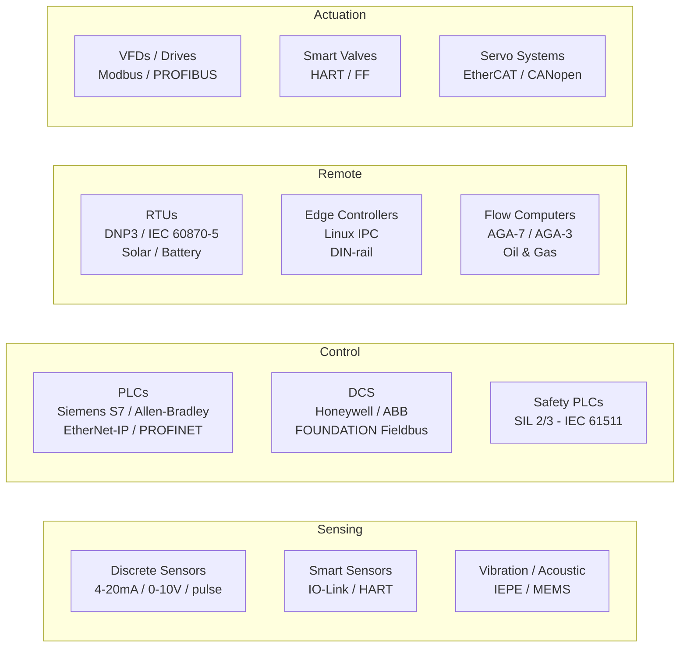
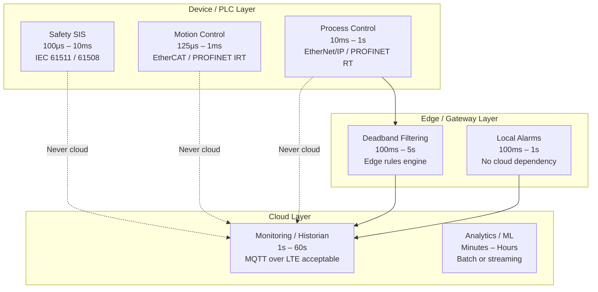

# Hardware Layer: Industrial Devices & Sensors

### 2.1 Device Taxonomy



### 2.2 Signal Types — What Engineers Actually Deal With

This is where most integration problems start. You receive a sensor spec sheet that says "4–20mA output" and assume it plugs straight into your system. It does not.

```
Analog Current Loop (4–20mA):
  4mA  = 0% of range (live zero — 0mA means wire break, not zero value)
  20mA = 100% of range
  Wire break detection: < 3.6mA → alarm
  Loop power: device powered by the loop current (2-wire sensors)
  Noise immunity: excellent — current doesn't change with wire resistance
  Max loop resistance: V_supply - V_device_min / 0.02A
    e.g., 24V supply, 12V device min: (24-12)/0.020 = 600Ω max cable

  Scaling formula:
    value = (raw_mA - 4.0) / (20.0 - 4.0) * (range_max - range_min) + range_min
    e.g., 12mA, range 0-200 bar: (12-4)/16 * 200 = 100 bar

HART (Highway Addressable Remote Transducer):
  Piggybacks FSK digital signal on 4-20mA loop
  Carrier: 1200Hz = logic 1, 2200Hz = logic 0, 1200 baud
  Master polls device: ~2 queries/second (do not poll faster)
  Provides: tag name, device type, engineering units, diagnostics, trim
  Wiring: no change — uses existing 4-20mA cable
  Critical gotcha: HART requires loop resistance ≥ 230Ω to work
    Most PLC input cards have < 50Ω — you need a HART multiplexer/modem

IO-Link (IEC 61131-9):
  Digital communication over standard 3-wire M12 cable
  Speeds: COM1=4.8kbps, COM2=38.4kbps, COM3=230.4kbps
  Point-to-point only (not a bus)
  Provides: process value + full parameterization + diagnostics
  IO-Link master: typically has 4-8 ports, connects to PLC via standard I/O
  IODD (IO-Link Device Description): XML device description — download from ifm/Sick/Balluff

  What you can read that 4-20mA can't give you:
    - Internal sensor temperature (detect drift)
    - Total operating hours
    - Calibration date
    - Detailed fault codes (not just "sensor fault")
```

### 2.3 Real-Time Constraints — Hard Numbers

Understanding the timing requirements of each control tier is the single most important thing you can do to prevent architectural mistakes. The most common error in IoT projects is routing a control decision through the cloud when the process requires a sub-second response. The numbers below are not targets — they are physics and safety standards. Any architecture that puts cloud latency in the path of these loops will fail, often dramatically. Pay particular attention to the absolute boundary: any loop requiring a response in under 500ms must be closed entirely at the PLC or edge device.

```
Control loop timing requirements by application:

  Safety instrumented functions (SIS):
    Response time: < 100ms (SIL 2), < 10ms (SIL 3)
    Standard: IEC 61511 / IEC 61508
    Architecture: fully independent from BPCS — never share networks

  Motion control (CNC, robotics, packaging):
    Servo loop: 125μs–1ms
    Position update: < 1ms
    Network: EtherCAT (< 100μs cycle), PROFINET IRT, Sercos III

  Process control (temperature, pressure, flow):
    PLC scan cycle: 10–100ms
    Control response: 100ms–1s acceptable for most loops
    Network: Standard Ethernet (EtherNet/IP, PROFINET RT)

  Monitoring / historian:
    Sample rate: 1s–60s depending on process dynamics
    Latency: minutes acceptable for cloud historian
    Network: Any — MQTT over LTE acceptable

  RULE: Any loop requiring < 500ms response time stays at edge/PLC.
  Cloud is NEVER in a control loop. Not even "fast" cloud.
```

**Control loop timing hierarchy — where each tier belongs:**



### 2.4 Top Hardware Choices by Category

Choosing hardware is not just a technical decision — it is a 10–20 year commitment. Industrial hardware outlasts software stacks by a wide margin. The table below reflects what is actually deployed in production environments, not just what vendors market.

**PLCs & Controllers:**

| Vendor / Model | Strengths | Watch-outs | Native IoT Path |
|---|---|---|---|
| **Siemens S7-1500** | Best OPC-UA support, TIA Portal integration, large install base | Expensive, proprietary ecosystem | OPC-UA server built-in (CPU 1511+) |
| **Allen-Bradley ControlLogix** | Dominant in North America, strong EtherNet/IP | Rockwell ecosystem lock-in, Kepware often needed | EtherNet/IP + CIP, use Kepware or pycomm3 |
| **Beckhoff CX-series** | PC-based (Windows CE/Linux), EtherCAT native, very flexible | Smaller support network | TwinCAT OPC-UA server |
| **Schneider Modicon M580** | Strong in process industries, Ethernet-native | OPC-UA support varies by CPU | OPC-UA or REST API (newer models) |
| **Phoenix Contact PLCnext** | Linux-based, open, cloud-native design | Smaller market share | MQTT and REST native, Node-RED support |
| **Codesys Runtime (multi-vendor)** | Open standard, runs on many IPCs | Varies by OEM implementation | OPC-UA via Codesys runtime |

**Edge Gateway Hardware:**

| Device | CPU / OS | Best For | I/O Options |
|---|---|---|---|
| **Moxa UC-8100** | ARM, Debian Linux | Rugged remote, DIN-rail, -40°C | RS-232/485, LTE, Wi-Fi |
| **Advantech UNO-2372G** | Intel x86, Ubuntu | High compute edge, multiple protocols | PCIe expansion, lots of I/O |
| **Siemens SIMATIC IPC227G** | Intel Atom, Windows/Linux | Siemens-heavy plants, TIA integration | PROFINET, industrial hardening |
| **Raspberry Pi CM4 (industrial carrier)** | ARM, Linux | Cost-sensitive, lower criticality | Flexible via HATs, not -40°C rated |
| **Toradex Colibri / Apalis** | ARM SoM, Linux | OEM embedded products | Customizable carrier boards |
| **Dell Edge Gateway 3200** | Intel x86, Ubuntu Core | High-compute, managed OTA via Dell | PCIe, lots of USB, DIN-rail option |

**RTUs & Remote Field Devices:**

| Device | Protocols | Connectivity | Use Case |
|---|---|---|---|
| **Emerson ROC809** | Modbus, HART, AGA-7 | Serial, Ethernet, cellular | Oil & gas flow measurement |
| **ABB RTU560** | DNP3, IEC 60870-5-101/104 | Serial, Ethernet, fibre | Power substations |
| **Yokogawa STARDOM** | Modbus, OPC-UA, FOUNDATION Fieldbus | Ethernet, serial | Remote process control |
| **Particle Tracker** | Custom, MQTT | LTE-M, GPS | Asset tracking, mobile RTU |
| **Digi WR44R** | Modbus, MQTT gateway | 4G LTE dual-SIM | Industrial router + protocol bridge |

**Wireless Sensor Nodes:**

| Platform | Protocol | Range | Power | Best For |
|---|---|---|---|---|
| **Emerson Wireless 1420 + 648** | WirelessHART | 100m mesh | Battery 5-10yr | Process sensor retrofit |
| **Multitech mDot** | LoRaWAN | 5km+ | Battery 5yr+ | Remote environmental monitoring |
| **Nordic nRF9160** | LTE-M/NB-IoT | Cellular | Battery 2-5yr | GPS + sensor combo |
| **ESP32-S3 (custom)** | Wi-Fi, BLE, MQTT | 50m | Mains / rechargeable | High-compute custom devices |
| **STM32WL** | LoRa, sub-GHz | 5km+ | Ultra-low power | Long-range sub-GHz sensor |

### 2.5 Industrial Hardware Configuration — Practical Examples

**Siemens S7-1500 PLC to OPC-UA:**
```
Hardware configuration (TIA Portal):
  1. CPU properties → OPC UA → Server → Enable OPC UA server
  2. Set endpoint: opc.tcp://192.168.1.10:4840
  3. Security policy: Basic256Sha256, mode: SignAndEncrypt (never None in prod)
  4. Activate "Allow anonymous access": NO
  5. Create OPC UA server interface:
     - Add variables to expose (drag from PLC tag table)
     - Set access: ReadOnly for sensors, ReadWrite for setpoints only
  6. Certificate management:
     - Generate server cert in TIA Portal
     - Trust the OPC-UA client cert on the PLC
     - Trust the PLC cert on the client

  Common failure: PLC's OPC-UA server rejects client connection
    → Check cert trust store on both sides
    → Check security policy mismatch (client vs server)
    → Firewall: ensure TCP 4840 open from gateway to PLC

Allen-Bradley ControlLogix to EtherNet/IP:
  Tag access via Logix5000 implicit/explicit messaging
  Explicit: read/write specific tags on demand (our use case for IoT)
  Library: pycomm3 (Python), libplctag (C/C++), Kepware OPC server

  # Python example using pycomm3
  from pycomm3 import LogixDriver
  with LogixDriver('192.168.1.20') as plc:
      tags = plc.read('Pump_007.Temperature', 'Pump_007.Pressure', 'Pump_007.Speed')
      # Returns: [Tag(Pump_007.Temperature, 72.4, REAL), ...]
```

---
