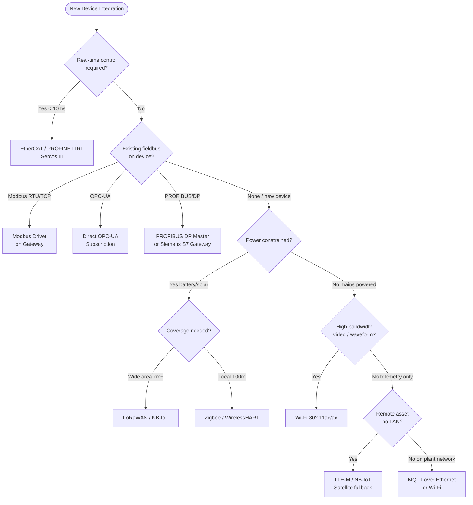
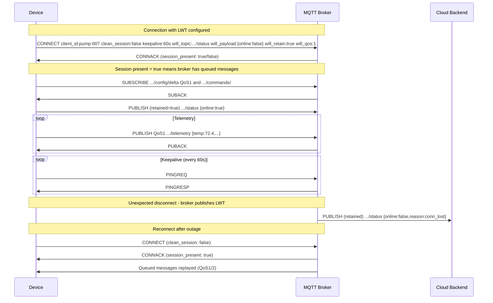
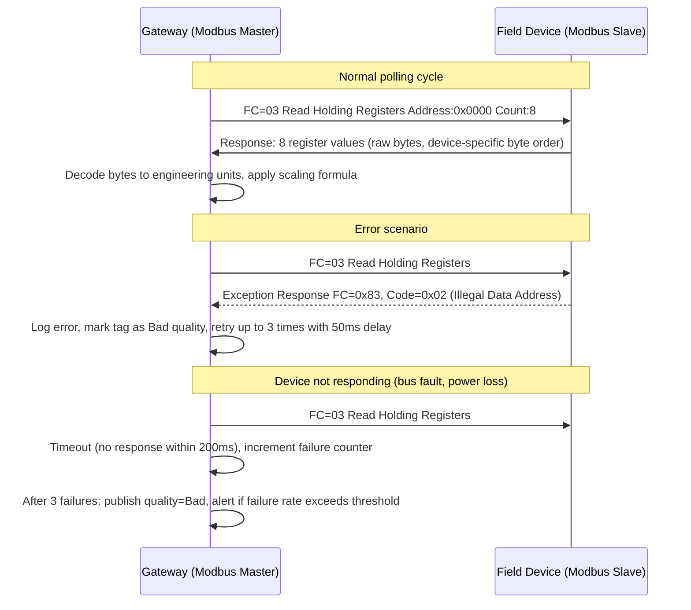

# Communication Protocols: Deep Dive

### 4.1 Protocol Selection Decision Tree



### 4.2 MQTT — Everything You Need to Know for Production

#### Connection Lifecycle



#### QoS Decision Guide — With Real Consequences

QoS selection has real operational consequences that compound at scale. A wrong choice is not a configuration detail — it is either a data loss risk (QoS too low) or a performance bottleneck (QoS too high). The guide below maps each level to specific IoT use cases with concrete failure scenarios. Note that QoS 2 is often misunderstood: it provides exactly-once delivery at the MQTT protocol level, but your consumer must still be idempotent because broker-to-consumer delivery is a separate concern.

```
QoS 0 — Fire and Forget:
  Use for:
    → High-frequency raw sensor data (1Hz+) where loss is acceptable
    → Metrics where the next reading makes a lost one irrelevant
  Do NOT use for:
    → Commands, configuration, alarms, anything stateful
  Real consequence of wrong choice:
    → QoS 0 over an unreliable LTE link loses 5-10% of readings.
       For a billing meter, that's revenue loss.

QoS 1 — At Least Once:
  Use for:
    → Most telemetry that matters
    → Alarms, events, command responses
    → Config acknowledgements
  Gotcha: duplicates ARE delivered. Your consumer must be idempotent.
    → Use message_id + device_id as deduplication key
    → Store in Redis SET with TTL, check before processing

QoS 2 — Exactly Once:
  Use for:
    → Billing / metering data
    → Audit trail records
    → Financial or regulatory compliance telemetry
  Cost: 4 network round-trips per message
  At 10,000 msg/s, the overhead is significant — test before committing
  Broker must support QoS 2 fully (not all do — verify your broker)
```

#### Topic Design — The ISA-95 Aligned Standard

```
Structure: {enterprise}/{site}/{area}/{line}/{device_type}/{device_id}/{data_class}/{tag}

Production example (discrete manufacturing):
  acme-corp/plant-detroit/body-shop/line-3/pump/P-007/telemetry
  acme-corp/plant-detroit/body-shop/line-3/pump/P-007/telemetry/temperature
  acme-corp/plant-detroit/body-shop/line-3/pump/P-007/status
  acme-corp/plant-detroit/body-shop/line-3/pump/P-007/commands/{cmd_id}
  acme-corp/plant-detroit/body-shop/line-3/pump/P-007/commands/{cmd_id}/ack
  acme-corp/plant-detroit/body-shop/line-3/pump/P-007/config/desired
  acme-corp/plant-detroit/body-shop/line-3/pump/P-007/config/reported
  acme-corp/plant-detroit/body-shop/line-3/pump/P-007/ota/notification
  acme-corp/plant-detroit/body-shop/line-3/pump/P-007/ota/status

Wildcard subscriptions for operations:
  acme-corp/plant-detroit/+/+/+/+/status         → All device status, one plant
  acme-corp/#                                      → Everything (use only for debug)
  acme-corp/+/body-shop/line-3/pump/+/telemetry   → All pump telemetry, line 3

Rules that production has taught:
  1. Never use # in production consumer subscriptions — scopes too broad
  2. Device_id in topic must match MQTT client_id and TLS cert CN
  3. No spaces, no special chars in topic segments (use hyphens)
  4. Keep depth ≤ 7 levels — deeper is hard to manage with wildcards
  5. Always include device_type in hierarchy — allows type-based fanout
```

### 4.3 OPC-UA — Production Integration Patterns

OPC-UA is not just "better Modbus." It is a full information modeling framework. Most teams use 5% of it.

```mermaid
sequenceDiagram
    participant GW as Edge Gateway (OPC-UA Client)
    participant PLC as Siemens S7-1500 (OPC-UA Server)

    Note over GW,PLC: 1. Session establishment
    GW->>PLC: OpenSecureChannel [Basic256Sha256, SignAndEncrypt]
    PLC->>GW: SecureChannelId + token
    GW->>PLC: CreateSession [sessionName, clientCert]
    PLC->>GW: SessionId + serverNonce
    GW->>PLC: ActivateSession [userIdentityToken + signature]
    PLC->>GW: ActivateSession OK

    Note over GW,PLC: 2. Browse address space (once on connect)
    GW->>PLC: Browse [ns=0;i=85 Objects folder]
    PLC->>GW: BrowseResult [PLC_Program, DeviceSet ...]
    GW->>PLC: TranslateBrowsePathsToNodeIds [Pump_007.Temperature_PV]
    PLC->>GW: NodeId ns=3;i=1042

    Note over GW,PLC: 3. Create subscription (push, not poll)
    GW->>PLC: CreateSubscription [publishingInterval=1000ms, lifetime=10]
    PLC->>GW: SubscriptionId=42
    GW->>PLC: CreateMonitoredItems [nodeId=ns=3;i=1042, deadband=0.5%]
    PLC->>GW: MonitoredItemId=1

    Note over GW,PLC: 4. Data change notifications
    loop On value change exceeding deadband
        PLC->>GW: Publish [value=72.4, quality=Good, ts=2026-03-19T14:22:00Z]
        GW->>PLC: PublishRequest [ack seqNo]
    end

    Note over GW,PLC: 5. Keep-alive when no changes
    PLC->>GW: Publish [keepAlive, no data]
```

The OPC-UA subscription model is far more efficient than polling — the server only sends data when values change (or when the keep-alive fires). However, the subscription parameters below must be tuned to your network and process dynamics. Default values from client libraries are rarely correct for production: default publishingInterval is often 500ms (too fast for slow process variables, too slow for high-speed machinery), and default queueSize of 1 causes data loss on slow or intermittent connections. Treat these as per-tag configuration, not system-wide defaults.

**Critical OPC-UA configuration parameters that matter in production:**

```
Server-side subscription tuning:
  publishingInterval:    1000ms   # How often server sends notifications
  samplingInterval:       500ms   # How often server samples the value
                                  # samplingInterval ≤ publishingInterval
  queueSize:               10     # Items buffered if client misses a publish
                                  # For alarms: set higher (50-100)
  lifetimeCount:           10     # Publish cycles before subscription expires
                                  # = 10 × 1000ms = 10s without client poll
  maxKeepAliveCount:        3     # Keep-alives before subscription expires
  maxNotificationsPerPublish: 0   # 0 = no limit (careful on low-bandwidth links)

Deadband on OPC-UA side (saves bandwidth from PLC → gateway):
  AbsoluteDeadband:  tag value changes reported only if |new-old| > threshold
  PercentDeadband:   as % of engineering range (EURange attribute must be set)

  Set EURange on PLC tags:
    TIA Portal → Tag properties → OPC UA → Engineering Unit Range
    min: 0.0, max: 200.0 (for a 0-200°C sensor)
    Then: PercentDeadband = 0.5 = only report if temperature changes > 1.0°C

Session keepalive:
  requestedSessionTimeout: 30000ms  # Session expires if client disconnects > 30s
  On reconnect: re-establish session (subscriptions are lost)
  Pattern: client maintains subscription ID map, re-creates on reconnect
```

### 4.4 Modbus — The Inescapable Legacy Protocol

You will encounter Modbus on every industrial project. Master it. Modbus was standardized in 1979 and has no built-in authentication, encryption, or error recovery beyond a basic CRC. Despite this, it remains the most widely deployed industrial protocol in the world because it is simple, deterministic, and runs on cheap hardware. In practice, Modbus integration failures are almost never caused by the protocol itself — they are caused by byte-order mismatches (big-endian vs word-swapped), incorrect register address offsets (0-based vs 1-based), and polling too fast for the RS-485 bus capacity. Get the register map from the vendor, read it carefully, and verify with a Modbus tester before writing production code.

```
Register map reading — step by step:

Step 1: Get the device register map (from vendor documentation)
  Example: Siemens SITRANS P DS III pressure transmitter
    Register 1 (40001): Measured value — FLOAT32, AB CD byte order
    Register 3 (40003): Status word — UINT16
    Register 5 (40005): Range upper — FLOAT32, AB CD
    Register 7 (40007): Range lower — FLOAT32, AB CD

Step 2: Read the registers
  FC=03 (Read Holding Registers)
  Start address: 0 (register 40001 = address 0 in protocol)
  Count: 8 (read registers 0-7, 4 FLOAT32 values)

Step 3: Decode (byte order trap — check your device!)
  Raw bytes returned: 42 90 00 00 (big-endian FLOAT32)
  = 0x42900000 = 72.0 in IEEE 754

  If device uses "word-swapped" format (some older devices):
    Raw: 00 00 42 90 → swap words → 42 90 00 00 = 72.0

Step 4: Apply scaling (some devices return raw counts, not engineering units)
  raw_value = 26214  (16-bit count)
  scaled = raw_value / 65535.0 * (range_upper - range_lower) + range_lower
  = 26214 / 65535.0 * (100 - 0) + 0 = 40.0 bar

Polling rate gotchas:
  RS-485 bus at 9600 baud, 1 device:
    Request packet:  8 bytes × 10 bits/byte = 80 bits
    Response (8 regs): 21 bytes × 10 bits = 210 bits
    Total: 290 bits / 9600 = 30ms per transaction
    Safe poll rate: 100ms (gives 3× margin for retries)

  RS-485 bus at 9600 baud, 10 devices:
    10 × 30ms = 300ms minimum
    Safe poll rate: 1000ms per device

  Error handling in production:
    Retry: 3 attempts with 50ms delay
    After 3 failures: mark tag as Bad quality, publish with quality code
    Log every failure with device address and function code
    Alert ops if failure rate > 5% over 5 minutes
```

**Modbus master/slave request-response flow:**



---
