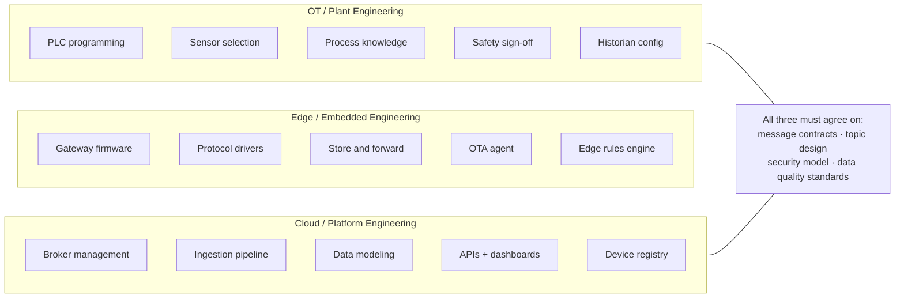

# Industrial IoT Platform Engineering
## Reference Architecture for Production-Grade Connected Systems

**Version:** 2.0
**Scope:** Platform-agnostic, industrial-grade, production-proven
**Audience:** Senior engineers and architects designing, integrating, or operating industrial IoT systems at scale

> **How to use this guide:** Each section is self-contained but builds on prior sections. Jump directly to a section when troubleshooting. Read sequentially when designing from scratch. Every pattern here has been derived from real production failures and hard-won operational experience.

---

## Table of Contents

1. [IoT Architecture: The Full Stack](#1-iot-architecture-the-full-stack)
2. [Hardware Layer: Industrial Devices & Sensors](#2-hardware-layer-industrial-devices--sensors)
3. [Edge Layer: Gateways, Runtimes & Platform Choices](#3-edge-layer-gateways--local-processing)
4. [Communication Protocols: Deep Dive](#4-communication-protocols-deep-dive)
5. [Contract Design & Schema Evolution](#5-contract-design--schema-evolution)
6. [Device-to-Cloud (D2C) Data Exchange](#6-device-to-cloud-d2c-data-exchange)
7. [Cloud-to-Device (C2D) Command Exchange](#7-cloud-to-device-c2d-command-exchange)
8. [Device Provisioning & Identity](#8-device-provisioning--identity)
9. [Data Ingestion Pipelines](#9-data-ingestion-pipelines)
10. [Data Modeling for IoT](#10-data-modeling-for-iot)
11. [Integration Patterns](#11-integration-patterns)
12. [OTA Firmware Updates: End-to-End](#12-ota-firmware-updates-end-to-end)
13. [Security Architecture](#13-security-architecture)
14. [Observability & Operations](#14-observability--operations)
15. [Reference Architectures](#15-reference-architectures)
16. [Operational Runbooks](#16-operational-runbooks)
17. [Digital Twin & Asset Modeling](#17-digital-twin--asset-modeling)
18. [Edge ML & Inference](#18-edge-ml--inference)
19. [Fleet Management at Scale](#19-fleet-management-at-scale)
20. [Multi-Site & Multi-Tenant Architecture](#20-multi-site--multi-tenant-architecture)
21. [API Design & Developer Experience](#21-api-design--developer-experience)
22. [Disaster Recovery & Business Continuity](#22-disaster-recovery--business-continuity)
23. [Regulatory Compliance](#23-regulatory-compliance)
24. [Cost Modeling & FinOps](#24-cost-modeling--finops)

**Appendices:**
- [A: Protocol Quick Reference](#appendix-a-protocol-quick-reference)
- [B: OPC-UA Quality Codes](#appendix-b-opc-ua-quality-codes-reference)
- [C: Schema Compatibility Matrix](#appendix-c-schema-version-compatibility-matrix)
- [D: Extension Roadmap](#appendix-d-whats-missing--extension-roadmap)

---

## Preface: Why Industrial IoT Is Hard

Before diving into protocols and schemas, it is worth grounding this in business reality. Industrial IoT sits at the intersection of two worlds that were never designed to work together — and the gap between them is where most projects stall.

### Key Industries & Domains

| Industry | Primary IoT Use Cases | Scale | Dominant Protocols |
|---|---|---|---|
| **Discrete Manufacturing** | OEE monitoring, predictive maintenance, quality traceability | 100s–10,000s of devices per plant | OPC-UA, EtherNet/IP, PROFINET |
| **Process / Chemicals** | Process optimization, emissions monitoring, safety compliance | 1,000s of sensors per site | HART, FOUNDATION Fieldbus, OPC-UA |
| **Oil & Gas** | Pipeline integrity, well monitoring, tank gauging, HSE | Remote, solar-powered, low bandwidth | Modbus, DNP3, LoRaWAN, Satellite |
| **Utilities (Power/Water)** | SCADA modernization, demand response, outage detection | Grid-scale, millions of endpoints | DNP3, IEC 60870-5, IEC 61968 |
| **Pharma / Life Sciences** | Environmental monitoring, batch traceability, cold chain | Strict compliance (21 CFR Part 11) | OPC-UA, Modbus, ISA-88 |
| **Smart Buildings / HVAC** | Energy management, occupancy, predictive maintenance | 100s–1,000s per building | BACnet, Modbus, Zigbee, KNX |
| **Logistics / Cold Chain** | Asset tracking, temperature monitoring, dock management | Mobile, GPS-dependent | BLE, LoRaWAN, LTE-M, MQTT |
| **Mining** | Equipment health, ventilation, blasting control | Harsh, underground, intermittent | Modbus, PROFIBUS, LTE private networks |

### Key Business Challenges Teams Actually Face

Understanding the business pain behind the technology prevents over-engineering and misaligned priorities.

**The OT/IT culture gap is the #1 project killer.**
OT teams (plant engineers, process engineers) have operated independently for decades. They are rightly cautious about any change to systems that control physical processes. IT teams move fast and break things — a philosophy that will result in actual broken things in an industrial environment. Successful projects establish clear ownership boundaries early: OT owns the control layer; IT/cloud owns the data layer. The edge gateway is the demilitarized zone between them.

**Legacy equipment does not disappear.**
A plant built in 1995 has PLCs from 1995. A refinery has instruments that predate the internet. Budget decisions rarely allow full hardware replacement. Any IoT platform that cannot integrate with Modbus, PROFIBUS, and HART from day one will fail to get traction. The real world is brownfield, not greenfield.

**Data quality, not data volume, is the actual problem.**
Most teams start by thinking "how do we get more data to the cloud?" The harder question is "how do we know the data is correct?" A temperature sensor with a failed heater tracing reads 18°C in a process that should be at 80°C. Without quality codes, alarm management, and sensor health monitoring, dashboards display wrong numbers with high confidence.

**Compliance and safety are non-negotiable constraints.**
IoT projects in regulated industries (pharma, nuclear, oil & gas) must satisfy auditors, not just engineers. Data integrity, audit trails, access control, and change management are not optional features — they are launch blockers. Build them in from the start.

**The total cost of operations is underestimated.**
A pilot with 50 devices looks easy. A production deployment with 5,000 devices across 10 sites creates: firmware version sprawl, certificate expiry incidents, connectivity monitoring, per-device configuration drift, and remote troubleshooting workflows. OTA, observability, and fleet management are not nice-to-haves — they are what separates a pilot from a product.

### Typical Team Structure & Ownership

---

## IoT Architecture: The Full Stack

Industrial IoT systems span five distinct layers. Each has its own failure modes, latency requirements, and operational concerns. Never conflate them — the most common architectural mistakes come from blurring these boundaries.

### 1.1 Why Layer Separation Matters in Production

In a real factory deployment a critical lesson repeats itself: teams collapse Layer 3 (edge) and Layer 4 (cloud) into a single "IoT platform" and then discover that:
- The factory loses internet for 4 hours and all sensor data is gone — because there was no store-and-forward at the edge
- A cloud rule engine fires a command to a PLC 800ms after the sensor condition, but the PLC scan cycle is 10ms — the response came 80 cycles too late
- A firmware bug in the gateway bricks 200 devices simultaneously because there was no staged rollout

**The layers are not just logical — they map to physical failure domains, ownership boundaries, and latency contracts.**

### 1.2 Key Architectural Tensions

| Tension | Industrial Default | Naive Default | Why It Matters |
|---|---|---|---|
| Latency vs. throughput | Low latency at edge, batch at cloud | Everything to cloud first | Control loops cannot tolerate cloud round-trips |
| Online vs. offline | Must work fully offline | Always-connected assumption | Factory floors lose connectivity — plan for 72h outages |
| Open vs. proprietary | Both coexist permanently | Standardize everything | Modbus from 1979 is still on your factory floor |
| Push vs. poll | Event-driven push | Polling everything | Polling at scale kills network and battery |
| Schema flexibility vs. contract | Strict contracts + versioning | Schema-on-read / loose JSON | Loose schemas cause silent data corruption at scale |
| Edge compute vs. cloud compute | Edge for latency, cloud for analytics | Cloud for everything | Edge ML inference is real; round-trip for classification is not |

---
