# Industrial IoT Platform Engineering
## Reference Architecture for Production-Grade Connected Systems

**Version:** 2.0
**Scope:** Platform-agnostic, industrial-grade, production-proven
**Audience:** Senior engineers and architects designing, integrating, or operating industrial IoT systems at scale

> **How to use this guide:** Each section is self-contained but builds on prior sections. Jump directly to a section when troubleshooting. Read sequentially when designing from scratch. Every pattern here has been derived from real production failures and hard-won operational experience.

---

## Table of Contents

1. [IoT Architecture: The Full Stack](#1-iot-architecture-the-full-stack)
2. [Hardware Layer: Industrial Devices & Sensors](#2-hardware-layer-industrial-devices--sensors)
3. [Edge Layer: Gateways, Runtimes & Platform Choices](#3-edge-layer-gateways--local-processing)
4. [Communication Protocols: Deep Dive](#4-communication-protocols-deep-dive)
5. [Contract Design & Schema Evolution](#5-contract-design--schema-evolution)
6. [Device-to-Cloud (D2C) Data Exchange](#6-device-to-cloud-d2c-data-exchange)
7. [Cloud-to-Device (C2D) Command Exchange](#7-cloud-to-device-c2d-command-exchange)
8. [Device Provisioning & Identity](#8-device-provisioning--identity)
9. [Data Ingestion Pipelines](#9-data-ingestion-pipelines)
10. [Data Modeling for IoT](#10-data-modeling-for-iot)
11. [Integration Patterns](#11-integration-patterns)
12. [OTA Firmware Updates: End-to-End](#12-ota-firmware-updates-end-to-end)
13. [Security Architecture](#13-security-architecture)
14. [Observability & Operations](#14-observability--operations)
15. [Reference Architectures](#15-reference-architectures)
16. [Operational Runbooks](#16-operational-runbooks)
17. [Digital Twin & Asset Modeling](#17-digital-twin--asset-modeling)
18. [Edge ML & Inference](#18-edge-ml--inference)
19. [Fleet Management at Scale](#19-fleet-management-at-scale)
20. [Multi-Site & Multi-Tenant Architecture](#20-multi-site--multi-tenant-architecture)
21. [API Design & Developer Experience](#21-api-design--developer-experience)
22. [Disaster Recovery & Business Continuity](#22-disaster-recovery--business-continuity)
23. [Regulatory Compliance](#23-regulatory-compliance)
24. [Cost Modeling & FinOps](#24-cost-modeling--finops)

**Appendices:**
- [A: Protocol Quick Reference](#appendix-a-protocol-quick-reference)
- [B: OPC-UA Quality Codes](#appendix-b-opc-ua-quality-codes-reference)
- [C: Schema Compatibility Matrix](#appendix-c-schema-version-compatibility-matrix)
- [D: Extension Roadmap](#appendix-d-whats-missing--extension-roadmap)

---

## Preface: Why Industrial IoT Is Hard

Before diving into protocols and schemas, it is worth grounding this in business reality. Industrial IoT sits at the intersection of two worlds that were never designed to work together — and the gap between them is where most projects stall.

### Key Industries & Domains

| Industry | Primary IoT Use Cases | Scale | Dominant Protocols |
|---|---|---|---|
| **Discrete Manufacturing** | OEE monitoring, predictive maintenance, quality traceability | 100s–10,000s of devices per plant | OPC-UA, EtherNet/IP, PROFINET |
| **Process / Chemicals** | Process optimization, emissions monitoring, safety compliance | 1,000s of sensors per site | HART, FOUNDATION Fieldbus, OPC-UA |
| **Oil & Gas** | Pipeline integrity, well monitoring, tank gauging, HSE | Remote, solar-powered, low bandwidth | Modbus, DNP3, LoRaWAN, Satellite |
| **Utilities (Power/Water)** | SCADA modernization, demand response, outage detection | Grid-scale, millions of endpoints | DNP3, IEC 60870-5, IEC 61968 |
| **Pharma / Life Sciences** | Environmental monitoring, batch traceability, cold chain | Strict compliance (21 CFR Part 11) | OPC-UA, Modbus, ISA-88 |
| **Smart Buildings / HVAC** | Energy management, occupancy, predictive maintenance | 100s–1,000s per building | BACnet, Modbus, Zigbee, KNX |
| **Logistics / Cold Chain** | Asset tracking, temperature monitoring, dock management | Mobile, GPS-dependent | BLE, LoRaWAN, LTE-M, MQTT |
| **Mining** | Equipment health, ventilation, blasting control | Harsh, underground, intermittent | Modbus, PROFIBUS, LTE private networks |

### Key Business Challenges Teams Actually Face

Understanding the business pain behind the technology prevents over-engineering and misaligned priorities.

**The OT/IT culture gap is the #1 project killer.**
OT teams (plant engineers, process engineers) have operated independently for decades. They are rightly cautious about any change to systems that control physical processes. IT teams move fast and break things — a philosophy that will result in actual broken things in an industrial environment. Successful projects establish clear ownership boundaries early: OT owns the control layer; IT/cloud owns the data layer. The edge gateway is the demilitarized zone between them.

**Legacy equipment does not disappear.**
A plant built in 1995 has PLCs from 1995. A refinery has instruments that predate the internet. Budget decisions rarely allow full hardware replacement. Any IoT platform that cannot integrate with Modbus, PROFIBUS, and HART from day one will fail to get traction. The real world is brownfield, not greenfield.

**Data quality, not data volume, is the actual problem.**
Most teams start by thinking "how do we get more data to the cloud?" The harder question is "how do we know the data is correct?" A temperature sensor with a failed heater tracing reads 18°C in a process that should be at 80°C. Without quality codes, alarm management, and sensor health monitoring, dashboards display wrong numbers with high confidence.

**Compliance and safety are non-negotiable constraints.**
IoT projects in regulated industries (pharma, nuclear, oil & gas) must satisfy auditors, not just engineers. Data integrity, audit trails, access control, and change management are not optional features — they are launch blockers. Build them in from the start.

**The total cost of operations is underestimated.**
A pilot with 50 devices looks easy. A production deployment with 5,000 devices across 10 sites creates: firmware version sprawl, certificate expiry incidents, connectivity monitoring, per-device configuration drift, and remote troubleshooting workflows. OTA, observability, and fleet management are not nice-to-haves — they are what separates a pilot from a product.

### Typical Team Structure & Ownership

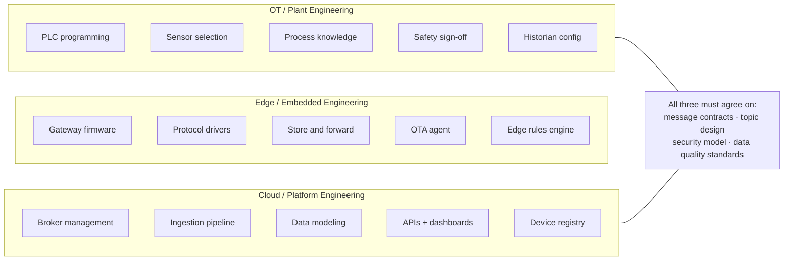

---

## 1. IoT Architecture: The Full Stack

Industrial IoT systems span five distinct layers. Each has its own failure modes, latency requirements, and operational concerns. Never conflate them — the most common architectural mistakes come from blurring these boundaries.

```mermaid
graph LR
    subgraph L1["L1 · Device & Sensor"]
        E1[PLCs / DCS]
        E2[RTUs]
        E3[Smart Sensors]
        E4[Actuators / Drives]
    end

    subgraph L2["L2 · Field Network"]
        D1[Industrial Ethernet]
        D2[RS-485 / Modbus]
        D3[LoRa / WirelessHART]
        D4[PROFINET / EtherCAT]
    end

    subgraph L3["L3 · Edge / Gateway"]
        C1[Protocol Translator]
        C2[Store & Forward]
        C3[Edge Rules Engine]
        C4[OTA Agent]
    end

    subgraph L4["L4 · Platform / Cloud"]
        B1[Message Broker]
        B2[Stream Processor]
        B3[Time-Series DB]
        B4[Device Registry]
        B5[OTA Service]
    end

    subgraph L5["L5 · Application"]
        A1[Dashboards]
        A2[ML / Analytics]
        A3[ERP Integration]
        A4[Alerting]
    end

    L1 <-->|field bus| L2
    L2 <-->|OT network| L3
    L3 <-->|MQTT / TLS| L4
    L4 <-->|APIs / events| L5
```

### 1.1 Why Layer Separation Matters in Production

In a real factory deployment a critical lesson repeats itself: teams collapse Layer 3 (edge) and Layer 4 (cloud) into a single "IoT platform" and then discover that:
- The factory loses internet for 4 hours and all sensor data is gone — because there was no store-and-forward at the edge
- A cloud rule engine fires a command to a PLC 800ms after the sensor condition, but the PLC scan cycle is 10ms — the response came 80 cycles too late
- A firmware bug in the gateway bricks 200 devices simultaneously because there was no staged rollout

**The layers are not just logical — they map to physical failure domains, ownership boundaries, and latency contracts.**

### 1.2 Key Architectural Tensions

| Tension | Industrial Default | Naive Default | Why It Matters |
|---|---|---|---|
| Latency vs. throughput | Low latency at edge, batch at cloud | Everything to cloud first | Control loops cannot tolerate cloud round-trips |
| Online vs. offline | Must work fully offline | Always-connected assumption | Factory floors lose connectivity — plan for 72h outages |
| Open vs. proprietary | Both coexist permanently | Standardize everything | Modbus from 1979 is still on your factory floor |
| Push vs. poll | Event-driven push | Polling everything | Polling at scale kills network and battery |
| Schema flexibility vs. contract | Strict contracts + versioning | Schema-on-read / loose JSON | Loose schemas cause silent data corruption at scale |
| Edge compute vs. cloud compute | Edge for latency, cloud for analytics | Cloud for everything | Edge ML inference is real; round-trip for classification is not |

---

## 2. Hardware Layer: Industrial Devices & Sensors

### 2.1 Device Taxonomy

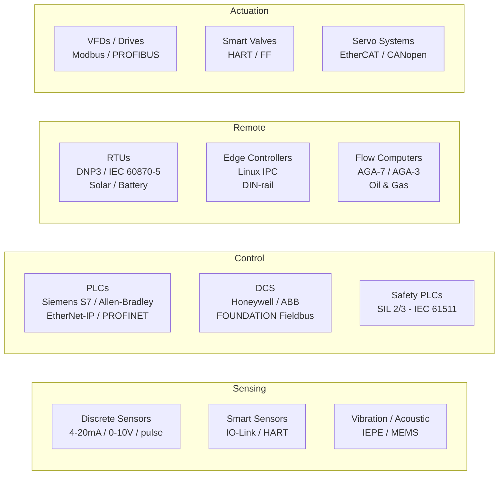

### 2.2 Signal Types — What Engineers Actually Deal With

This is where most integration problems start. You receive a sensor spec sheet that says "4–20mA output" and assume it plugs straight into your system. It does not.

```
Analog Current Loop (4–20mA):
  4mA  = 0% of range (live zero — 0mA means wire break, not zero value)
  20mA = 100% of range
  Wire break detection: < 3.6mA → alarm
  Loop power: device powered by the loop current (2-wire sensors)
  Noise immunity: excellent — current doesn't change with wire resistance
  Max loop resistance: V_supply - V_device_min / 0.02A
    e.g., 24V supply, 12V device min: (24-12)/0.020 = 600Ω max cable

  Scaling formula:
    value = (raw_mA - 4.0) / (20.0 - 4.0) * (range_max - range_min) + range_min
    e.g., 12mA, range 0-200 bar: (12-4)/16 * 200 = 100 bar

HART (Highway Addressable Remote Transducer):
  Piggybacks FSK digital signal on 4-20mA loop
  Carrier: 1200Hz = logic 1, 2200Hz = logic 0, 1200 baud
  Master polls device: ~2 queries/second (do not poll faster)
  Provides: tag name, device type, engineering units, diagnostics, trim
  Wiring: no change — uses existing 4-20mA cable
  Critical gotcha: HART requires loop resistance ≥ 230Ω to work
    Most PLC input cards have < 50Ω — you need a HART multiplexer/modem

IO-Link (IEC 61131-9):
  Digital communication over standard 3-wire M12 cable
  Speeds: COM1=4.8kbps, COM2=38.4kbps, COM3=230.4kbps
  Point-to-point only (not a bus)
  Provides: process value + full parameterization + diagnostics
  IO-Link master: typically has 4-8 ports, connects to PLC via standard I/O
  IODD (IO-Link Device Description): XML device description — download from ifm/Sick/Balluff

  What you can read that 4-20mA can't give you:
    - Internal sensor temperature (detect drift)
    - Total operating hours
    - Calibration date
    - Detailed fault codes (not just "sensor fault")
```

### 2.3 Real-Time Constraints — Hard Numbers

Understanding the timing requirements of each control tier is the single most important thing you can do to prevent architectural mistakes. The most common error in IoT projects is routing a control decision through the cloud when the process requires a sub-second response. The numbers below are not targets — they are physics and safety standards. Any architecture that puts cloud latency in the path of these loops will fail, often dramatically. Pay particular attention to the absolute boundary: any loop requiring a response in under 500ms must be closed entirely at the PLC or edge device.

```
Control loop timing requirements by application:

  Safety instrumented functions (SIS):
    Response time: < 100ms (SIL 2), < 10ms (SIL 3)
    Standard: IEC 61511 / IEC 61508
    Architecture: fully independent from BPCS — never share networks

  Motion control (CNC, robotics, packaging):
    Servo loop: 125μs–1ms
    Position update: < 1ms
    Network: EtherCAT (< 100μs cycle), PROFINET IRT, Sercos III

  Process control (temperature, pressure, flow):
    PLC scan cycle: 10–100ms
    Control response: 100ms–1s acceptable for most loops
    Network: Standard Ethernet (EtherNet/IP, PROFINET RT)

  Monitoring / historian:
    Sample rate: 1s–60s depending on process dynamics
    Latency: minutes acceptable for cloud historian
    Network: Any — MQTT over LTE acceptable

  RULE: Any loop requiring < 500ms response time stays at edge/PLC.
  Cloud is NEVER in a control loop. Not even "fast" cloud.
```

**Control loop timing hierarchy — where each tier belongs:**

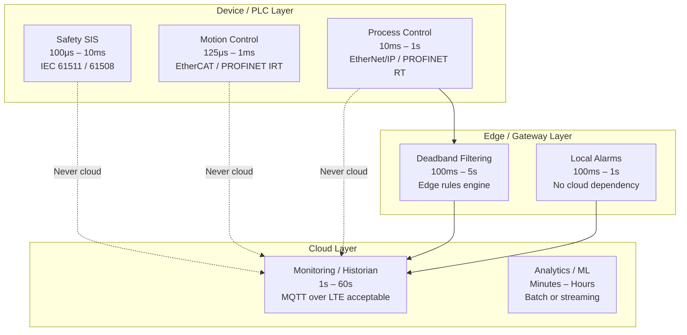

### 2.4 Top Hardware Choices by Category

Choosing hardware is not just a technical decision — it is a 10–20 year commitment. Industrial hardware outlasts software stacks by a wide margin. The table below reflects what is actually deployed in production environments, not just what vendors market.

**PLCs & Controllers:**

| Vendor / Model | Strengths | Watch-outs | Native IoT Path |
|---|---|---|---|
| **Siemens S7-1500** | Best OPC-UA support, TIA Portal integration, large install base | Expensive, proprietary ecosystem | OPC-UA server built-in (CPU 1511+) |
| **Allen-Bradley ControlLogix** | Dominant in North America, strong EtherNet/IP | Rockwell ecosystem lock-in, Kepware often needed | EtherNet/IP + CIP, use Kepware or pycomm3 |
| **Beckhoff CX-series** | PC-based (Windows CE/Linux), EtherCAT native, very flexible | Smaller support network | TwinCAT OPC-UA server |
| **Schneider Modicon M580** | Strong in process industries, Ethernet-native | OPC-UA support varies by CPU | OPC-UA or REST API (newer models) |
| **Phoenix Contact PLCnext** | Linux-based, open, cloud-native design | Smaller market share | MQTT and REST native, Node-RED support |
| **Codesys Runtime (multi-vendor)** | Open standard, runs on many IPCs | Varies by OEM implementation | OPC-UA via Codesys runtime |

**Edge Gateway Hardware:**

| Device | CPU / OS | Best For | I/O Options |
|---|---|---|---|
| **Moxa UC-8100** | ARM, Debian Linux | Rugged remote, DIN-rail, -40°C | RS-232/485, LTE, Wi-Fi |
| **Advantech UNO-2372G** | Intel x86, Ubuntu | High compute edge, multiple protocols | PCIe expansion, lots of I/O |
| **Siemens SIMATIC IPC227G** | Intel Atom, Windows/Linux | Siemens-heavy plants, TIA integration | PROFINET, industrial hardening |
| **Raspberry Pi CM4 (industrial carrier)** | ARM, Linux | Cost-sensitive, lower criticality | Flexible via HATs, not -40°C rated |
| **Toradex Colibri / Apalis** | ARM SoM, Linux | OEM embedded products | Customizable carrier boards |
| **Dell Edge Gateway 3200** | Intel x86, Ubuntu Core | High-compute, managed OTA via Dell | PCIe, lots of USB, DIN-rail option |

**RTUs & Remote Field Devices:**

| Device | Protocols | Connectivity | Use Case |
|---|---|---|---|
| **Emerson ROC809** | Modbus, HART, AGA-7 | Serial, Ethernet, cellular | Oil & gas flow measurement |
| **ABB RTU560** | DNP3, IEC 60870-5-101/104 | Serial, Ethernet, fibre | Power substations |
| **Yokogawa STARDOM** | Modbus, OPC-UA, FOUNDATION Fieldbus | Ethernet, serial | Remote process control |
| **Particle Tracker** | Custom, MQTT | LTE-M, GPS | Asset tracking, mobile RTU |
| **Digi WR44R** | Modbus, MQTT gateway | 4G LTE dual-SIM | Industrial router + protocol bridge |

**Wireless Sensor Nodes:**

| Platform | Protocol | Range | Power | Best For |
|---|---|---|---|---|
| **Emerson Wireless 1420 + 648** | WirelessHART | 100m mesh | Battery 5-10yr | Process sensor retrofit |
| **Multitech mDot** | LoRaWAN | 5km+ | Battery 5yr+ | Remote environmental monitoring |
| **Nordic nRF9160** | LTE-M/NB-IoT | Cellular | Battery 2-5yr | GPS + sensor combo |
| **ESP32-S3 (custom)** | Wi-Fi, BLE, MQTT | 50m | Mains / rechargeable | High-compute custom devices |
| **STM32WL** | LoRa, sub-GHz | 5km+ | Ultra-low power | Long-range sub-GHz sensor |

### 2.5 Industrial Hardware Configuration — Practical Examples

**Siemens S7-1500 PLC to OPC-UA:**
```
Hardware configuration (TIA Portal):
  1. CPU properties → OPC UA → Server → Enable OPC UA server
  2. Set endpoint: opc.tcp://192.168.1.10:4840
  3. Security policy: Basic256Sha256, mode: SignAndEncrypt (never None in prod)
  4. Activate "Allow anonymous access": NO
  5. Create OPC UA server interface:
     - Add variables to expose (drag from PLC tag table)
     - Set access: ReadOnly for sensors, ReadWrite for setpoints only
  6. Certificate management:
     - Generate server cert in TIA Portal
     - Trust the OPC-UA client cert on the PLC
     - Trust the PLC cert on the client

  Common failure: PLC's OPC-UA server rejects client connection
    → Check cert trust store on both sides
    → Check security policy mismatch (client vs server)
    → Firewall: ensure TCP 4840 open from gateway to PLC

Allen-Bradley ControlLogix to EtherNet/IP:
  Tag access via Logix5000 implicit/explicit messaging
  Explicit: read/write specific tags on demand (our use case for IoT)
  Library: pycomm3 (Python), libplctag (C/C++), Kepware OPC server

  # Python example using pycomm3
  from pycomm3 import LogixDriver
  with LogixDriver('192.168.1.20') as plc:
      tags = plc.read('Pump_007.Temperature', 'Pump_007.Pressure', 'Pump_007.Speed')
      # Returns: [Tag(Pump_007.Temperature, 72.4, REAL), ...]
```

---

## 3. Edge Layer: Gateways & Local Processing

### 3.1 Gateway Architecture — What It Actually Does

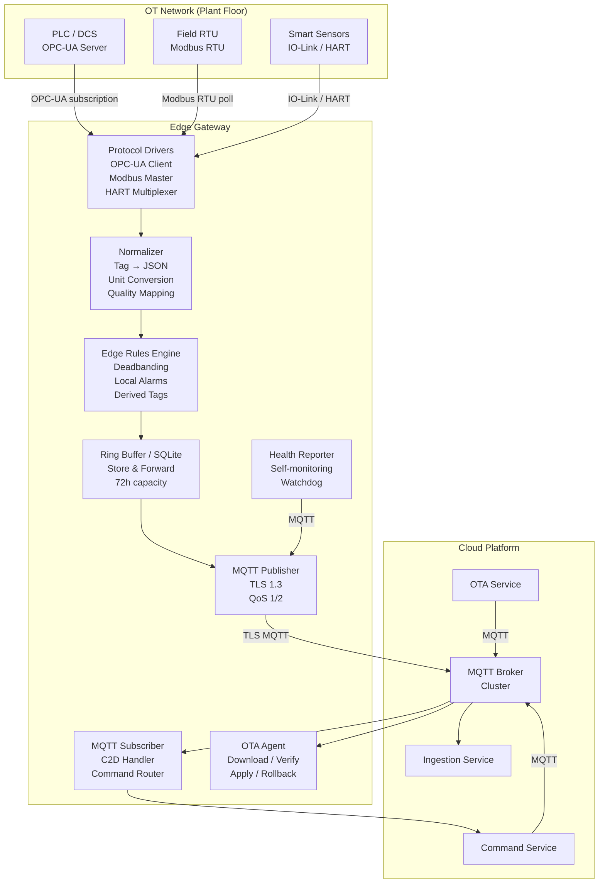

### 3.2 Store & Forward — Production Implementation

This is the feature most teams skip and regret. A gateway without store-and-forward is not an industrial gateway. The architectural principle is simple: **always write to local storage first, then forward**. The gateway treats the outbox as the source of truth, not the MQTT connection. This means connectivity becoming available or unavailable is a background concern — the data pipeline never stalls or drops messages because of it. In regulated industries (pharma, utilities), the ability to reconstruct a complete time-series across a connectivity outage is not optional — it is an audit requirement. Size your buffer for the worst-case outage your site has historically experienced, not the average.

```
Failure scenario without S&F:
  Factory loses internet for 3 hours.
  1,000 sensors generating 10 readings/minute.
  = 1,800,000 readings lost.
  Process engineers cannot reconstruct what happened during the outage.
  Regulatory compliance failure if this is pharma or utilities.

Implementation using SQLite WAL mode:

  Schema:
  CREATE TABLE outbox (
    id          INTEGER PRIMARY KEY AUTOINCREMENT,
    topic       TEXT NOT NULL,
    payload     BLOB NOT NULL,
    qos         INTEGER DEFAULT 1,
    created_at  INTEGER NOT NULL,  -- Unix milliseconds
    attempts    INTEGER DEFAULT 0,
    sent_at     INTEGER            -- NULL until sent
  );
  CREATE INDEX idx_outbox_unsent ON outbox(sent_at) WHERE sent_at IS NULL;

  Write path (always write to outbox first):
    BEGIN IMMEDIATE;
    INSERT INTO outbox (topic, payload, qos, created_at) VALUES (?, ?, ?, ?);
    COMMIT;

  Send path (background worker):
    SELECT id, topic, payload FROM outbox
    WHERE sent_at IS NULL
    ORDER BY created_at ASC
    LIMIT 100;                     -- batch for efficiency

    On MQTT publish ACK:
      UPDATE outbox SET sent_at = ? WHERE id = ?;

    On failure:
      UPDATE outbox SET attempts = attempts + 1 WHERE id = ?;
      -- Backoff: min(30s * 2^attempts, 3600s)

  Retention policy (avoid disk full):
    DELETE FROM outbox
    WHERE sent_at IS NOT NULL
    AND sent_at < (unixepoch() - 86400) * 1000;  -- keep sent for 24h

    DELETE FROM outbox
    WHERE sent_at IS NULL
    AND created_at < (unixepoch() - 259200) * 1000;  -- drop unsent > 72h
    -- LOG this as a data loss event with count

  Buffer sizing:
    required_bytes = data_rate_bytes_per_sec × outage_duration_sec × 1.3
    e.g., 500 devices × 200 bytes/msg × 1 msg/sec × 259200s × 1.3 = ~33 GB
    Use appropriate hardware: industrial SSD, not SD card
```

### 3.3 Edge Deadbanding — Reduce Cloud Traffic by 60-80%

Raw polling sends data every cycle regardless of change. Deadband filtering is essential at scale.

```python
class DeadbandFilter:
    """
    Only forward a value if it has changed by more than the deadband threshold
    or the max_interval has elapsed (ensures liveness even in stable processes).
    """
    def __init__(self, deadband_pct: float, max_interval_s: float = 60.0):
        self.deadband_pct = deadband_pct  # e.g., 0.5 = 0.5% of engineering range
        self.max_interval_s = max_interval_s
        self._last_sent: dict[str, tuple[float, float]] = {}  # tag -> (value, timestamp)

    def should_forward(self, tag: str, value: float, eng_range: float, now: float) -> bool:
        if tag not in self._last_sent:
            self._last_sent[tag] = (value, now)
            return True

        last_value, last_ts = self._last_sent[tag]
        deadband_abs = self.deadband_pct / 100.0 * eng_range
        value_changed = abs(value - last_value) >= deadband_abs
        interval_exceeded = (now - last_ts) >= self.max_interval_s

        if value_changed or interval_exceeded:
            self._last_sent[tag] = (value, now)
            return True
        return False

# Usage:
# filter = DeadbandFilter(deadband_pct=0.5, max_interval_s=60)
# if filter.should_forward("pump.temperature", 72.4, eng_range=200.0, now=time.time()):
#     publish_to_mqtt(...)
```

### 3.4 Platform Software Stack: Open Source vs. Cloud Managed

One of the most consequential early decisions in an IoT platform build is where to draw the line between self-managed open source and cloud-managed services. There is no universally correct answer — the right choice depends on your team's operational maturity, data sovereignty requirements, and scale. The table below reflects real-world tradeoffs, not marketing claims.

#### MQTT Brokers

The broker is the nervous system of your IoT platform. Choose carefully — migrating brokers is painful.

| Broker | Type | Strengths | Weaknesses | Scale | Best For |
|---|---|---|---|---|---|
| **Eclipse Mosquitto** | OSS, self-hosted | Lightweight, battle-tested, simple | No clustering (single node), limited auth plugins | ~100k connections | Dev/test, small deployments, edge broker |
| **EMQX** | OSS + Enterprise, self-hosted | Full clustering, MQTT 5.0, rule engine, rich plugins, Kubernetes-native | Enterprise features paid, complex ops at scale | 10M+ connections | Production at scale, Kubernetes-native stacks |
| **HiveMQ** | Enterprise, self-hosted / cloud | Enterprise-grade, excellent extensions, strong MQTT 5.0 | Expensive licensing | Millions of connections | Large enterprise, regulated industries |
| **VerneMQ** | OSS, self-hosted | Erlang/OTP clustering, strong consistency | Smaller community, harder to operate | ~1M connections | Telecom-grade reliability requirements |
| **AWS IoT Core** | Fully managed | Zero ops, deep AWS integration, scales infinitely | Vendor lock-in, per-message pricing adds up at scale, data stays in AWS | Unlimited | AWS-committed teams, variable workloads |
| **Azure IoT Hub** | Fully managed | Deep Azure integration, D2C/C2D built-in, DPS, excellent enterprise features | Lock-in, pricing at scale | Unlimited | Azure-committed, enterprise Microsoft shops |
| **Google Cloud IoT Core** | ⚠️ Deprecated Aug 2023 | — | Shut down — do not use | — | Migrate off |
| **Solace PubSub+** | Enterprise | Multi-protocol (MQTT, AMQP, JMS, REST), guaranteed delivery | Very expensive | High | Financial services, mission-critical |

> **Recommendation for most greenfield industrial projects:** Start with EMQX Community Edition (self-hosted, Kubernetes). If you are fully committed to AWS, use AWS IoT Core but budget for per-message costs at scale and plan your egress costs early.

#### Time-Series Databases

| Database | Type | Strengths | Weaknesses | Best For |
|---|---|---|---|---|
| **TimescaleDB** | OSS (PostgreSQL extension) | Full SQL, continuous aggregates, excellent compression, Postgres ecosystem | Requires Postgres ops expertise | General industrial IoT, complex queries |
| **InfluxDB v3 (IOx)** | OSS + Cloud | Purpose-built for time-series, line protocol, Flux/SQL, good UI | v2→v3 migration disruption, cloud pricing | Metrics-heavy, simpler data models |
| **QuestDB** | OSS | Extremely fast ingestion (1.6M rows/sec), SQL, low resource usage | Smaller community, fewer integrations | Ultra-high-frequency data |
| **Apache IoTDB** | OSS | Designed for IoT, hierarchical model, good compression | Newer ecosystem, less enterprise tooling | Large-scale industrial telemetry |
| **AWS Timestream** | Fully managed | Zero ops, scales automatically, integrates with QuickSight | Expensive at scale, limited SQL | AWS shops that want zero DB ops |
| **Azure Data Explorer (ADX)** | Fully managed | Extremely fast at petabyte scale, KQL powerful, good for analytics | Learning curve (KQL), cost at high write rates | Analytics-heavy, large Azure deployments |
| **OSIsoft PI / AVEVA PI** | Enterprise, licensed | Industry standard in process industries, PIMS ecosystem | Expensive, proprietary, historian-centric model | Brownfield process industries already using PI |

> **Recommendation:** TimescaleDB for most production deployments — it gives you the full power of PostgreSQL (JOINs, window functions, foreign keys) while handling time-series scale. Use continuous aggregates to pre-compute roll-ups and avoid raw-data queries on dashboards.

#### Edge Runtimes & Frameworks

| Runtime | Type | Strengths | Weaknesses | Best For |
|---|---|---|---|---|
| **Node-RED** | OSS | Rapid visual wiring, huge node library, quick to prototype | Not suitable for high-throughput, logic gets unwieldy at scale | Protocol bridging, low-volume, rapid PoC |
| **Eclipse Kura** | OSS (Java/OSGi) | Enterprise-grade plugin system, device management, remote config | Heavy Java footprint, slower to develop | Structured enterprise edge deployments |
| **AWS IoT Greengrass v2** | Managed (OSS core) | Managed OTA, Lambda + Docker components, cloud-synced | AWS lock-in, complex setup, resource-heavy | AWS-committed, managed fleet OTA critical |
| **Azure IoT Edge** | Managed (OSS core) | Module marketplace, managed OTA, tight Azure integration | Azure lock-in, Docker required (heavy for small devices) | Azure-committed, containerized workloads |
| **EdgeX Foundry** | OSS | Microservice architecture, vendor-neutral, device service abstraction | Complex to deploy, many moving parts | Flexible multi-vendor edge architectures |
| **Custom Go/Rust daemon** | Custom | Maximum performance, minimal footprint, full control | Development time, maintenance burden | High-throughput production with specific requirements |

> **Recommendation:** For production industrial gateways, a custom Go service (or Go + Node-RED for protocol bridging) typically outperforms framework-heavy options. Use AWS Greengrass or Azure IoT Edge if managed OTA and cloud integration justify the operational overhead. Avoid Node-RED in the critical path for production data flows above ~1k msg/s.

#### Schema Registries

| Tool | Type | Protocol Support | Best For |
|---|---|---|---|
| **Confluent Schema Registry** | OSS + Enterprise | Avro, JSON Schema, Protobuf | Kafka-centric pipelines, production standard |
| **AWS Glue Schema Registry** | Fully managed | Avro, JSON Schema, Protobuf | AWS Kafka (MSK) pipelines |
| **Apicurio Registry** | OSS | Avro, JSON Schema, Protobuf, OpenAPI | Self-hosted, multi-protocol |
| **Git + JSON Schema files** | DIY | JSON Schema | Small teams, simple schemas, full control |

---

## 4. Communication Protocols: Deep Dive

### 4.1 Protocol Selection Decision Tree

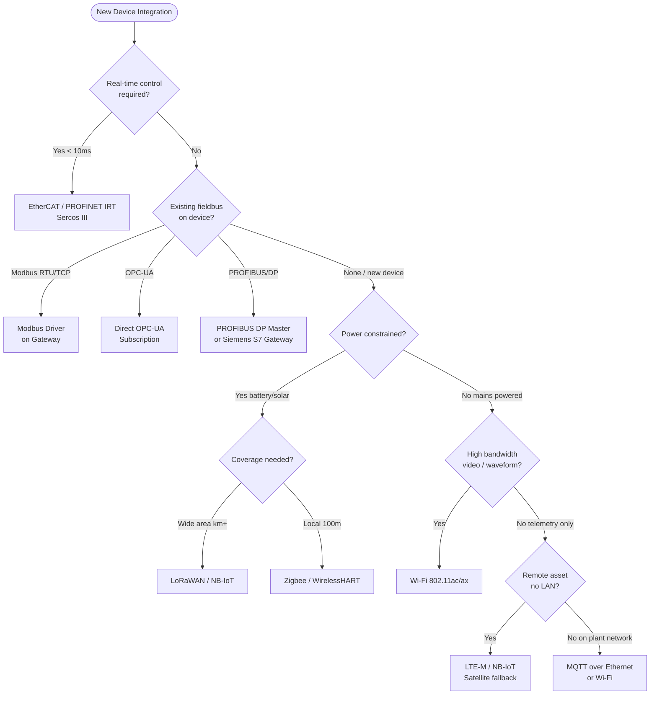

### 4.2 MQTT — Everything You Need to Know for Production

#### Connection Lifecycle

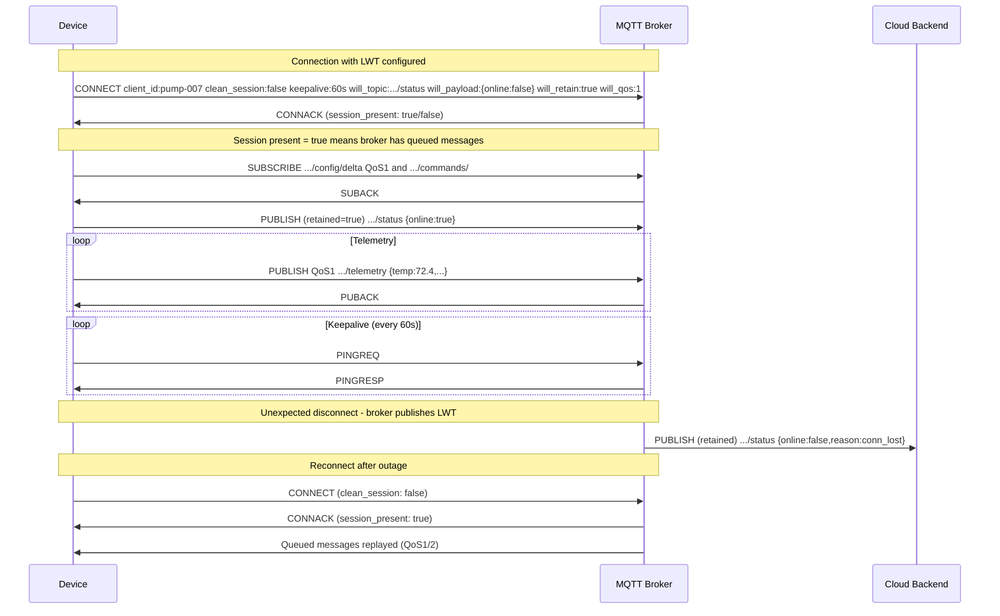

#### QoS Decision Guide — With Real Consequences

QoS selection has real operational consequences that compound at scale. A wrong choice is not a configuration detail — it is either a data loss risk (QoS too low) or a performance bottleneck (QoS too high). The guide below maps each level to specific IoT use cases with concrete failure scenarios. Note that QoS 2 is often misunderstood: it provides exactly-once delivery at the MQTT protocol level, but your consumer must still be idempotent because broker-to-consumer delivery is a separate concern.

```
QoS 0 — Fire and Forget:
  Use for:
    → High-frequency raw sensor data (1Hz+) where loss is acceptable
    → Metrics where the next reading makes a lost one irrelevant
  Do NOT use for:
    → Commands, configuration, alarms, anything stateful
  Real consequence of wrong choice:
    → QoS 0 over an unreliable LTE link loses 5-10% of readings.
       For a billing meter, that's revenue loss.

QoS 1 — At Least Once:
  Use for:
    → Most telemetry that matters
    → Alarms, events, command responses
    → Config acknowledgements
  Gotcha: duplicates ARE delivered. Your consumer must be idempotent.
    → Use message_id + device_id as deduplication key
    → Store in Redis SET with TTL, check before processing

QoS 2 — Exactly Once:
  Use for:
    → Billing / metering data
    → Audit trail records
    → Financial or regulatory compliance telemetry
  Cost: 4 network round-trips per message
  At 10,000 msg/s, the overhead is significant — test before committing
  Broker must support QoS 2 fully (not all do — verify your broker)
```

#### Topic Design — The ISA-95 Aligned Standard

```
Structure: {enterprise}/{site}/{area}/{line}/{device_type}/{device_id}/{data_class}/{tag}

Production example (discrete manufacturing):
  acme-corp/plant-detroit/body-shop/line-3/pump/P-007/telemetry
  acme-corp/plant-detroit/body-shop/line-3/pump/P-007/telemetry/temperature
  acme-corp/plant-detroit/body-shop/line-3/pump/P-007/status
  acme-corp/plant-detroit/body-shop/line-3/pump/P-007/commands/{cmd_id}
  acme-corp/plant-detroit/body-shop/line-3/pump/P-007/commands/{cmd_id}/ack
  acme-corp/plant-detroit/body-shop/line-3/pump/P-007/config/desired
  acme-corp/plant-detroit/body-shop/line-3/pump/P-007/config/reported
  acme-corp/plant-detroit/body-shop/line-3/pump/P-007/ota/notification
  acme-corp/plant-detroit/body-shop/line-3/pump/P-007/ota/status

Wildcard subscriptions for operations:
  acme-corp/plant-detroit/+/+/+/+/status         → All device status, one plant
  acme-corp/#                                      → Everything (use only for debug)
  acme-corp/+/body-shop/line-3/pump/+/telemetry   → All pump telemetry, line 3

Rules that production has taught:
  1. Never use # in production consumer subscriptions — scopes too broad
  2. Device_id in topic must match MQTT client_id and TLS cert CN
  3. No spaces, no special chars in topic segments (use hyphens)
  4. Keep depth ≤ 7 levels — deeper is hard to manage with wildcards
  5. Always include device_type in hierarchy — allows type-based fanout
```

### 4.3 OPC-UA — Production Integration Patterns

OPC-UA is not just "better Modbus." It is a full information modeling framework. Most teams use 5% of it.

```mermaid
sequenceDiagram
    participant GW as Edge Gateway (OPC-UA Client)
    participant PLC as Siemens S7-1500 (OPC-UA Server)

    Note over GW,PLC: 1. Session establishment
    GW->>PLC: OpenSecureChannel [Basic256Sha256, SignAndEncrypt]
    PLC->>GW: SecureChannelId + token
    GW->>PLC: CreateSession [sessionName, clientCert]
    PLC->>GW: SessionId + serverNonce
    GW->>PLC: ActivateSession [userIdentityToken + signature]
    PLC->>GW: ActivateSession OK

    Note over GW,PLC: 2. Browse address space (once on connect)
    GW->>PLC: Browse [ns=0;i=85 Objects folder]
    PLC->>GW: BrowseResult [PLC_Program, DeviceSet ...]
    GW->>PLC: TranslateBrowsePathsToNodeIds [Pump_007.Temperature_PV]
    PLC->>GW: NodeId ns=3;i=1042

    Note over GW,PLC: 3. Create subscription (push, not poll)
    GW->>PLC: CreateSubscription [publishingInterval=1000ms, lifetime=10]
    PLC->>GW: SubscriptionId=42
    GW->>PLC: CreateMonitoredItems [nodeId=ns=3;i=1042, deadband=0.5%]
    PLC->>GW: MonitoredItemId=1

    Note over GW,PLC: 4. Data change notifications
    loop On value change exceeding deadband
        PLC->>GW: Publish [value=72.4, quality=Good, ts=2026-03-19T14:22:00Z]
        GW->>PLC: PublishRequest [ack seqNo]
    end

    Note over GW,PLC: 5. Keep-alive when no changes
    PLC->>GW: Publish [keepAlive, no data]
```

The OPC-UA subscription model is far more efficient than polling — the server only sends data when values change (or when the keep-alive fires). However, the subscription parameters below must be tuned to your network and process dynamics. Default values from client libraries are rarely correct for production: default publishingInterval is often 500ms (too fast for slow process variables, too slow for high-speed machinery), and default queueSize of 1 causes data loss on slow or intermittent connections. Treat these as per-tag configuration, not system-wide defaults.

**Critical OPC-UA configuration parameters that matter in production:**

```
Server-side subscription tuning:
  publishingInterval:    1000ms   # How often server sends notifications
  samplingInterval:       500ms   # How often server samples the value
                                  # samplingInterval ≤ publishingInterval
  queueSize:               10     # Items buffered if client misses a publish
                                  # For alarms: set higher (50-100)
  lifetimeCount:           10     # Publish cycles before subscription expires
                                  # = 10 × 1000ms = 10s without client poll
  maxKeepAliveCount:        3     # Keep-alives before subscription expires
  maxNotificationsPerPublish: 0   # 0 = no limit (careful on low-bandwidth links)

Deadband on OPC-UA side (saves bandwidth from PLC → gateway):
  AbsoluteDeadband:  tag value changes reported only if |new-old| > threshold
  PercentDeadband:   as % of engineering range (EURange attribute must be set)

  Set EURange on PLC tags:
    TIA Portal → Tag properties → OPC UA → Engineering Unit Range
    min: 0.0, max: 200.0 (for a 0-200°C sensor)
    Then: PercentDeadband = 0.5 = only report if temperature changes > 1.0°C

Session keepalive:
  requestedSessionTimeout: 30000ms  # Session expires if client disconnects > 30s
  On reconnect: re-establish session (subscriptions are lost)
  Pattern: client maintains subscription ID map, re-creates on reconnect
```

### 4.4 Modbus — The Inescapable Legacy Protocol

You will encounter Modbus on every industrial project. Master it. Modbus was standardized in 1979 and has no built-in authentication, encryption, or error recovery beyond a basic CRC. Despite this, it remains the most widely deployed industrial protocol in the world because it is simple, deterministic, and runs on cheap hardware. In practice, Modbus integration failures are almost never caused by the protocol itself — they are caused by byte-order mismatches (big-endian vs word-swapped), incorrect register address offsets (0-based vs 1-based), and polling too fast for the RS-485 bus capacity. Get the register map from the vendor, read it carefully, and verify with a Modbus tester before writing production code.

```
Register map reading — step by step:

Step 1: Get the device register map (from vendor documentation)
  Example: Siemens SITRANS P DS III pressure transmitter
    Register 1 (40001): Measured value — FLOAT32, AB CD byte order
    Register 3 (40003): Status word — UINT16
    Register 5 (40005): Range upper — FLOAT32, AB CD
    Register 7 (40007): Range lower — FLOAT32, AB CD

Step 2: Read the registers
  FC=03 (Read Holding Registers)
  Start address: 0 (register 40001 = address 0 in protocol)
  Count: 8 (read registers 0-7, 4 FLOAT32 values)

Step 3: Decode (byte order trap — check your device!)
  Raw bytes returned: 42 90 00 00 (big-endian FLOAT32)
  = 0x42900000 = 72.0 in IEEE 754

  If device uses "word-swapped" format (some older devices):
    Raw: 00 00 42 90 → swap words → 42 90 00 00 = 72.0

Step 4: Apply scaling (some devices return raw counts, not engineering units)
  raw_value = 26214  (16-bit count)
  scaled = raw_value / 65535.0 * (range_upper - range_lower) + range_lower
  = 26214 / 65535.0 * (100 - 0) + 0 = 40.0 bar

Polling rate gotchas:
  RS-485 bus at 9600 baud, 1 device:
    Request packet:  8 bytes × 10 bits/byte = 80 bits
    Response (8 regs): 21 bytes × 10 bits = 210 bits
    Total: 290 bits / 9600 = 30ms per transaction
    Safe poll rate: 100ms (gives 3× margin for retries)

  RS-485 bus at 9600 baud, 10 devices:
    10 × 30ms = 300ms minimum
    Safe poll rate: 1000ms per device

  Error handling in production:
    Retry: 3 attempts with 50ms delay
    After 3 failures: mark tag as Bad quality, publish with quality code
    Log every failure with device address and function code
    Alert ops if failure rate > 5% over 5 minutes
```

**Modbus master/slave request-response flow:**

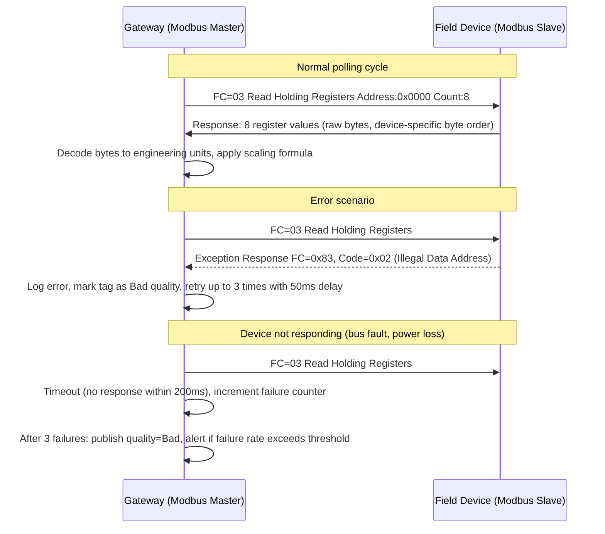

---

## 5. Contract Design & Schema Evolution

This section is where most IoT projects fail quietly. A device ships with firmware v1 publishing JSON. Six months later firmware v2 adds fields. Firmware v3 renames a field. Now your backend silently drops half the data, and nobody notices for three months because the dashboard still shows numbers.

The core problem is that IoT devices are not servers. You cannot do a coordinated deploy where firmware and backend upgrade simultaneously. Devices in the field run dozens of different firmware versions. Devices go offline for weeks and reconnect with old firmware. A backend that cannot handle messages from firmware versions 2.1, 2.3, and 3.0 simultaneously is not production-ready.

Treat every message format your device publishes as a **public API contract** — even if the only consumers are internal. The cost of a breaking schema change in IoT is measured in field technician visits, support tickets, and lost data — not just a failed CI build.

### 5.1 What Is a Message Contract?

A message contract defines:
1. **Structure** — what fields exist, their types, required vs. optional
2. **Semantics** — what the fields mean (units, ranges, quality)
3. **Versioning** — how changes are communicated and handled
4. **Compatibility rules** — what changes are safe, what are breaking

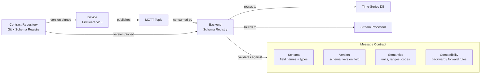

### 5.2 Schema Versioning Strategy

#### Option A: Envelope Versioning (Recommended for MQTT/IoT)

Every message carries its own schema version. Backend routes based on version. This approach is preferred for MQTT/IoT because it requires no out-of-band schema negotiation — the decoder needed is self-described in every message. It handles fleet heterogeneity naturally: a backend receiving messages from firmware v1, v2, and v3 simultaneously routes each to its appropriate handler without needing to track which device is on which version at the time of processing.

```json
{
  "schema_version": "2.1",
  "device_id": "P-007",
  "ts": 1710844800000,
  "d": {
    "temp_inlet_c": 72.4,
    "temp_outlet_c": 81.2,
    "pressure_bar": 4.2,
    "flow_m3h": 142.7
  },
  "meta": {
    "fw_version": "2.3.1",
    "site": "plant-detroit"
  }
}
```

**Backend routing by version:**
```python
def route_message(payload: bytes, topic: str) -> None:
    msg = json.loads(payload)
    version = msg.get("schema_version", "1.0")  # default for legacy devices

    handler = VERSION_HANDLERS.get(version)
    if handler is None:
        # Unknown version — do not drop, route to dead letter queue for triage
        dlq.publish(topic, payload, reason=f"unknown_schema_version_{version}")
        return

    normalized = handler(msg)  # returns canonical internal format
    ingestion_pipeline.ingest(normalized)

VERSION_HANDLERS = {
    "1.0": handle_v1,   # legacy — field rename adapters
    "2.0": handle_v2,
    "2.1": handle_v2_1, # minor addition
}
```

#### Option B: Schema Registry (for high-scale, multi-team)

Use Confluent Schema Registry, AWS Glue, or Apicurio when:
- Multiple teams produce and consume messages
- You have > 50 message types
- Compliance requires schema audit trail

```
Schema Registry flow:
  1. Developer registers schema:
     POST /subjects/acme.pump.telemetry/versions
     Body: Avro / JSON Schema / Protobuf schema

  2. Registry returns schema_id: 42

  3. Producer (firmware/gateway) encodes:
     [0x00][schema_id 4 bytes][encoded payload]

  4. Consumer decodes:
     → reads schema_id from header
     → fetches schema from registry (cached locally)
     → deserializes with correct schema

  Compatibility modes (set per subject):
    BACKWARD:  new schema can read data written by old schema
    FORWARD:   old schema can read data written by new schema
    FULL:      both — recommended for IoT
    NONE:      no compatibility checks — dangerous
```

### 5.3 Backward Compatibility Rules — What You Can and Cannot Change

The decision tree below encodes hard-won rules for safe schema evolution in production IoT systems. The key insight is that IoT devices in the field cannot be updated atomically with the backend — there will always be a period during which old and new firmware coexist. Any schema change that breaks this coexistence causes silent data loss, not a clean error. Work through the decision tree for every proposed change before touching a message contract.

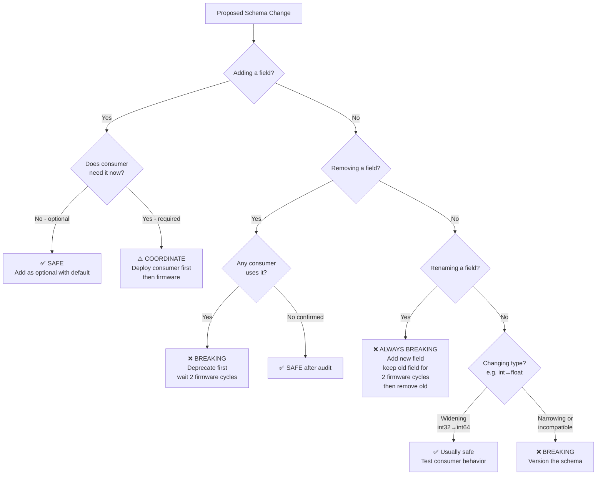

**The Field Rename Anti-Pattern — and the correct fix:**
```
Wrong approach (what teams do):
  v1: { "temp": 72.4 }   ← firmware v1
  v2: { "temperature_c": 72.4 }  ← firmware v2 renames it

  Backend receives v2: looks for "temp" → null
  Silent data loss. Alarm thresholds stop working.
  Discovered 2 months later when a sensor reads 0°C everywhere.

Correct approach:
  Step 1 (firmware v2): publish BOTH fields
    { "temp": 72.4, "temperature_c": 72.4, "schema_version": "2.0" }

  Step 2: deploy backend that reads "temperature_c", falls back to "temp"
    value = msg.get("temperature_c") or msg.get("temp")

  Step 3: wait until all devices are on firmware v2+ (check registry)
    query: SELECT COUNT(*) FROM devices WHERE fw_version < '2.0.0'
    Proceed only when = 0

  Step 4 (firmware v3): remove old field
    { "temperature_c": 72.4, "schema_version": "3.0" }
    Backend: still reads "temperature_c" — no change needed
```

### 5.4 Protobuf Schema Evolution — Production Rules

When you graduate from JSON to Protobuf for performance, schema evolution rules become more rigid and more consequential. Unlike JSON (where unknown fields are simply ignored), Protobuf encodes fields by number — and once a field number is assigned, it must never be reused, even if the field is deleted. Violating this rule causes silent data corruption on the receiving end. The schema below shows a real pump telemetry message evolved across three versions, with the critical reservation pattern for deleted fields. Pay attention to field number allocation: fields 1–15 consume one byte in the encoding and should be reserved for the most frequently transmitted values.

```protobuf
// pump_telemetry.proto
syntax = "proto3";
package acme.iot.v1;

message PumpTelemetry {
  string device_id = 1;
  int64  timestamp_ms = 2;
  float  temp_inlet_c = 3;
  float  temp_outlet_c = 4;
  float  pressure_bar = 5;
  float  flow_m3h = 6;

  // v2 additions — safe, optional, have defaults
  float  vibration_rms_mms = 7;  // added in schema v2
  float  power_kw = 8;            // added in schema v2

  // v3 — new nested message for quality
  DataQuality quality = 9;        // added in schema v3

  // NEVER reuse field numbers after deletion
  // reserved 10, 11;             // mark deleted fields as reserved
  // reserved "old_field_name";   // also reserve the name
}

message DataQuality {
  uint32 opc_quality_code = 1;  // 192 = Good, 0 = Bad
  bool   sensor_fault = 2;
  bool   out_of_range = 3;
}

/* Rules for field numbers in production IoT:
   1-15:  most frequently used fields (1-byte encoding)
   16-2047: less frequent
   Never delete a field — mark as reserved
   Never change a field's type
   Never change a field's number

   Adding enum values: safe (old decoders get UNKNOWN)
   Removing enum values: coordinate — receivers must handle unknown
*/
```

### 5.5 Contract Testing — How to Prevent Silent Breakage

Contract testing is the automated enforcement of the message contracts defined in this section. Without it, schema violations are discovered in production — typically weeks after the firmware that introduced the breaking change was deployed to thousands of devices. The pattern below requires both the firmware team and the backend team to publish sample messages and consumer expectations, then validates them against each other in CI. Any proposed firmware change that would break the current consumer, or any backend change that would reject current firmware output, is caught before it ships.

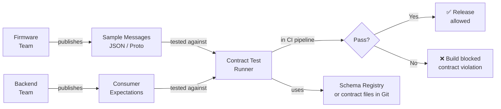

```python
# contract_test.py — run in CI for both firmware and backend changes
import pytest
import json
from jsonschema import validate, ValidationError

PUMP_TELEMETRY_SCHEMA_V2 = {
    "type": "object",
    "required": ["schema_version", "device_id", "ts", "d"],
    "properties": {
        "schema_version": {"type": "string", "pattern": "^2\\."},
        "device_id": {"type": "string", "minLength": 1},
        "ts": {"type": "integer", "minimum": 0},
        "d": {
            "type": "object",
            "required": ["temp_inlet_c", "pressure_bar"],  # truly required
            "properties": {
                "temp_inlet_c":  {"type": "number", "minimum": -50, "maximum": 500},
                "temp_outlet_c": {"type": "number", "minimum": -50, "maximum": 500},
                "pressure_bar":  {"type": "number", "minimum": 0, "maximum": 50},
                "flow_m3h":      {"type": "number", "minimum": 0},
                "vibration_rms_mms": {"type": "number", "minimum": 0},  # optional
                "power_kw":      {"type": "number", "minimum": 0}        # optional
            },
            "additionalProperties": False  # REJECT unknown fields to catch renames
        }
    }
}

def test_firmware_sample_messages_match_contract():
    """Firmware team provides sample messages; contract test validates them."""
    sample_messages = load_firmware_samples("tests/contracts/pump_telemetry_v2_samples.json")
    for i, msg in enumerate(sample_messages):
        try:
            validate(msg, PUMP_TELEMETRY_SCHEMA_V2)
        except ValidationError as e:
            pytest.fail(f"Sample message {i} violates contract: {e.message}")

def test_backward_compatibility_with_v1_messages():
    """Backend must handle v1 messages even after deploying v2 schema support."""
    v1_messages = load_firmware_samples("tests/contracts/pump_telemetry_v1_samples.json")
    for msg in v1_messages:
        result = normalize_message(msg)  # your backend normalization function
        assert result["temp_inlet_c"] is not None, "v1 'temp' field must be mapped"
```

---

## 6. Device-to-Cloud (D2C) Data Exchange

D2C is the primary data flow in any IoT system — the steady stream of telemetry, status, and events flowing upward from physical assets to the platform. It looks simple until you operate it at scale: 10,000 devices, each publishing every second, with varying firmware versions, intermittent connectivity, and a requirement that no data is silently lost.

The key design concerns for D2C are: **delivery reliability** (QoS + store-and-forward), **payload efficiency** (JSON vs binary, batching), **data quality propagation** (OPC-UA quality codes must travel with the value), and **backward-compatible schema evolution** (covered in §5). Get these right and D2C becomes a stable foundation. Get them wrong and you spend most of your time debugging data gaps and quality issues.

### 6.1 D2C Message Flow — Full Lifecycle

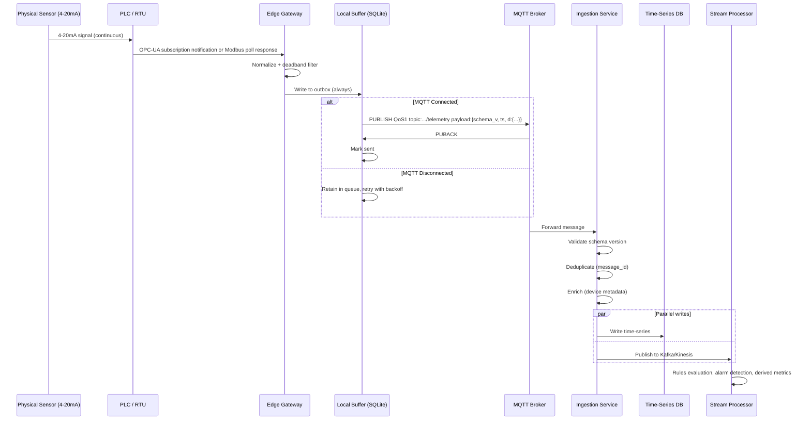

### 6.2 D2C Payload — Production-Grade Format

The payload format below represents a production-proven structure that satisfies the four key D2C concerns: every field earns its place. The nested `{v, q}` structure for each data point propagates OPC-UA quality codes alongside values — without quality codes, a dashboard cannot distinguish a genuine zero reading from a sensor failure. The `msg_id` (ULID) provides both deduplication and sortable traceability across the entire pipeline. The `seq` counter enables gap detection at the ingestion layer, which is the only reliable way to detect message loss that the broker-level QoS cannot catch.

```json
{
  "schema_version": "2.1",
  "msg_id": "01HX7K3NBVYD5V2Q3BZ8MNRZWK",
  "device_id": "P-007",
  "device_type": "centrifugal_pump",
  "ts": 1710844800123,
  "seq": 48291,
  "d": {
    "temp_inlet_c":   { "v": 72.4, "q": 192 },
    "temp_outlet_c":  { "v": 81.2, "q": 192 },
    "pressure_bar":   { "v": 4.2,  "q": 192 },
    "flow_m3h":       { "v": 142.7,"q": 192 },
    "vibration_rms":  { "v": 0.82, "q": 68  },
    "power_kw":       { "v": 18.4, "q": 192 }
  },
  "meta": {
    "fw_version": "2.3.1",
    "gw_id": "gw-detroit-l3-01",
    "source_ts": 1710844799980,
    "edge_latency_ms": 143
  }
}
```

**Why each field exists:**
```
msg_id:           ULID (sortable UUID) — deduplication, tracing, replay
schema_version:   Backend routes to correct decoder
seq:              Monotonic counter per device — detect gaps and reordering
ts:               Gateway timestamp (device may not have RTC)
source_ts:        PLC/sensor timestamp if available (better accuracy)
edge_latency_ms:  ts - source_ts — detect clock drift
d.v:              Value
d.q:              OPC-UA quality code — 192=Good, 0=Bad, 68=Uncertain
meta.gw_id:       Which gateway forwarded (useful for debugging)
```

**Flat format (for high-frequency / size-constrained):**
```json
{
  "v": "2.1",
  "id": "P-007",
  "t": 1710844800123,
  "ti": 72.4,
  "to": 81.2,
  "p":  4.2,
  "f":  142.7,
  "pw": 18.4
}
```
Use abbreviated keys when: payload size matters (LoRaWAN limit: 51-222 bytes) or message rate > 50k/s.

### 6.3 D2C Delivery Guarantees — Exactly What You Can Promise

Understanding what MQTT QoS actually guarantees — and what it explicitly does not — prevents a class of hard-to-debug production incidents. QoS 1 ("at least once") is often misread as "reliable delivery"; it means the broker received it, not that your database contains it. The gap between broker receipt and database write is where the real reliability work happens: deduplication by `msg_id`, gap detection by `seq`, and ingestion-layer retries. Design your guarantees at each hop independently rather than assuming end-to-end delivery from a single QoS setting.

```
QoS 1 (most IoT deployments):
  PROMISE: each message delivered at least once to the broker
  NOT PROMISED:
    - Delivery to the ingestion service (broker → consumer can fail)
    - No duplicates (must handle at consumer)
    - Order (MQTT does not guarantee cross-session ordering)

  Deduplication at ingestion:
    Redis SET with key: {device_id}:{msg_id}, TTL: 1 hour

    if redis.setnx(f"dedup:{device_id}:{msg_id}", "1", ex=3600):
        process(message)    # first time seen
    else:
        metrics.inc("duplicate_messages_dropped")

  Gap detection at ingestion:
    Track last_seq per device in Redis
    If msg.seq != last_seq + 1:
        gap = msg.seq - last_seq - 1
        log.warning(f"Gap detected: {gap} messages missing from {device_id}")
        metrics.inc("message_gaps", gap)
    redis.set(f"seq:{device_id}", msg.seq)
```

### 6.4 High-Frequency Telemetry — Waveform / Vibration Data

Some use cases (predictive maintenance, vibration analysis) require burst high-frequency data. This is a fundamentally different transport problem from steady-state telemetry: you are no longer sending individual readings but waveform captures that are orders of magnitude larger. MQTT is not designed for large binary payloads — broker limits are typically 256KB to a few MB, and chunking introduces reassembly complexity. The pattern below handles this with chunked MQTT for smaller captures and pre-signed URL direct upload for larger ones. In both cases, the MQTT channel remains for metadata and completion signals, while the bulk data takes a direct path to object storage.

```
Scenario: vibration sensor sampled at 10kHz for 1 second every minute
  Raw data: 10,000 samples × 4 bytes = 40KB per burst
  Cannot be sent as individual MQTT messages

Approach: chunked binary upload

Step 1: Device captures waveform
  samples = vibration_sensor.capture(duration_ms=1000, rate_hz=10000)
  # 10,000 float32 values

Step 2: Compress
  compressed = lz4.compress(struct.pack(f'{len(samples)}f', *samples))
  # typically 60-70% reduction

Step 3: Chunked upload via MQTT (if < 256KB total)
  chunk_size = 16384  # 16KB chunks
  total_chunks = ceil(len(compressed) / chunk_size)
  upload_id = str(uuid4())

  for i, chunk in enumerate(chunks(compressed, chunk_size)):
      broker.publish(
          topic=f"{base}/waveform/{upload_id}/chunk/{i}",
          payload=chunk,
          qos=1
      )

  broker.publish(
      topic=f"{base}/waveform/{upload_id}/complete",
      payload=json.dumps({
          "upload_id": upload_id,
          "total_chunks": total_chunks,
          "total_bytes": len(compressed),
          "sample_rate_hz": 10000,
          "sample_count": 10000,
          "format": "float32_le",
          "checksum_sha256": sha256(compressed)
      }),
      qos=1
  )

Step 4: Backend reassembles
  Collect chunks by upload_id
  Verify checksum
  Reassemble → store in blob storage (S3/Azure Blob)
  Write metadata (device, timestamp, sample_rate) to DB
  Trigger FFT analysis job

Alternative for large waveforms: pre-signed URL upload
  Device requests upload URL from backend API
  Device uploads directly to blob storage via HTTPS
  Sends completion notification via MQTT
```

---

## 7. Cloud-to-Device (C2D) Command Exchange

C2D is the reverse data flow — commands, configuration changes, and control signals flowing downward from the platform to devices. It is far less volume than D2C but far higher stakes. A telemetry message that is lost or delayed is a data gap. A command that is lost, delivered twice, or executed 10 minutes late can result in incorrect process states, product defects, or in extreme cases, safety incidents.

The gap between how web engineers think about C2D ("just POST to an endpoint") and how industrial IoT requires it to work is wide. A device may be offline for hours when a command is issued. The device may receive the same command twice due to QoS 1 retransmission. The command may have been issued by an operator based on process conditions that no longer exist by the time the device reconnects. None of these failure modes exist in a typical web service context, but all of them are daily reality in industrial IoT.

The patterns in this section — command TTL, idempotency, lifecycle state machine, offline queue management — address each of these failure modes specifically.

### 7.1 Command Lifecycle State Machine

Commands in industrial IoT are not fire-and-forget API calls. They have lifecycle, authorization, and real physical consequences.

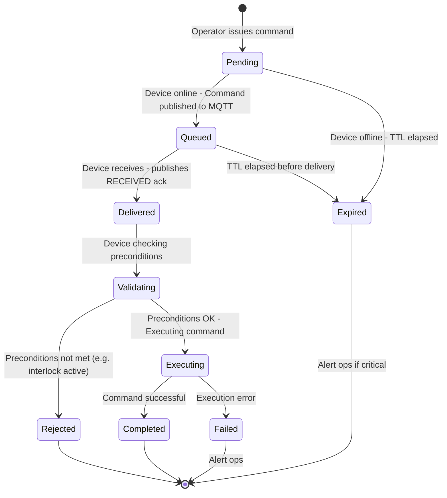

### 7.2 C2D Command Contract

The command contract is more than a message format — it is the authorization and safety boundary for every operator action on a physical asset. Every field below has been added to address a specific failure mode observed in production: `expires_at` prevents stale commands executing after a device reconnects from a long outage, `constraints` gives the device a last line of defense against out-of-range values even if the backend validation had a bug, and `issued_by` provides the audit trail required by most regulated industries. Do not strip fields to save bytes here — command volume is low and the overhead is justified.

```json
{
  "schema_version": "1.0",
  "command_id": "01HX7K3NBVYD5V2Q3BZ8MNRZWK",
  "command": "set_setpoint",
  "device_id": "P-007",
  "params": {
    "tag": "temperature_setpoint_c",
    "value": 75.0,
    "unit": "celsius"
  },
  "constraints": {
    "min_value": 20.0,
    "max_value": 90.0,
    "requires_interlock_clear": true,
    "max_rate_of_change_per_min": 5.0
  },
  "meta": {
    "issued_by": "jsmith@acme.com",
    "issued_at": "2026-03-19T14:00:00Z",
    "expires_at": "2026-03-19T14:02:00Z",
    "priority": "normal",
    "reason": "Batch temperature adjustment per work order WO-4472"
  }
}
```

**Command acknowledgement:**
```json
{
  "command_id": "01HX7K3NBVYD5V2Q3BZ8MNRZWK",
  "status": "completed",
  "device_id": "P-007",
  "ts": "2026-03-19T14:00:00.412Z",
  "previous_value": 70.0,
  "new_value": 75.0,
  "execution_time_ms": 412,
  "message": "Setpoint updated to 75.0°C. Ramp active.",
  "executed_by_fw": "2.3.1"
}
```

### 7.3 C2D Full Message Exchange

The full sequence diagram below shows every hop a command takes from operator action to physical execution and back. The key design points to observe: the command service records state before publishing to the broker (not after), so a broker publish failure is recoverable; the gateway validates the expiry timestamp before touching the PLC, not after; and acknowledgements flow back through the same MQTT channel so the operator UI gets real-time status without polling. This bidirectional status flow is what separates industrial command handling from simple fire-and-forget REST calls.

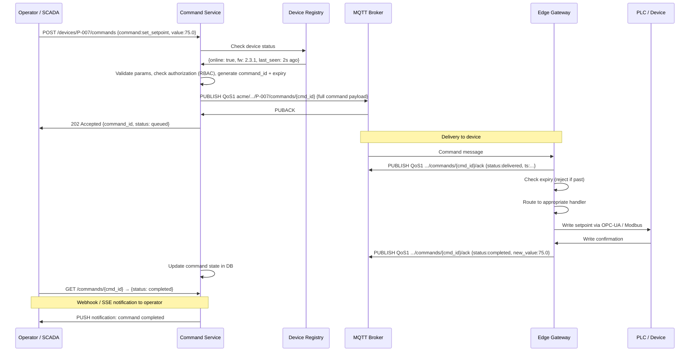

### 7.4 Idempotency — Critical for C2D

Idempotency in C2D is not a theoretical concern — QoS 1 will deliver duplicate commands in normal operation, not just edge cases. The critical distinction is between absolute commands (naturally idempotent) and relative commands (dangerous when duplicated). This distinction should be enforced at the command contract level, not handled case-by-case in device firmware. Device-side deduplication using the `command_id` as a key provides the second layer of protection when command design is correct, and the only protection when it is not.

```
Problem: QoS 1 can deliver command twice. If command is "open valve":
  First delivery:  valve opens ✓
  Second delivery: valve opens again (already open — no harm)
  Third delivery:  fine

If command is "increase setpoint by 5°C":
  First delivery:  75°C → 80°C ✓
  Second delivery: 80°C → 85°C ✗ WRONG

Rule: Absolute commands are naturally idempotent. Relative commands are not.

Solution:
  1. Prefer absolute commands: {set_to: 80.0} not {increase_by: 5.0}
  2. Track command_id on device, reject duplicates:

     # Device-side deduplication
     def handle_command(cmd):
         if db.exists(f"cmd:{cmd['command_id']}"):
             # Already processed — re-send last ack
             ack = db.get(f"cmd:{cmd['command_id']}:ack")
             publish_ack(ack)
             return

         result = execute_command(cmd)
         ack = build_ack(cmd, result)
         db.set(f"cmd:{cmd['command_id']}", "processed", ttl=86400)
         db.set(f"cmd:{cmd['command_id']}:ack", ack, ttl=86400)
         publish_ack(ack)
```

### 7.5 Command Queue Management for Offline Devices

Industrial devices go offline regularly — planned maintenance windows, network outages, power cycles. Commands issued during these windows must be managed carefully, not simply dropped or blindly queued. The flowchart below encodes the decisions that depend on command type: time-critical commands (emergency stops, interlocks) should never wait — set a short TTL and alert immediately if the device is unreachable. Configuration and maintenance commands can safely queue for hours or days. The most important rule: when a device reconnects, do not deliver a burst of queued commands simultaneously. Deliver them in order, waiting for acknowledgement before sending the next.

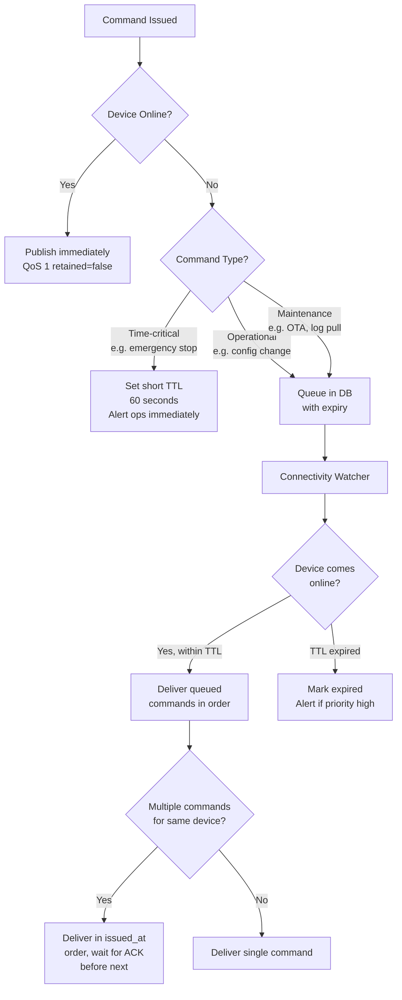

**Stale command prevention — always enforce TTL on device:**
```c
// Device firmware command handler (C pseudocode)
void handle_command(Command* cmd) {
    uint64_t now_ms = get_epoch_ms();
    uint64_t expires_ms = parse_iso8601_ms(cmd->expires_at);

    if (now_ms > expires_ms) {
        LOG_WARN("Command %s expired %lums ago — rejecting",
                 cmd->command_id, now_ms - expires_ms);
        publish_ack(cmd->command_id, STATUS_EXPIRED,
                    "Command expired before execution");
        return;
    }

    // Execute...
}
```

---

## 8. Device Provisioning & Identity

### 8.1 PKI Hierarchy

The PKI hierarchy below is the trust foundation for the entire platform. Every device certificate, gateway certificate, and service certificate chains up to a single offline root CA. The separation into manufacturing and operations intermediate CAs is deliberate: the manufacturing CA is only online during device production, limiting the blast radius of a compromise. The operations CA issues shorter-lived certificates with automatic renewal, accepting that some operational complexity is the price of reducing the impact of a compromised certificate.

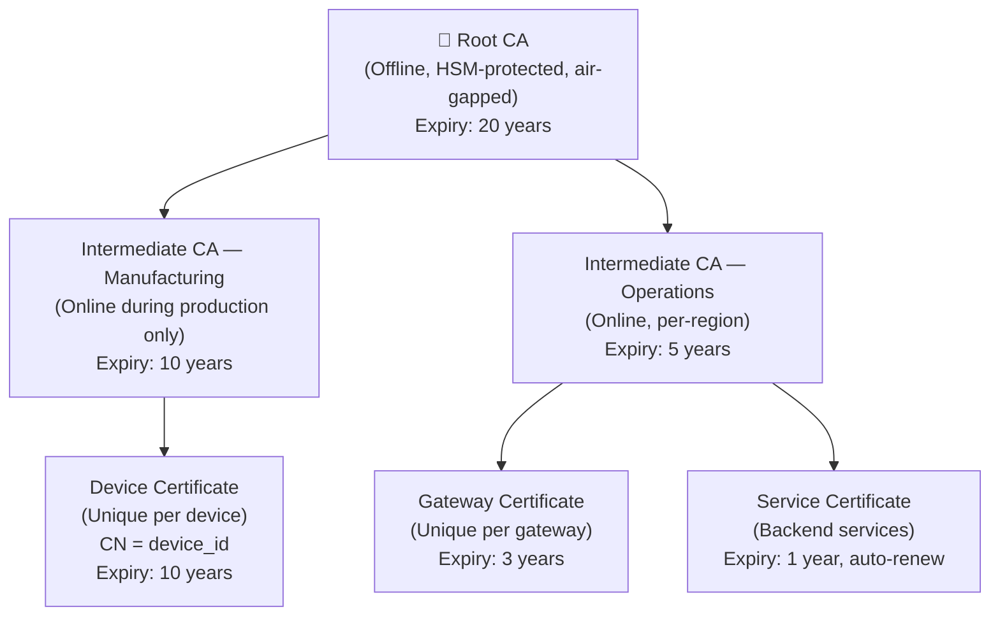

### 8.2 Zero-Touch Provisioning Flow

Zero-touch provisioning means a device can go from factory floor to operational state without a technician manually entering credentials, IP addresses, or certificates on site. This matters at scale: configuring 5,000 devices manually at deployment is a months-long project with high error rates. The sequence below splits provisioning into two phases: manufacturing time (key generation, certificate installation, pre-registration) and first-power-on (automated enrollment using the manufacturing certificate as the proof of identity). The site claim token is a one-time secret that links the device to the correct customer and site during enrollment.

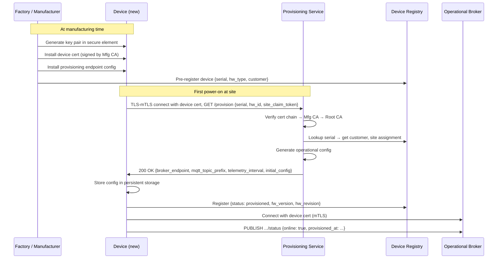

---

## 9. Data Ingestion Pipelines

The ingestion pipeline is the path between "message arrives at the broker" and "data is queryable in the time-series database." It sounds like a simple write operation but at production scale it is a distributed system with its own failure modes, bottlenecks, and tuning surface.

The critical design decision is whether to write directly from MQTT to your database or to introduce a message bus (Kafka, Kinesis, Pulsar) in between. The message bus adds operational complexity but provides: consumer fan-out (multiple services processing the same stream independently), replay capability (re-process historical data after a bug fix), and decoupling (database can be down without losing messages). For deployments above ~5,000 devices or requiring multiple downstream consumers, the message bus is almost always worth it.

A second key decision is **schema validation at ingestion**. You can validate early (at the broker via auth hooks, or at the ingestion worker) or late (at query time). Validate early: bad data caught late costs more to remediate and may have already flowed into dashboards, alerts, and ML models.

### 9.1 Scalable Ingestion Architecture

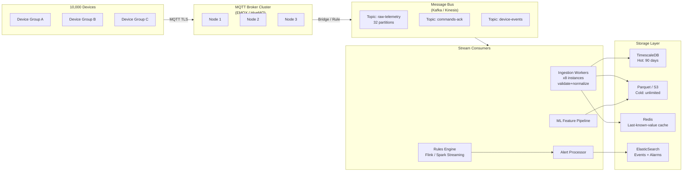

### 9.2 Throughput Math — Sizing Your Pipeline

Pipeline sizing is one of the most common causes of production incidents in IoT platforms — not because engineers do not care, but because they use the wrong input numbers. The calculation below walks through a realistic mid-size plant deployment with all the factors that are typically forgotten: deadband filtering (which typically reduces traffic 60–80% from the raw poll rate), payload format choice (Protobuf vs JSON matters at this scale), and the distinction between broker capacity and database capacity. Run this calculation before committing to infrastructure, and add at least 3× headroom for burst traffic during connectivity restoration events.

```
Real-world calculation for a mid-size plant deployment:

  Devices:          2,000
  Tags per device:  15 (mix of fast and slow)
  Fast tags (temp, pressure, flow): 10 tags, 1s interval
  Slow tags (totals, setpoints):     5 tags, 60s interval

  Raw message rate:
    Fast: 2,000 × 10 × 1 msg/s  = 20,000 msg/s
    Slow: 2,000 × 5 / 60 msg/s  =    167 msg/s
    Total: ≈ 20,167 msg/s

  After deadband filtering (assume 70% reduction in steady state):
    Effective: ≈ 6,050 msg/s to broker

  Payload size:
    JSON (verbose): 350 bytes avg → 2.1 MB/s ingress
    JSON (compact):  200 bytes avg → 1.2 MB/s ingress
    Protobuf:         80 bytes avg → 0.48 MB/s ingress

  Daily volume (compact JSON):
    1.2 MB/s × 86,400s = 103 GB/day uncompressed
    With LZ4 compression: ≈ 25-35 GB/day on disk

  Kafka partition sizing:
    Target: 50,000 msg/s per partition (conservative)
    Partitions needed: ceil(6,050 / 50,000) = 2 → use 8 (for consumer parallelism)

  TimescaleDB sizing:
    6,050 rows/s × 86,400s = 522M rows/day
    At 50 bytes/row (compressed): ≈ 26 GB/day
    90-day hot storage: ≈ 2.3 TB

  Chunk interval for hypertable:
    time_bucket = '1 day' for 90-day retention
    chunk_time_interval = INTERVAL '1 day'
```

---

## 10. Data Modeling for IoT

### 10.1 Time-Series Schema — Wide vs. Narrow

The wide vs. narrow schema decision is one of the highest-leverage choices in your IoT data model, and the wrong choice is expensive to reverse at scale. Narrow tables are schema-flexible but query-expensive: getting temperature and pressure for a pump at the same instant requires a self-join or pivot. Wide tables are faster for cross-tag analysis (the common dashboard query) but require a schema migration for every new sensor type. The recommendation for most production deployments is a hybrid: a wide table for the stable core tags of each device type, and a narrow overflow table for extended diagnostic or optional tags.

```sql
-- NARROW table: one row per tag per timestamp
-- Pros: simple schema, new tags require no schema change
-- Cons: 15x more rows, JOINs for cross-tag analysis, poor columnar compression

CREATE TABLE telemetry_narrow (
    time       TIMESTAMPTZ     NOT NULL,
    device_id  TEXT            NOT NULL,
    tag        TEXT            NOT NULL,
    value      DOUBLE PRECISION,
    quality    SMALLINT        DEFAULT 192
);
SELECT create_hypertable('telemetry_narrow', 'time',
    chunk_time_interval => INTERVAL '1 day');
CREATE INDEX ON telemetry_narrow (device_id, tag, time DESC);

-- WIDE table: one row per device per timestamp (all tags as columns)
-- Pros: columnar compression, fast cross-tag queries, natural schema
-- Cons: schema change for new tags, NULL-heavy for sparse devices

CREATE TABLE telemetry_pump (
    time            TIMESTAMPTZ     NOT NULL,
    device_id       TEXT            NOT NULL,
    temp_inlet_c    DOUBLE PRECISION,
    temp_outlet_c   DOUBLE PRECISION,
    pressure_bar    DOUBLE PRECISION,
    flow_m3h        DOUBLE PRECISION,
    vibration_rms   DOUBLE PRECISION,
    power_kw        DOUBLE PRECISION,
    q_temp_inlet    SMALLINT DEFAULT 192,
    q_pressure      SMALLINT DEFAULT 192
    -- quality codes per tag that matter
);
SELECT create_hypertable('telemetry_pump', 'time',
    chunk_time_interval => INTERVAL '1 day');

-- RECOMMENDATION:
-- Wide table per device type — better query performance
-- Narrow table for dynamic/unknown tags — more flexible
-- Hybrid: wide for core tags, narrow for extended/diagnostic tags
```

### 10.2 Continuous Aggregates — Production Query Performance

Raw data queries at 1s resolution over 90 days are slow. Use continuous aggregates. A dashboard querying 90 days of 1Hz data for a single device touches 7.8 million rows — and most dashboards query multiple devices and tags simultaneously. Continuous aggregates pre-compute these roll-ups incrementally as new data arrives, reducing a 30-second query to sub-second response time. The critical configuration detail is the `start_offset`: set it to cover your maximum expected late-arriving data (devices reconnecting after outages can deliver data that is hours old). Setting it too small means roll-ups are computed before all data has arrived, producing incorrect aggregates.

```sql
-- 1-minute aggregate (materialized, auto-updated)
CREATE MATERIALIZED VIEW telemetry_1min
WITH (timescaledb.continuous) AS
SELECT
    time_bucket('1 minute', time) AS bucket,
    device_id,
    AVG(temp_inlet_c)   AS temp_inlet_avg,
    MIN(temp_inlet_c)   AS temp_inlet_min,
    MAX(temp_inlet_c)   AS temp_inlet_max,
    STDDEV(temp_inlet_c) AS temp_inlet_stddev,
    AVG(pressure_bar)   AS pressure_avg,
    AVG(flow_m3h)       AS flow_avg,
    AVG(power_kw)       AS power_avg,
    COUNT(*)            AS sample_count,
    -- Quality: only aggregate Good readings (q=192)
    COUNT(*) FILTER (WHERE q_temp_inlet = 192) AS good_quality_count
FROM telemetry_pump
GROUP BY bucket, device_id
WITH NO DATA;

-- Auto-refresh policy
SELECT add_continuous_aggregate_policy('telemetry_1min',
    start_offset => INTERVAL '2 hours',   -- reprocess last 2h (late data)
    end_offset   => INTERVAL '1 minute',  -- don't process very recent
    schedule_interval => INTERVAL '1 minute');

-- 1-hour aggregate (built on top of 1-minute, not raw)
CREATE MATERIALIZED VIEW telemetry_1hour
WITH (timescaledb.continuous) AS
SELECT
    time_bucket('1 hour', bucket) AS hour,
    device_id,
    AVG(temp_inlet_avg)   AS temp_inlet_avg,
    MIN(temp_inlet_min)   AS temp_inlet_min,
    MAX(temp_inlet_max)   AS temp_inlet_max,
    SUM(sample_count)     AS sample_count
FROM telemetry_1min
GROUP BY hour, device_id
WITH NO DATA;

-- Retention: raw data 7 days, 1-min 90 days, 1-hour forever
SELECT add_retention_policy('telemetry_pump',  INTERVAL '7 days');
SELECT add_retention_policy('telemetry_1min',  INTERVAL '90 days');
-- telemetry_1hour: no retention policy (keep forever)
```

### 10.3 Alarm & Event Model

Alarm management is a safety-critical function in industrial environments, not just a notification feature. The schema below implements a proper alarm lifecycle (active → acknowledged → cleared → shelved) that matches ISA-18.2, the industrial alarm management standard. Without acknowledgement tracking, operators cannot tell whether an alarm has been seen. Without shelving, nuisance alarms that cannot be immediately fixed will be ignored — and real alarms will be buried. The flood detection query at the bottom is particularly important: a single failing sensor can generate thousands of alarms per hour, masking real incidents and overwhelming operators.

```sql
CREATE TABLE alarms (
    id              UUID PRIMARY KEY DEFAULT gen_random_uuid(),
    device_id       TEXT NOT NULL,
    tag             TEXT NOT NULL,
    alarm_type      TEXT NOT NULL,          -- 'process', 'device', 'comms'
    severity        TEXT NOT NULL,          -- 'critical','high','medium','low'
    condition       TEXT NOT NULL,          -- 'gt','lt','eq','rate_of_change'
    threshold       DOUBLE PRECISION,
    value_at_trigger DOUBLE PRECISION,
    activated_at    TIMESTAMPTZ NOT NULL,
    cleared_at      TIMESTAMPTZ,
    acknowledged_at TIMESTAMPTZ,
    acknowledged_by TEXT,
    shelved_until   TIMESTAMPTZ,            -- operator can shelve noisy alarms
    state           TEXT NOT NULL           -- 'active','cleared','acked','shelved'
        CHECK (state IN ('active','cleared','acked','shelved')),
    message         TEXT,
    norm_value      DOUBLE PRECISION        -- value when cleared
);

CREATE INDEX ON alarms (device_id, activated_at DESC);
CREATE INDEX ON alarms (state, severity) WHERE state = 'active';

-- Alarm flood detection query
SELECT device_id, COUNT(*) as alarm_count
FROM alarms
WHERE activated_at > NOW() - INTERVAL '10 minutes'
GROUP BY device_id
HAVING COUNT(*) > 10
ORDER BY alarm_count DESC;
-- Devices with > 10 alarms in 10 min = flooding → suppress + alert ops
```

---

## 11. Integration Patterns

### 11.1 Unified Namespace (UNS) — The ISA-95 Pattern in Practice

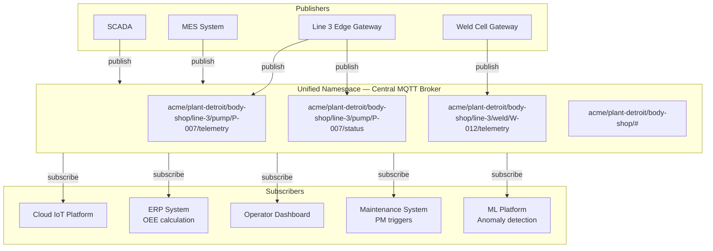

**Why UNS beats point-to-point integration:**
```
Before UNS (typical enterprise):
  SCADA → (custom adapter) → Historian
  SCADA → (OPC-DA bridge) → MES
  SCADA → (FTP export) → ERP
  Gateway → (REST API) → Cloud
  Gateway → (ODBC) → Local SQL
  = 5 integrations, each with its own failure modes, auth, versioning

  Adding a new consumer (ML platform): build a 6th integration
  SCADA change: update all 5 integrations

After UNS:
  SCADA → MQTT → UNS (one integration)
  All consumers subscribe independently
  Adding ML platform: subscribe to UNS, no producer changes
  SCADA change: update SCADA → UNS adapter (one point)
```

### 11.2 OT/IT Data Bridge — What Actually Works in Production

The OT/IT boundary is where most industrial IoT projects fail politically even when they succeed technically. OT teams have legitimate concerns about any new system that touches their network — a misconfigured gateway can disrupt SCADA communications, which can halt production. The pattern below is the one that consistently gets OT sign-off: read-only access through the existing historian, outbound-only data flow, no direct connections from IT systems into the OT network. The key principle is that the IT/cloud layer receives a copy of the data, never the original, and has no path back into the control network.

```mermaid
sequenceDiagram
    participant SCADA as SCADA System (Plant Network - Zone 2)
    participant HIST as OT Historian (PI / Wonderware)
    participant DMZ as DMZ Server (Zone 3)
    participant CLOUD as Cloud Platform (Zone 4)

    Note over SCADA,HIST: Existing OT data flow (do not disrupt)
    SCADA->>HIST: Tag values at 1s (existing)

    Note over HIST,DMZ: New: read-only replication out of OT
    HIST->>DMZ: PI to PI replication OR OPC-UA Historical Data Access (outbound only from OT)

    Note over DMZ,CLOUD: DMZ → Cloud (outbound only, no inbound to DMZ)
    DMZ->>CLOUD: MQTT TLS over port 8883 or HTTPS to cloud API

    Note over CLOUD: Cloud has no path back into plant network
    Note over CLOUD: Command-to-device goes through separate commissioned path (gateway, not SCADA)
```

**Data diode pattern for air-gapped OT:**
```
Hardware data diode (e.g., Waterfall Security, Owl Cyber Defense):
  - Physical one-way fiber — electrically impossible to send back
  - OT side: UDP transmitter
  - IT side: UDP receiver (no TCP — no SYN/ACK possible)
  - Protocol: custom UDP-based streaming, no acknowledgement
  - Use for: nuclear, defence, utilities where regulations require air-gap

Software data diode (for less strict requirements):
  - Firewall rules: OT → DMZ allowed, DMZ → OT blocked
  - DMZ server has no route to OT network
  - But: software can be misconfigured; not a true air-gap
```

---

## 12. OTA Firmware Updates: End-to-End

This is where industrial IoT deployments go wrong most often. A poorly designed OTA system can brick thousands of devices simultaneously. Every element below has been learned from real incidents.

### 12.1 OTA System Architecture

```mermaid
graph TB
    subgraph CI["CI/CD Pipeline"]
        BUILD[Firmware Build<br/>CMake / PlatformIO]
        SIGN[Code Signing<br/>HSM / Vault]
        STORE[Artifact Storage<br/>S3 / Azure Blob]
        META[Firmware Metadata<br/>DB Record]
    end

    subgraph OTA_SVC["OTA Service"]
        CAMP[Campaign Manager<br/>Rollout Scheduler]
        GATE[Canary Gate<br/>Health Monitor]
        NOTIFY[Notification Publisher<br/>MQTT]
        STAT[Status Tracker]
    end

    subgraph DEVICE["Device / Gateway"]
        OTA_AGENT[OTA Agent]
        VERIFY[Verify:<br/>1. Checksum SHA-256<br/>2. Signature ECDSA<br/>3. Version constraint]
        APPLY[Apply:<br/>Write to staging partition]
        BOOT[Bootloader:<br/>A/B swap + watchdog]
        ROLLBACK[Rollback:<br/>Revert to previous]
    end

    BUILD --> SIGN --> STORE
    SIGN --> META
    META --> CAMP
    CAMP -->|select cohort| GATE
    GATE -->|if healthy| NOTIFY
    NOTIFY -->|MQTT: ota/notification| OTA_AGENT
    OTA_AGENT -->|HTTPS GET signed URL| STORE
    STORE -->|firmware binary| OTA_AGENT
    OTA_AGENT --> VERIFY
    VERIFY -->|valid| APPLY
    VERIFY -->|invalid| OTA_AGENT
    APPLY --> BOOT
    BOOT -->|boot OK| STAT
    BOOT -->|boot fail| ROLLBACK
    ROLLBACK --> STAT
    STAT -->|MQTT: ota/status| OTA_SVC
    STAT --> GATE
```

### 12.2 Firmware Signing — Non-Negotiable in Industrial IoT

Firmware signing is the security control that makes OTA safe to operate at fleet scale. Without it, a compromised OTA service or a MITM attack can push arbitrary code to every device on your platform simultaneously — a single point of failure with catastrophic physical consequences for an industrial deployment. ECDSA P-256 is the recommended algorithm for constrained devices: it provides strong security with much faster verification than RSA (critical on MCUs without hardware crypto acceleration). The signing key must live in an HSM, never on a CI/CD server. Treat the signing key compromise as a Tier 1 security incident requiring full fleet re-provisioning.

```
Threat: attacker pushes malicious firmware to 10,000 devices.
Without signing: impossible to detect until after deployment.
With signing: firmware rejected at device before any execution.

Signing process (use ECDSA P-256 — faster verification than RSA on constrained devices):

1. Build produces: firmware.bin (raw binary)

2. Sign:
   # Using OpenSSL
   openssl dgst -sha256 -sign firmware_signing.key \
     -out firmware.sig firmware.bin

   # Verify locally before publishing
   openssl dgst -sha256 -verify firmware_signing.pub \
     -signature firmware.sig firmware.bin

3. Package (OTA manifest):
{
  "firmware_id": "fw-pump-monitor-2.4.0",
  "version": "2.4.0",
  "device_type": "pump_monitor_v2",
  "min_hw_revision": "Rev-B",
  "binary_url": "https://ota.acme.com/fw/pump-monitor-2.4.0.bin",
  "binary_size_bytes": 524288,
  "checksum_sha256": "a3b4c5d6...",
  "signature_ecdsa": "3046022100...",
  "signing_cert_id": "fw-signing-cert-2026-01",
  "release_notes_url": "https://...",
  "rollback_version": "2.3.1",
  "published_at": "2026-03-19T10:00:00Z"
}

4. Device verification (C pseudocode):
   uint8_t fw_signing_pubkey[] = { /* baked into firmware */ };

   bool verify_firmware(uint8_t* fw_data, size_t fw_size,
                        uint8_t* signature, size_t sig_size) {
       // Step 1: checksum
       uint8_t actual_hash[32];
       sha256(fw_data, fw_size, actual_hash);
       if (memcmp(actual_hash, expected_hash, 32) != 0) {
           LOG_ERROR("Firmware checksum mismatch");
           return false;
       }
       // Step 2: signature
       if (!ecdsa_verify(fw_signing_pubkey, actual_hash, signature, sig_size)) {
           LOG_ERROR("Firmware signature invalid");
           return false;
       }
       return true;
   }
```

### 12.3 A/B Partition — The Only Safe OTA for Industrial

A/B partition (dual-bank) firmware is the only OTA approach that is safe for unattended industrial devices. Without it, a power failure during a firmware write produces a device with corrupted firmware and no recovery path — the only fix is a field visit. With A/B partitioning, the active firmware continues running on partition A while the new firmware downloads to partition B. The boot only switches after a successful download and verification. If the new firmware fails to boot healthy, the bootloader automatically reverts to the known-good partition. This makes OTA failures self-healing at the device level, which is what enables fleet-scale rollouts without field technician standby.

Flash layout (embedded Linux / RTOS):

```mermaid
graph TB
    subgraph FLASH["Flash Storage Layout (total: ~16 MB example)"]
        BL["Bootloader — 64 KB<br/>Read-only, NEVER updated via OTA<br/>Manages A/B swap + watchdog"]
        BC["Boot Config — 4 KB<br/>Active partition pointer<br/>rollback_on_fail flag"]
        PA["Partition A — 4 MB<br/>Active firmware (currently running v2.3)<br/>Verified good — do not modify"]
        PB["Partition B — 4 MB<br/>Staging partition (OTA download target)<br/>Write new v2.4 here while A runs"]
        DP["Data Partition — 8 MB<br/>Config, certs, local SQLite DB<br/>Survives OTA — never erased"]
    end

    BL --> BC
    BC --> PA
    BC --> PB
    PA -.->|"boot config points here during normal ops"| BC
    PB -.->|"after OTA: boot config switches pointer here"| BC
    DP -.->|"independent of firmware partitions"| BL
```

Update sequence:
  1. Download v2.4 to Partition B (Partition A still running)
  2. Verify checksum + signature of Partition B
  3. Set boot config: next_boot = B, rollback_on_fail = true
  4. Set watchdog timer: 120s (if new fw doesn't check in, watchdog reboots)
  5. Reboot
  6. Bootloader reads boot config → boots Partition B (v2.4)
  7. New firmware starts, runs health checks
  8. If healthy: call confirm_update() → set boot config: active = B, permanent
  9. If unhealthy: watchdog fires OR firmware calls rollback()
     → bootloader boots Partition A (v2.3)
     → device publishes: ota/status {status: rolled_back, reason: "health check failed"}

What "healthy" means — device must validate:
  - Connects to MQTT broker within 30s
  - All required drivers initialize
  - Configuration loaded successfully
  - First telemetry message published
  - No hard faults in first 60s
```

### 12.4 OTA State Machine — Full Device Lifecycle

```mermaid
stateDiagram-v2
    [*] --> Idle: Normal operation
    Idle --> Notified: OTA notification received
    Notified --> Checking: Check version constraint and hw_revision
    Checking --> Idle: Version same or hw not compatible
    Checking --> DownloadScheduled: Compatible - schedule for maintenance window
    DownloadScheduled --> Downloading: Maintenance window opens or immediate if forced
    Downloading --> Verifying: Download complete
    Downloading --> DownloadFailed: Network error or timeout
    DownloadFailed --> DownloadScheduled: Retry (backoff)
    Verifying --> Verified: Checksum + signature OK
    Verifying --> VerifyFailed: Checksum or signature mismatch
    VerifyFailed --> Idle: Report failure - do not apply
    Verified --> WaitingApply: Wait for apply window or operator approval
    WaitingApply --> Applying: Apply command received or auto-apply window
    Applying --> Rebooting: Written to partition B - boot config updated
    Rebooting --> HealthCheck: New firmware boots
    HealthCheck --> Confirmed: All health checks pass - confirm_update() called
    HealthCheck --> RolledBack: Health check fails or watchdog fires
    Confirmed --> Idle: Report success
    RolledBack --> Idle: Report rollback - alert ops
```

### 12.5 Rollout Campaigns — Safe Deployment at Fleet Scale

At fleet scale, a firmware update is a distributed systems operation, not a simple file push. The phased rollout approach below is designed to catch firmware regressions before they reach the full fleet, with each phase acting as a gate that must pass before the next opens. The critical operational discipline is automatic rollback: the campaign manager must monitor health signals and pause the campaign automatically, not wait for a human to notice a problem. By the time an on-call engineer manually notices an elevated rollback rate at 3am, hundreds more devices may have already been enrolled.

```
Rollout phases for a 5,000-device fleet:

Phase 0 — Lab / Staging (before any production device):
  Target:    Test bench devices (not production)
  Duration:  24h burn-in
  Criteria:  Zero crashes, all telemetry nominal, command round-trip < 500ms

Phase 1 — Canary (1%, ~50 devices):
  Target:    Non-critical devices with human oversight
  Duration:  48h
  Auto-rollback triggers:
    - OTA success rate < 95%
    - Post-update crash rate > 2%
    - Telemetry gap rate > 5%
    - Any device permanently bricked (requires manual recovery)
  Proceed criteria: all triggers green for 48h

Phase 2 — Early adopters (10%, ~500 devices):
  Target:    Mix of criticality levels
  Duration:  72h
  Monitor: same triggers, expand crash monitoring to memory/CPU trends

Phase 3 — General rollout (50% → 100%):
  Batch size: 500 devices/hour (don't blast all at once)
  Stagger: different sites in different hours (follow sun)
  Skip: devices actively executing critical processes (interlock)

  Scheduling logic:
    - Check device.is_in_active_process() before scheduling OTA
    - Prefer: weekends, nights, planned maintenance windows
    - Maintenance window config per device/site:
      "ota_window": "Sun 02:00-06:00 UTC"

Post-rollout:
  - 7-day observation window before closing campaign
  - Compare: MTBF before vs. after update
  - Energy consumption delta (firmware bugs can cause CPU spin)
  - Telemetry quality score before vs. after
```

### 12.6 Delta OTA — When Bandwidth Is Constrained

For LoRaWAN, satellite, or metered cellular devices, full firmware downloads may be physically impossible or economically prohibitive. Delta OTA (binary patching) transmits only the differences between firmware versions, typically achieving 85–95% size reduction for incremental updates. This comes with significant operational complexity: you must maintain a delta catalog for every supported upgrade path, and the device must have sufficient RAM to hold three firmware copies simultaneously during reconstruction. Add this complexity only when bandwidth genuinely constrains your deployment — on Wi-Fi or wired Ethernet, full image OTA is simpler and more reliable.

For LoRaWAN, satellite, or metered cellular devices:

```
Binary delta generation (bsdiff / xdelta3):

  xdelta3 -e -s old_firmware.bin new_firmware.bin delta.patch
  # old: 512KB, new: 524KB, delta: typically 20-80KB (90% reduction)

  Device reconstruction:
    xdelta3 -d -s current_firmware.bin delta.patch new_firmware.bin
    # Verify new_firmware.bin checksum before applying

  Constraints:
    - Device must have enough RAM/storage for 3 copies during reconstruction
    - Delta is FROM-version specific — need delta for every upgrade path
    - Keep delta catalog: v2.1→v2.2, v2.2→v2.3, v2.1→v2.3, etc.
    - Maintain for N-2 versions minimum

  When to use delta vs. full:
    Full bandwidth headroom > 10x firmware size: use full (simpler)
    LoRaWAN (< 250 bytes/message): delta mandatory + chunking
    LTE-M on data plan: delta if firmware > 100KB
    Wi-Fi / Ethernet: full image almost always
```

### 12.7 OTA Failure Recovery Playbook

Every OTA failure mode in the playbook below has been observed in production fleets. The most important operational discipline is treating any automatic rollback as a production incident requiring immediate investigation — not as a successful safety mechanism to be acknowledged and forgotten. A rollback means real firmware that passed your CI/CD pipeline and canary phase failed in the field, which means your canary criteria missed something. Understanding why is more important than the rollback itself. The Scenario 4 case (bricked device) should be treated as a bootloader bug — a/b partition design makes bricking via OTA theoretically impossible, so any brick indicates a gap in your invariants.

```
Scenario 1: Device fails to download (network timeout)
  Automatic: retry with exponential backoff (max 6h between attempts)
  After 3 failed attempts: alert operations team
  Manual: operator can force-retry or defer campaign

Scenario 2: Verification failure (checksum mismatch)
  Automatic: delete partial download, alert immediately
  Cause: corrupted download (most common), or wrong firmware served
  Manual: check artifact storage checksum, re-serve

Scenario 3: New firmware boot fails (watchdog fires, rollback)
  Automatic: device rolls back to last good firmware, reports status
  Alert: immediate — paged to on-call (any rollback is a production incident)
  Root cause: new firmware incompatible with device state/config
  Manual: investigate logs, fix firmware, re-test on canary before re-campaign

Scenario 4: Device bricked (doesn't boot after OTA, no rollback)
  Cause: bootloader corruption (should be impossible with A/B, means bootloader bug)
        or hardware failure triggered during reboot
  Manual: field technician physical recovery or RMA
  Prevention: never OTA the bootloader via the same OTA channel as application

Scenario 5: Mass rollback (>5% of campaign devices rolled back)
  Automatic: campaign paused, no further devices enrolled
  Alert: escalate to engineering lead, not just ops
  Manual: investigate with devices in Phase 1/2 before proceeding
```

---

## 13. Security Architecture

### 13.1 Threat Model

```mermaid
graph LR
    subgraph Threats
        T1[Unauthenticated<br/>broker connections]
        T2[MITM on device<br/>communication]
        T3[Malicious firmware<br/>pushed via OTA]
        T4[Stolen device<br/>certificate]
        T5[Replay attack<br/>on commands]
        T6[Lateral movement<br/>from compromised gateway]
        T7[Data exfiltration<br/>via device]
    end
    subgraph Controls
        C1[mTLS + cert pinning]
        C2[TLS 1.3 everywhere]
        C3[ECDSA firmware signing<br/>+ secure element]
        C4[Short-lived certs<br/>+ CRL / OCSP]
        C5[Command TTL<br/>+ nonce + timestamp]
        C6[Network segmentation<br/>IEC 62443 zones]
        C7[Topic-level ACLs<br/>per device scope]
    end
    T1 --> C1
    T2 --> C2
    T3 --> C3
    T4 --> C4
    T5 --> C5
    T6 --> C6
    T7 --> C7
```

### 13.2 Network Zone Architecture (IEC 62443)

IEC 62443 defines the zone-and-conduit model that is the basis for industrial cybersecurity architecture. The key principle is that every zone boundary is a trust boundary: traffic crossing a zone boundary must be explicitly authorized, and the direction of trust matters — higher-trust zones (cloud) must never be able to initiate connections into lower-trust zones (OT). The diagram below shows the standard four-zone model; pay attention to Zone 0 (safety systems), which must be physically isolated — no network path exists to or from it, by design. Any architecture that touches Zone 0 from a network connection is non-compliant with IEC 61511 safety requirements.

```mermaid
graph TB
    subgraph Z0["Zone 0 — Safety Layer (isolated, SIL-rated)"]
        SIS[Safety Instrumented System<br/>Burner Management, ESD]
    end
    subgraph Z1["Zone 1 — Control (OT Network, no internet)"]
        PLC[PLCs / DCS]
        HMI[Local HMI]
    end
    subgraph Z2["Zone 2 — Operations DMZ"]
        HIST[OT Historian]
        GW[Edge Gateways]
        MQTT_LOCAL[Local MQTT Broker]
    end
    subgraph Z3["Zone 3 — Business IT / Cloud"]
        CLOUD_PLAT[Cloud IoT Platform]
        ERP[ERP / Business Systems]
    end
    subgraph Z4["Zone 4 — Internet (untrusted)"]
        REMOTE[Remote Access<br/>VPN only]
    end

    Z0 -.->|"Physical isolation - no network path"| Z1
    Z1 -->|"OPC-UA / Modbus - OT-to-DMZ only"| Z2
    Z2 -.->|"Blocked: no inbound to control zone"| Z1
    Z2 -->|"MQTT TLS outbound or HTTPS"| Z3
    Z3 -.->|"No direct inbound to DMZ"| Z2
    Z4 -->|"VPN only - Jump host required"| Z3
```

### 13.3 Certificate Lifecycle Management

Certificate expiry is the most common operational security incident in IoT fleets — more common than actual attacks. A device with an expired certificate cannot authenticate to the broker, which means it silently stops sending data. At fleet scale with certificates expiring on different schedules, this creates a rolling pattern of unexplained device offline events that consumes significant operations time. The workflow below implements a 90-day advance warning with automated renewal, which means no device should ever expire as a surprise. The overlap period (old and new certs both valid) is essential: it allows rollback if the new cert has a problem, and accommodates devices that are offline during the renewal window.

```
Certificate states and operations:

  ISSUED → ACTIVE → EXPIRING (30 days) → EXPIRED → REVOKED
                                ↓
                          AUTO-RENEW
                          (if device online)

Rotation workflow:
  1. Monitor cert expiry: daily job checks all devices
     SELECT device_id, cert_expiry, (cert_expiry - NOW()) as days_left
     FROM devices
     WHERE cert_expiry < NOW() + INTERVAL '90 days'
     ORDER BY cert_expiry ASC;

  2. 90 days before expiry: issue new cert, push via secure channel
  3. Device stores new cert alongside old cert
  4. Device tests new cert (connects to test endpoint)
  5. On success: device switches to new cert, reports cert_id
  6. Old cert revoked after 7-day overlap

  Revocation for compromised cert:
    CRL: update CRL, distribute to all brokers (max 24h propagation)
    OCSP: real-time revocation check (preferred, adds latency)

    Industrial reality: many devices cannot do OCSP (no internet, constrained MCU)
    Solution: CRL distribution to edge gateway (gateway validates on behalf of device)
```

---

## 14. Observability & Operations

### 14.1 The Four Signals for IoT

Adapt Google SRE's four golden signals to IoT. The SRE framework (latency, traffic, errors, saturation) does not map cleanly to IoT operations — you cannot measure latency for a device that is offline, and traffic rate is less important than data freshness. The adapted signals below reflect what actually predicts an IoT operational incident. Connectivity rate dropping is often the first signal of a broker or network problem. Data freshness degrading — devices still connected but not sending — often indicates a deadlocking bug in firmware or an edge rules engine overload. Track all four on the same operations dashboard so you can correlate them.

```
1. CONNECTIVITY (replaces latency for IoT)
   - fleet_connectivity_rate = online_devices / total_devices
   - per_device_last_seen_gap
   - reconnect_rate (high reconnect = network instability)

2. THROUGHPUT (replaces traffic)
   - messages_per_second ingested
   - bytes_per_second
   - message_drop_rate (broker or consumer)

3. ERRORS
   - schema_validation_failures_rate
   - bad_quality_reading_pct
   - command_failure_rate
   - OTA_rollback_rate

4. DATA FRESHNESS (replaces saturation for IoT)
   - per_device: age of last reading vs. expected interval
   - fleet: % of devices with data fresher than 2× their interval
   - stale_device_count (readings > 5× expected interval old)
```

### 14.2 Operational Dashboard — What to Show

An operations dashboard that requires an operator to click through to find problems has already failed. The layout below puts fleet health status at the top row — always visible, no scrolling — with connectivity rate, message throughput, active alarm count, and OTA campaign status as persistent KPIs. The hierarchy below that (site map, then time-series, then active incidents) is ordered by scope: site-level problems first, then trends, then specific device issues. Build this before you build device-level dashboards — the fleet view is what on-call engineers use at 3am, and it should require no more than three seconds to determine whether a fleet-wide incident is happening.

```mermaid
graph TB
    subgraph DASH["Operations Dashboard"]
        subgraph ROW1["Fleet Health (top row — always visible)"]
            KPI1["🟢 Online: 1,847/2,000<br/>(92.4%)"]
            KPI2["📨 Msg Rate: 5,842/s"]
            KPI3["⚡ Active Alarms: 12<br/>(3 critical)"]
            KPI4["🔄 OTA: 234 pending<br/>98.7% success"]
        end
        subgraph ROW2["Per-Site Connectivity Map"]
            MAP[Heatmap: site → connectivity %<br/>Red less than 85%, Yellow less than 95%, Green 95%+]
        end
        subgraph ROW3["Time-Series Charts"]
            CHART1[Message rate last 24h]
            CHART2[Alarm rate last 24h]
            CHART3[Data quality score last 7d]
        end
        subgraph ROW4["Active Incidents"]
            INC[Sorted by severity<br/>Time since last seen<br/>Firmware version<br/>Last alarm]
        end
    end
```

### 14.3 Alerting Rules — Production-Proven Thresholds

The thresholds below are not arbitrary — they have been calibrated against real fleets where lower thresholds caused alert fatigue and higher thresholds let real incidents go undetected. The tiering (immediate page vs. team notification vs. daily digest) is as important as the thresholds: an on-call engineer who receives 50 pages per night will start ignoring them, which means the critical alarm that matters gets the same treatment as the noisy low-severity one. Review and adjust these thresholds after your first 90 days in production — every fleet has different baseline connectivity rates and alarm patterns.

```yaml
# AlertManager / PagerDuty rules

alerts:

  # Immediate page
  - name: fleet_connectivity_critical
    condition: fleet_connectivity_rate < 0.85
    duration: 5m
    severity: critical
    page: true
    message: "Fleet connectivity dropped to {value}%. Check broker and network."

  - name: broker_down
    condition: broker_connections_active == 0
    duration: 1m
    severity: critical
    page: true

  - name: ingestion_lag_critical
    condition: kafka_consumer_lag > 100000
    duration: 3m
    severity: critical
    page: true

  # Team notification (business hours OK)
  - name: device_offline_extended
    condition: device_last_seen > 30m AND device.criticality == 'high'
    severity: high
    notify: ops_team_channel

  - name: cert_expiry_warning
    condition: device.cert_expiry_days < 30
    severity: medium
    notify: infra_team

  - name: ota_rollback_rate_elevated
    condition: ota_rollback_rate_1h > 0.05  # > 5% rollback
    severity: high
    notify: firmware_team
    message: "OTA rollback rate elevated: {value}. Pause campaign."

  # Daily digest
  - name: firmware_version_drift
    condition: devices_not_on_target_fw / total_devices > 0.1
    severity: low
    notify: daily_digest
```

---

## 15. Reference Architectures

### 15.1 Greenfield Industrial IoT — Complete Architecture

```mermaid
graph TB
    subgraph FIELD["Plant Floor (OT Network)"]
        PLC1["PLC Line 3<br/>Siemens S7-1500<br/>OPC-UA Server"]
        RTU1["Field RTU<br/>DNP3/Modbus<br/>Solar + LTE"]
        SENS1["IO-Link Sensors<br/>Sick / ifm"]
    end

    subgraph EDGE["Edge Layer (DMZ)"]
        GW1["Edge Gateway 1<br/>(Line 3)<br/>Intel NUC / Moxa V2403"]
        GW2["Edge Gateway 2<br/>(Remote Assets)<br/>Raspberry Pi CM4 / Advantech"]
    end

    subgraph CLOUD_INFRA["Cloud Platform"]
        subgraph BROKER_CLUSTER["MQTT Broker Cluster (EMQX x3)"]
            B1[Node 1]
            B2[Node 2]
            B3[Node 3]
        end

        subgraph INGESTION["Ingestion Layer"]
            KAFKA["Kafka<br/>8 partitions<br/>raw-telemetry"]
            ING_W["Ingestion Workers<br/>×4 containers"]
        end

        subgraph STORAGE["Storage"]
            TSDB["TimescaleDB<br/>(Hot: 90d)"]
            S3["S3 / Azure Blob<br/>(Cold: unlimited<br/>Parquet format)"]
            REDIS["Redis<br/>Last-known-value<br/>Deduplication"]
        end

        subgraph SERVICES["Platform Services"]
            REG["Device Registry<br/>+ DPS"]
            CMD["Command Service"]
            OTA_S["OTA Service"]
            RULES["Rules Engine<br/>(Flink)"]
            API["REST API<br/>+ WebSocket"]
        end
    end

    subgraph APP["Application Layer"]
        DASH["Grafana<br/>Operations Dashboard"]
        ALARM["Alarm Manager"]
        ML["ML Platform<br/>Predictive Maintenance"]
        ERP["ERP Integration<br/>SAP / Oracle"]
    end

    PLC1 -->|OPC-UA subscription| GW1
    SENS1 -->|IO-Link → OPC-UA| PLC1
    RTU1 -->|Modbus RTU| GW2

    GW1 -->|MQTT TLS 8883| BROKER_CLUSTER
    GW2 -->|MQTT TLS over LTE| BROKER_CLUSTER

    BROKER_CLUSTER -->|Bridge| KAFKA
    KAFKA --> ING_W
    ING_W --> TSDB
    ING_W --> S3
    ING_W --> REDIS
    ING_W --> RULES
    RULES --> ALARM

    API --> TSDB
    API --> REDIS
    API --> REG

    CMD -->|MQTT via broker| GW1
    OTA_S -->|MQTT notification| GW1

    APP --> API
    ML --> S3
    ERP --> API
```

### 15.2 Brownfield Retrofit — SCADA + Historian + Cloud

```mermaid
graph LR
    subgraph OT["Existing OT (do not modify)"]
        PLC_EXIST[Existing PLCs<br/>All brands]
        SCADA_EXIST[Existing SCADA<br/>Inductrial / iFIX]
        HIST_EXIST[Existing Historian<br/>PI / Wonderware]
    end

    subgraph NEW_EDGE["New: Read-Only Edge Layer"]
        OPCUA_GW[OPC-UA Client<br/>on Edge Gateway<br/>Read-only subscription<br/>to SCADA tags]
        PI_CON[PI Connector<br/>(if PI Historian)<br/>Read OSIsoft tags]
    end

    subgraph NEW_CLOUD["New: Cloud Layer"]
        BROKER_NEW[MQTT Broker]
        PLATFORM[IoT Platform]
        ANALYTICS[Analytics / ML]
    end

    PLC_EXIST --> SCADA_EXIST --> HIST_EXIST
    SCADA_EXIST -->|OPC-UA read-only - no writes to SCADA| OPCUA_GW
    HIST_EXIST -->|PI-to-PI or JDBC read| PI_CON
    OPCUA_GW -->|MQTT TLS| BROKER_NEW
    PI_CON -->|MQTT TLS| BROKER_NEW
    BROKER_NEW --> PLATFORM --> ANALYTICS

    style SCADA_EXIST fill:#ffd700,color:#000
    style HIST_EXIST fill:#ffd700,color:#000
    style PLC_EXIST fill:#ffd700,color:#000
```

> **Golden rule for brownfield:** The existing OT system is the source of truth. The cloud is a copy. Never route commands through SCADA that wasn't designed for it. Any new C2D command path gets its own dedicated gateway and its own network path.

### 15.3 Remote Asset Monitoring — Oil & Gas / Utilities

Remote asset monitoring is the hardest class of IoT deployment. Devices operate in harsh environments with no reliable connectivity, limited power, cellular data costs, and 15–20 year asset lifespans. Every design decision has a direct cost — data sent costs money, power consumed shortens battery life, and a firmware bug deployed to 2,000 solar-powered RTUs in the field requires a truck roll to recover. This architecture is optimised for resilience and frugality over capability.

The key constraint that shapes all other decisions is **intermittent connectivity**. Unlike a factory gateway that loses internet for hours, a remote RTU on an oil pipeline may have LTE coverage for 30 minutes per hour and must operate correctly during the 30 minutes it does not. This mandates: store-and-forward on the device itself (not just the gateway), time-synchronised data with source timestamps, and commands that are safe to arrive late or not at all.

```mermaid
graph TB
    subgraph FIELD["Remote Field Site (Hazardous Area, IP67)"]
        SENS1[Pressure Sensors<br/>4-20mA / HART]
        SENS2[Flow Computer<br/>AGA-7 / Modbus RTU]
        SENS3[Level Sensor<br/>Guided wave radar]
        RTU[RTU / Edge Controller<br/>Moxa UC-8100 / Emerson ROC<br/>Class I Div 2 rated]
        SOLAR[Solar Panel + Battery<br/>200W panel, 100Ah LiFePO4]
    end

    subgraph COMMS["Connectivity Layer (Intermittent)"]
        LTE[LTE-M Modem<br/>Dual SIM failover<br/>60-70% uptime SLA]
        SAT[Satellite Fallback<br/>Iridium / Inmarsat<br/>for critical alarms only]
    end

    subgraph CLOUD["Cloud Platform"]
        BROKER[MQTT Broker Cluster<br/>QoS 1 persistent sessions]
        INGST[Ingestion Service<br/>gap-aware, sequence tracking]
        TSDB[Time-Series DB<br/>source timestamp preserved]
        ALARM[Alarm Service<br/>edge-evaluated + cloud]
        SCADA_CLOUD[Cloud SCADA<br/>Ignition / custom]
    end

    subgraph OPS["Operations"]
        DASH[Field Operations<br/>Dashboard]
        MAINT[Maintenance<br/>Work Orders]
        REG[Regulatory<br/>Reporting]
    end

    SENS1 -->|4-20mA loop| RTU
    SENS2 -->|Modbus RTU RS-485| RTU
    SENS3 -->|HART / Modbus| RTU
    SOLAR -->|24V DC power| RTU
    RTU -->|Primary: LTE-M MQTT TLS| LTE
    RTU -->|Fallback: critical alarms| SAT
    LTE -->|MQTT QoS1 persistent| BROKER
    SAT -->|SMS / MQTT| ALARM
    BROKER --> INGST --> TSDB
    INGST --> ALARM
    TSDB --> SCADA_CLOUD
    SCADA_CLOUD --> DASH
    ALARM --> MAINT
    TSDB --> REG
```

**Key design decisions specific to remote assets:**
- **Store-and-forward on the RTU itself** (not just the gateway) — size the local buffer for worst-case outage (72h at design data rate)
- **Source timestamps are mandatory** — RTU must have GPS or NTP sync; cloud cannot infer timestamps from receipt time when connectivity is intermittent
- **Edge-evaluated alarms** — do not rely on cloud for safety alarms; RTU must evaluate high/low limits locally and trigger local outputs (shutdowns, horns) regardless of connectivity
- **Satellite for critical alarms only** — satellite data costs $0.10–$0.50 per KB; reserve for emergency shutdowns, not telemetry
- **OTA in designated window only** — RTU must enforce maintenance window and reject OTA outside it; a firmware update during peak flow measurement creates regulatory reporting gaps

```
Design constraints for remote assets:
  Power:        Solar + battery → budget < 2W average
  Connectivity: LTE-M with 60-70% uptime SLA
  Data budget:  50 MB/month per device (cellular cost)
  Environment:  -40°C to +70°C, IP67, Class I Div 2 (hazardous area)
  Asset life:   15-20 years (no hardware replacement)
  Update window: 02:00-04:00 local time

Data budget calculation:
  Available: 50 MB/month = 50,000 KB = 50M bytes
  Overhead (TLS, MQTT, retries): ~15% → 42.5M bytes usable
  Per day: 42.5M / 30 = 1.42 MB/day

  At 5 tags, 5-minute interval, 80 bytes/msg (compact JSON):
  5 tags × 288 msgs/day × 80 bytes = 115,200 bytes/day → ✅ well within budget

  At 5 tags, 1-minute interval:
  5 × 1440 × 80 = 576,000 bytes/day → still within budget

  Protocol overhead for LTE-M:
  Use MQTT persistent sessions (clean_session=false)
  Reconnect without resending SUBSCRIBE (saves bandwidth)
  Use MQTT 5.0 message expiry to avoid delivering stale commands

Power budget (example RTU):
  MCU active (sampling + processing): 200mW × 0.05 duty cycle = 10mW avg
  LTE-M active (transmit burst):      500mW × 0.02 duty cycle = 10mW avg
  Sensors (4-20mA loop):              25mW × 3 sensors = 75mW
  Total: ~95mW → solar panel: 200mW sufficient (with 3× margin)
  Battery: 10Ah × 3.7V = 37Wh → ~16 days without sun
```

### 15.4 Predictive Maintenance Platform Architecture

Predictive maintenance (PdM) is the highest-value IoT application in discrete manufacturing — moving from time-based maintenance schedules to condition-based intervention reduces unplanned downtime by 30–50% in well-instrumented plants. The architecture differs from standard telemetry in three key ways: it generates burst high-frequency waveform data (vibration at 10–50kHz), it requires a feature engineering pipeline between raw data and model input, and the output is not a dashboard value but a work order trigger in a CMMS system. Model inference can run at the edge (lower latency, works offline) or in the cloud (easier retraining, larger models) — the typical production pattern runs a lightweight anomaly detection model at the edge and a more sophisticated degradation model in the cloud.

```mermaid
graph TB
    subgraph SENSORS["Sensing Layer"]
        VIB["Vibration Sensors<br/>IEPE accelerometers<br/>10kHz–50kHz sample rate"]
        TEMP["Process Sensors<br/>Temperature, pressure, flow<br/>1s–10s interval"]
        AMP["Power Meters<br/>Current + power factor<br/>Motor load signature"]
    end

    subgraph EDGE["Edge Gateway (PdM-capable)"]
        DAQ["DAQ Module<br/>High-speed waveform capture<br/>1s burst every 10–60min"]
        FFT["Edge FFT Processor<br/>Time → frequency domain<br/>Peak detection"]
        FEAT_E["Edge Feature Extraction<br/>RMS, crest factor,<br/>kurtosis, bearing freqs"]
        INF_E["Edge Inference<br/>ONNX lightweight model<br/>Anomaly threshold"]
        BUF_E["Local Buffer<br/>Waveform store 7 days"]
    end

    subgraph CLOUD["Cloud Platform"]
        INGEST["Ingestion Pipeline<br/>Raw waveform + features<br/>Kafka / Kinesis"]
        FEAT_C["Cloud Feature Pipeline<br/>Flink streaming<br/>Rolling statistics"]
        BLOB["Waveform Store<br/>S3 / Azure Blob<br/>Parquet format"]
        TSDB_PD["TimescaleDB<br/>Features + health scores<br/>90-day hot storage"]
        TRAIN["Model Training<br/>MLflow + scikit-learn<br/>Retrain weekly on new data"]
        INF_C["Inference Service<br/>Degradation model<br/>RUL estimation"]
        MODEL_REG["Model Registry<br/>MLflow / SageMaker<br/>Version + deploy to edge"]
    end

    subgraph INTEGRATION["Business Integration"]
        CMMS["CMMS / EAM<br/>SAP PM / IBM Maximo<br/>Work order creation"]
        ALERT_PD["PdM Alert Engine<br/>Severity scoring<br/>Lead time estimation"]
        DASH_PD["Maintenance Dashboard<br/>Health scores per asset<br/>Upcoming interventions"]
    end

    VIB -->|IEPE / IO-Link| DAQ
    TEMP -->|OPC-UA / Modbus| EDGE
    AMP -->|Modbus TCP| EDGE
    DAQ --> FFT --> FEAT_E --> INF_E
    INF_E -->|anomaly flag + features| INGEST
    DAQ --> BUF_E -->|full waveform upload| BLOB

    INGEST --> FEAT_C --> TSDB_PD
    INGEST --> BLOB
    TSDB_PD --> INF_C
    FEAT_C --> INF_C
    INF_C --> ALERT_PD
    ALERT_PD -->|work order trigger| CMMS
    ALERT_PD --> DASH_PD
    TSDB_PD --> TRAIN
    BLOB --> TRAIN
    TRAIN --> MODEL_REG -->|deploy model| INF_E
    MODEL_REG -->|deploy model| INF_C
```

**Key design decisions for PdM:**

- **Vibration data handling:** Capture waveforms at the edge at the required sample rate (10–50kHz), compute FFT and statistical features locally, and send only features to the cloud during normal operation. Send full waveforms only on anomaly detection or for periodic model retraining. This keeps LTE bandwidth viable for remote assets.
- **Model serving at edge vs. cloud:** Run a lightweight threshold-based or AutoEncoder model at the edge for real-time anomaly flagging with zero cloud dependency. Run a more complex LSTM or random forest degradation model in the cloud for remaining-useful-life (RUL) estimation, which can tolerate minutes of latency. The edge model catches the acute failure; the cloud model catches the gradual trend.
- **Alert-to-work-order integration:** PdM value is only realized if the alert creates a maintenance action. Integrate the inference service output directly with your CMMS via REST API or message queue. Include estimated lead time (days to failure) in the work order so planners can schedule parts and labor. A PdM alert with no downstream action is a notification system, not a maintenance system.

### 15.5 Smart Building / BMS Architecture

Smart building IoT differs from industrial manufacturing IoT in its dominant protocols (BACnet and Modbus TCP rather than OPC-UA and PROFIBUS), its scale profile (hundreds of devices per building, thousands per campus), and its primary business metric (energy cost reduction and occupancy optimization rather than OEE). The BMS gateway is the critical integration point: it translates BACnet/IP device objects and Modbus registers into a normalized MQTT stream while maintaining the BMS's ability to continue managing local HVAC control loops without cloud dependency.

```mermaid
graph LR
    subgraph BUILDING["Building Systems"]
        AHU["AHUs / VAVs<br/>BACnet/IP<br/>Temperature, flow, damper"]
        CHILLER["Chillers / Boilers<br/>BACnet/IP or Modbus TCP<br/>kW, COP, setpoints"]
        METER["Energy Meters<br/>Modbus TCP<br/>kWh, kVA, power factor"]
        LIGHTING["Lighting Controls<br/>DALI / BACnet<br/>Occupancy + lux"]
        ACCESS["Access Control<br/>OSDP / proprietary<br/>Occupancy counts"]
    end

    subgraph BMS_GW["BMS Gateway / Edge"]
        BACNET_D["BACnet/IP Driver<br/>COV subscriptions<br/>Read-only for IoT"]
        MODBUS_D["Modbus TCP Driver<br/>Energy meter polling<br/>15-min intervals"]
        NORM_B["Normalizer<br/>BACnet object → MQTT<br/>Unit + quality mapping"]
        BUFF_B["Local Buffer<br/>SQLite WAL mode<br/>72h capacity"]
    end

    subgraph CLOUD_B["Cloud Platform"]
        BROKER_B["MQTT Broker<br/>Building topic hierarchy<br/>campus/building/floor/zone"]
        INGEST_B["Ingestion Pipeline"]
        TSDB_B["TimescaleDB<br/>Energy + comfort data"]
        RULES_B["Rules Engine<br/>Setpoint optimization<br/>Demand response"]
    end

    subgraph APP_B["Applications"]
        ENERGY["Energy Dashboard<br/>EUI, peak demand,<br/>cost per sqft"]
        COMFORT["Comfort Monitoring<br/>CO2, temp, humidity<br/>per zone"]
        DR["Demand Response<br/>Utility program integration<br/>Automated curtailment"]
        REPORT["Sustainability Reporting<br/>ENERGY STAR, LEED<br/>Carbon accounting"]
    end

    AHU -->|BACnet/IP COV| BACNET_D
    CHILLER -->|BACnet/IP| BACNET_D
    METER -->|Modbus TCP| MODBUS_D
    LIGHTING -->|BACnet/IP| BACNET_D
    ACCESS -->|API| NORM_B

    BACNET_D --> NORM_B
    MODBUS_D --> NORM_B
    NORM_B --> BUFF_B --> BROKER_B
    BROKER_B --> INGEST_B --> TSDB_B
    TSDB_B --> RULES_B
    RULES_B --> ENERGY
    RULES_B --> COMFORT
    RULES_B --> DR
    TSDB_B --> REPORT
```

**BACnet specifics:** BACnet/IP uses Change-of-Value (COV) subscriptions rather than polling — subscribe to an object and the device pushes updates only when the value changes beyond a COV increment threshold. This is efficient but requires the gateway to manage subscription lifecycles (BACnet COV subscriptions expire and must be renewed). BACnet object model (Analog Input, Binary Output, etc.) maps cleanly to MQTT topics with some normalization. For large buildings with hundreds of devices, use a BACnet router or BBMD (BACnet Broadcast Management Device) to span subnets.

**Energy management context:** The primary analytics use case is energy use intensity (EUI) tracking and demand peak shaving. Meter data at 15-minute intervals aligns with utility billing intervals. Demand response integration with the utility requires automated setpoint commands from the cloud back through the BMS gateway — this is one of the few building IoT scenarios where C2D commands touch physical control systems, so the command contract patterns from §7 apply fully.

### 15.6 Fleet / Mobile Asset Tracking

Mobile asset tracking differs from fixed-sensor IoT in that the asset moves — vehicles, containers, mobile equipment. The primary data is GPS position, but industrial fleet tracking also includes: engine telemetry (J1939/OBD-II), driver behaviour, geofencing events, cargo condition (temperature, shock), and regulatory compliance (ELD for HGVs). Unlike fixed sensors, mobile assets experience variable and intermittent connectivity as they move through coverage gaps, tunnels, or remote areas, so store-and-forward and adaptive reporting intervals are essential design requirements rather than optional extras.

```mermaid
graph LR
    ASSETS["Mobile Assets<br/>GPS tracker + OBD-II<br/>or J1939 telematics"]
    LTE["LTE-M<br/>Connectivity"]
    BROKER["Cloud MQTT Broker"]
    INGEST["Ingestion Pipeline"]
    GEO["Geofencing<br/>Rules Engine"]
    TSDB["Telemetry DB"]
    ROUTEDB["Route DB"]
    FLEET["Fleet Dashboard<br/>Live Map"]
    ELD["ELD Compliance<br/>Reporting"]
    MAINT["Maintenance<br/>Scheduling"]
    CARGO["Cargo Condition<br/>Monitoring"]

    ASSETS -->|LTE-M| LTE --> BROKER --> INGEST
    INGEST --> GEO
    INGEST --> TSDB
    INGEST --> ROUTEDB
    GEO --> FLEET
    TSDB --> FLEET
    TSDB --> ELD
    TSDB --> MAINT
    TSDB --> CARGO
```

**GPS data volume management:** GPS at 1 Hz generates 86,400 position records per vehicle per day. For most fleet dashboards the useful update rate is every 10 seconds, or only when position changes by more than a configurable threshold (e.g., 50 metres). Apply a movement-threshold filter on-device before transmission — this reduces cellular data usage by 70–90% on vehicles that spend significant time stationary (loading docks, traffic). Transmit at full 1 Hz only when a safety or incident event is triggered.

**Geofencing:** Geofencing evaluation should be at the edge (device) for low-latency alerts, not cloud. A vehicle entering a restricted zone or exiting a delivery area should trigger an alert within 1–2 seconds — cloud round-trip for geofence evaluation adds 200–800ms and fails entirely during connectivity gaps. Store the geofence polygon set on-device and update via OTA config channel when geofences change.

**ELD compliance:** Electronic Logging Device (ELD) data has regulatory format requirements (FMCSA ELD mandate in the US). J1939 PGNs (Parameter Group Numbers) carry Hours of Service data. Store raw J1939 PGNs alongside derived values — auditors require the raw data, not just the formatted report. The PGN for engine hours is PGN 65253; total vehicle distance is PGN 65248. Parse and forward these at the edge; retain raw bytes in cold storage.

### 15.7 Water Utilities / SCADA Modernisation

Water utility IoT sits at the intersection of critical infrastructure, aging SCADA systems, and stringent regulatory requirements. The primary driver is SCADA modernisation — moving from proprietary closed SCADA to open, cloud-connected architectures while maintaining the safety and reliability that water distribution requires. Unlike manufacturing IoT, the operational philosophy is conservative: the SCADA system is not replaced but extended. Cloud connectivity is a read-only overlay on the existing control system, not a replacement for it.

```mermaid
graph TB
    FIELD["Field Devices<br/>Pumping stations<br/>PLCs + RTUs<br/>Pressure sensors<br/>Flow meters<br/>Water quality analyzers<br/>pH / chlorine / turbidity<br/>Modbus or DNP3"]
    SCADA["Existing SCADA<br/>Ignition or iFIX<br/>Read-only tap —<br/>do not replace"]
    EDGE["Edge / OPC-UA Client<br/>Reading from SCADA<br/>+ direct RTU polling<br/>for remote sites"]
    BROKER["MQTT Broker"]
    INGEST["Ingestion Pipeline"]
    TSDB["Time-Series DB"]
    ALARM["Alarm Engine"]
    LIMS["LIMS Integration<br/>Lab Information<br/>Management System"]
    OPS["Operations Dashboard"]
    REG["Regulatory Reporting<br/>EPA / DWR"]
    ENERGY["Energy Optimisation"]
    LEAK["Leak Detection<br/>Pressure transient<br/>analysis"]

    FIELD -->|Modbus / DNP3| SCADA
    FIELD -->|Direct poll| EDGE
    SCADA -->|OPC-UA read| EDGE
    EDGE -->|MQTT / TLS| BROKER
    BROKER --> INGEST --> TSDB
    TSDB --> ALARM
    TSDB --> LIMS
    TSDB --> OPS
    TSDB --> REG
    TSDB --> ENERGY
    TSDB --> LEAK
```

**Water quality regulatory requirements:** pH, chlorine residual, and turbidity data has regulatory reporting requirements under the Safe Drinking Water Act (US) and Water Framework Directive (EU). Store raw analyser readings with timestamp, quality code, and calibration date for every sample. Regulators do not accept derived or aggregated values for compliance reporting — you need the original measurement exactly as the instrument produced it. Design your ingestion schema to carry `calibration_date` and `instrument_serial` alongside the measurement value.

**Leak detection:** Pressure transient analysis (water hammer signature detection) requires 100 ms sampling on pressure sensors at key nodes across the distribution network. This is edge-processed — a cloud round-trip is far too slow and the data volume at 10 Hz from 50 pressure loggers is impractical to forward continuously. The edge device runs a sliding-window FFT or matched-filter algorithm and publishes only detected events (location estimate, event type, confidence score) plus 10 seconds of raw waveform data for post-analysis.

**Safety architecture:** The existing SCADA is the control system and must remain in control. Cloud connectivity is read-only from the SCADA perspective. Never route a control command (pump start/stop, valve actuate) from cloud through the SCADA to a field device unless a full hazard analysis has been completed and an independent safety shutdown is in place. Water distribution failures can have public health consequences.

### 15.8 Multi-Site SaaS IoT Platform

Building an IoT SaaS platform — selling IoT capabilities to multiple enterprise customers — multiplies the complexity of every section in this document. Every architectural decision must be evaluated for its tenant isolation implications, and the operational model shifts from "operate one system" to "operate a platform that runs many systems." The economics also change fundamentally: you must be able to onboard a new customer without infrastructure changes, and your cost per customer must decrease as you scale.

```mermaid
graph TB
    CUST_A["Customer A Devices<br/>Dedicated MQTT prefix<br/>tenant-a/..."]
    CUST_B["Customer B Devices<br/>Different prefix<br/>tenant-b/..."]
    BROKER["Shared MQTT Broker Cluster<br/>Per-tenant ACL rules<br/>TLS cert → tenant_id mapping"]
    INGEST["Shared Ingestion Workers<br/>Tenant ID extracted<br/>from topic prefix"]
    SCHEMA_A["Customer A Schema<br/>Postgres schema<br/>or RLS policy"]
    SCHEMA_B["Customer B Schema<br/>Postgres schema<br/>or RLS policy"]
    API_A["Customer A API<br/>Scoped to tenant_id"]
    API_B["Customer B API<br/>Scoped to tenant_id"]
    DASH_A["Customer A Dashboard"]
    DASH_B["Customer B Dashboard"]
    ADMIN["Platform Admin Plane<br/>Tenant provisioning<br/>Billing metering<br/>Health monitoring"]
    DEV_PORTAL["Developer Portal<br/>API keys<br/>Webhook configuration<br/>Schema management"]
    SHARED["Shared Services<br/>Schema registry<br/>OTA service (tenant-scoped)<br/>Global monitoring"]

    CUST_A --> BROKER
    CUST_B --> BROKER
    BROKER --> INGEST
    INGEST --> SCHEMA_A
    INGEST --> SCHEMA_B
    SCHEMA_A --> API_A --> DASH_A
    SCHEMA_B --> API_B --> DASH_B
    ADMIN --> BROKER
    ADMIN --> INGEST
    DEV_PORTAL --> API_A
    DEV_PORTAL --> API_B
    SHARED --> INGEST
```

**Broker isolation:** EMQX with per-tenant ACL rules (each device's TLS certificate CN maps to a `tenant_id`, and broker ACLs enforce that a device can only publish or subscribe to topics beginning with their `tenant_id`) is the most cost-effective approach. A separate broker instance per tenant provides stronger isolation at significantly higher cost — appropriate for enterprise customers in regulated industries who require dedicated infrastructure as a contractual guarantee.

**Schema isolation:** Shared Postgres schema with `tenant_id` column plus Row Level Security (RLS) policies is simplest operationally — one schema to migrate, one set of indexes. Per-tenant Postgres schema is harder to aggregate across (cross-tenant analytics requires dynamic SQL or a separate aggregation layer) but provides stronger isolation and easier per-tenant data export. Per-tenant database is reserved for high-value enterprise contracts with strict data sovereignty requirements.

**Billing metering:** Count messages and devices per tenant per billing period. Do not instrument the main telemetry Kafka topic for billing — create a dedicated `billing-events` topic where every ingest worker emits a lightweight event `{tenant_id, device_id, message_count, byte_count, ts}`. A separate billing consumer aggregates these and writes to the billing database. This keeps billing logic out of the hot path and allows replay if the billing consumer falls behind.

**Developer portal:** Multi-tenant SaaS requires an API-first approach with self-service onboarding. Each tenant gets: API keys scoped to their `tenant_id`, webhook configuration for real-time event push, schema management (defining their device type schemas), and a sandbox environment. The developer portal is the difference between a platform and a managed service.

---

## 16. Operational Runbooks

Runbooks are as much a part of a reference architecture as diagrams and code. Design knowledge tells engineers how to build the system; operational knowledge tells them how to keep it running. The patterns in this section capture the most common failure scenarios in production IoT fleets and the diagnosis paths for each. Including them in the architecture document ensures they are written by the people who designed the system (when the failure modes are still fresh) rather than discovered under pressure during an incident.

### 16.1 Device Goes Offline — Diagnosis Flow

A device that stops publishing data is the most common operational event in an IoT fleet. The cause is almost never what you first suspect. Work through the flowchart below in order — skipping steps leads to wasted time and incorrect diagnosis. The most common root causes in production, in order of frequency: network change at the plant (firewall rule, VLAN reconfiguration), certificate expiry, gateway crash or OOM, PLC communication fault, and actual device power loss.

```mermaid
flowchart TD
    START([Device Offline Alert]) --> LS{Check last seen<br/>timestamp}
    LS -->|Less than 5 min ago| FLAP[Likely connectivity flap<br/>Monitor for 10 min<br/>before escalating]
    LS -->|More than 30 min| CHECK_BROKER{Check broker<br/>connection logs}
    CHECK_BROKER -->|Last CONNECT seen recently| PROTO[Check protocol layer<br/>Gateway still publishing?<br/>Check gateway MQTT logs]
    CHECK_BROKER -->|No CONNECT seen| CHECK_GW{Check gateway health}
    CHECK_GW -->|Gateway healthy| OT_NET{Check OT network<br/>connectivity}
    CHECK_GW -->|Gateway offline or OOM| GW_ISSUE[Gateway issue<br/>Check system logs<br/>memory, CPU, disk<br/>Restart if safe to do so]
    OT_NET -->|OT network reachable| CERT{Check device<br/>certificate expiry}
    OT_NET -->|OT network unreachable| NET_ISSUE[Network issue<br/>Contact plant IT/OT team<br/>Check firewall rules<br/>VLAN configuration]
    CERT -->|Certificate expired| CERT_RENEW[Execute certificate<br/>renewal runbook §16.3<br/>Alert: device will stay<br/>offline until renewed]
    CERT -->|Certificate valid| POWER{Check device<br/>power and connectivity}
    POWER -->|Power confirmed| FIELD[Dispatch field technician<br/>Physical inspection required<br/>Check: sensor wiring,<br/>device status LEDs,<br/>local HMI if present]
    POWER -->|Power uncertain| POWER_ISSUE[Check UPS / power feed<br/>Check CB / fuse status<br/>Remote power cycle if available]

    FLAP --> MONITOR[Monitor — alert if<br/>continues more than 30 min]
    GW_ISSUE --> VERIFY_GW[Verify recovery:<br/>check device reconnects<br/>within 5 min of gateway restart]
```

### 16.2 Data Gap Investigation

A data gap is a period where a device was online (last seen timestamps show connectivity) but no telemetry rows exist in the time-series database. This is more subtle than a device going offline — the device and broker appear healthy, but data is silently lost somewhere in the pipeline. The most common causes: ingestion consumer lag (Kafka consumer group fell behind), schema validation rejection (firmware updated without schema update on backend), deduplication false positive, or edge deadband misconfiguration causing no data to be forwarded.

```mermaid
flowchart TD
    START2([Data gap detected in time-series]) --> ONLINE{Was device online<br/>during the gap period?}
    ONLINE -->|Device was offline| NOT_GAP[Not a data gap —<br/>device was disconnected<br/>Check store-and-forward<br/>buffer for catchup data]
    ONLINE -->|Device was online| BROKER_LOG{Check broker logs:<br/>Did messages arrive<br/>at broker during gap?}
    BROKER_LOG -->|No messages at broker| EDGE_BUF{Check edge buffer<br/>outbox table}
    BROKER_LOG -->|Messages arrived at broker| KAFKA_LAG{Check Kafka consumer<br/>lag for ingestion group}
    EDGE_BUF -->|Buffer full — data dropped| BUFF_FULL[Buffer overrun event<br/>Check disk space on gateway<br/>Check network bandwidth<br/>Increase buffer size or<br/>reduce polling interval]
    EDGE_BUF -->|Buffer has unsent messages| CONN_ISSUE[Gateway connectivity issue<br/>Messages buffered but not sent<br/>Check MQTT connection state<br/>Check TLS cert, broker ACLs]
    KAFKA_LAG -->|Consumer lag > threshold| INGEST_SLOW[Ingestion consumer overloaded<br/>Scale up consumer instances<br/>Check DB write latency<br/>Check for slow queries]
    KAFKA_LAG -->|Consumer lag normal| SCHEMA_VAL{Check schema validation<br/>rejection logs}
    SCHEMA_VAL -->|Validation failures found| FW_SCHEMA[Schema mismatch<br/>Firmware updated without<br/>backend schema update<br/>Check firmware version vs<br/>registered schema version<br/>Add handler for new version]
    SCHEMA_VAL -->|No validation failures| DEDUP{Check deduplication<br/>log — false positives?}
    DEDUP -->|Duplicate key collisions| DEDUP_ISSUE[msg_id collision or<br/>Redis TTL too short<br/>Investigate ULID generation<br/>on device firmware]
    DEDUP -->|No dedup issues| DEADBAND{Check edge deadband<br/>configuration}
    DEADBAND -->|Deadband too wide| DB_CONFIG[Process is stable —<br/>deadband filter suppressing<br/>all changes as expected<br/>Review deadband settings<br/>with process engineer]
```

### 16.3 Certificate Expiry Response

Certificate expiry is a predictable, scheduled event that should never cause an unplanned outage. If it does, the monitoring and auto-renewal system has failed. The steps below cover both the automated renewal path (which should handle 99% of cases) and the manual recovery path for devices that were offline during their renewal window.

**Step 1 — Detection (automated, 90 days before expiry)**
The daily certificate monitoring job flags all devices with `cert_expiry < NOW() + 90 days`. Infra team receives a digest notification. No action required at 90 days — this is an awareness alert.

**Step 2 — Automated renewal initiation (60 days before expiry)**
The provisioning service issues a new certificate and publishes it to the device via the secure config channel (`{device}/config/desired`). The device downloads the new certificate, tests it against the test endpoint, and reports success via `{device}/config/reported`. On success, the device switches to the new certificate. The old certificate remains valid for a 7-day overlap period.

**Step 3 — Manual follow-up for offline devices (30 days before expiry)**
For devices that did not acknowledge the renewal (offline at Step 2): send a high-priority alert to the ops team with the list of affected device IDs and their expiry dates. Schedule a maintenance window or dispatch a technician if the device is expected to remain offline past the expiry date.

**Step 4 — Emergency recovery (certificate already expired)**
1. Check whether the device can still reach the provisioning service (provisioning service accepts the manufacturing cert, not just the operational cert).
2. If yes: trigger a re-provisioning flow — device connects to provisioning endpoint and receives a fresh operational certificate.
3. If the device cannot connect at all: physical access is required. Technician connects via local console or USB, loads a pre-generated emergency certificate, and confirms reconnection.
4. After recovery: conduct a post-mortem on why auto-renewal failed. Update monitoring to alert earlier.

**Prevention checklist:**
- [ ] Certificate monitoring job runs daily and pages on `< 30 days` remaining
- [ ] Auto-renewal configured for all device types that support it
- [ ] Offline device renewal backlog reviewed weekly
- [ ] Provisioning service accessible from manufacturing cert even after operational cert expiry
- [ ] Emergency certificate pre-generated and accessible to field technicians

---

## 17. Digital Twin & Asset Modeling

Digital twins are the semantic layer above raw telemetry — they define what a device IS (equipment class, location, relationships) not just what it measures. Without an asset model, dashboards show tag names; with one, they show "Pump P-007 on Line 3 feeding Reactor R-02." The asset model also drives maintenance scheduling, spare parts management, and fault isolation. Raw telemetry is meaningless without context: a temperature reading of 72.4°C is just a number until the asset model tells you it is the inlet temperature of a centrifugal pump running in a body shop, rated at 160 m³/h, with a health score of 84 and 23 days to its next scheduled maintenance.

### 17.1 Asset Hierarchy — ISA-95 / ISO 14224

ISA-95 (and its industrial maintenance cousin ISO 14224) define a standard equipment hierarchy that maps naturally to MQTT topic structure and database schemas. The hierarchy has six levels: Enterprise (the company), Site (a physical location), Area (a functional zone within a site), WorkCell (a production cell), WorkUnit (a specific machine or unit), and Equipment (a physical component). This structure is not academic — it is the basis for maintenance scheduling, spare parts inventory, fault isolation, and regulatory reporting in every major industrial organisation.

```mermaid
graph TB
    E["Enterprise<br/>ACME Corp"]
    S["Site<br/>Plant Detroit"]
    A["Area<br/>Body Shop"]
    L["Line<br/>Line 3"]
    WC["WorkCell<br/>Pump Station"]
    EQ["Equipment<br/>P-007"]
    COMP["Component<br/>Impeller"]
    TAG["Tag<br/>temperature_inlet_c"]

    E --> S --> A --> L --> WC --> EQ --> COMP --> TAG
```

The MQTT topic structure mirrors this hierarchy directly: `acme/plant-detroit/body-shop/line-3/pump-station/P-007/telemetry`. This means any system consuming MQTT messages can extract the full asset context from the topic string without a database lookup — the topic is self-describing. When designing your topic structure, include at least Site, Area, and Device ID in every topic — these three levels are sufficient for routing, ACL enforcement, and dashboard filtering in most deployments.

**ISA-95 level mapping to architecture:** Enterprise-level queries aggregate across sites (total OEE for the company). Site-level queries drive site dashboards and energy reporting. Area and Line levels drive production scheduling and OEE calculation. Equipment-level queries drive maintenance scheduling and predictive models. Tag-level is the raw telemetry — it should almost never be queried directly in a dashboard without aggregation.

### 17.2 Digital Twin State Model

A digital twin is not a static metadata record. It has three dynamic state layers that must be tracked and kept in sync: Reported state (what the device is actually doing, from telemetry), Desired state (what the operator or platform wants the device to do), and Computed state (derived values calculated from telemetry — efficiency, health score, remaining useful life). The separation between Reported and Desired state is the foundation of the device shadow/twin pattern used by AWS IoT, Azure IoT Hub, and Eclipse Ditto. When they diverge, the platform must reconcile them — either by sending a command to the device or by alerting the operator.

```mermaid
graph LR
    TEL["Device Telemetry<br/>MQTT messages"]
    DESIRED["Operator / Platform Config<br/>setpoints, thresholds"]
    ML["Derived Computation<br/>efficiency model<br/>health scoring<br/>RUL prediction"]

    REPORTED["Reported State<br/>temp_inlet_c: 72.4<br/>flow_m3h: 142.7<br/>status: running"]
    DESIREDST["Desired State<br/>setpoint_c: 75.0"]
    COMPUTED["Computed State<br/>efficiency_pct: 89.2<br/>health_score: 84.0<br/>days_to_maintenance: 23"]

    TWIN["Digital Twin Document<br/>P-007"]

    TEL --> REPORTED --> TWIN
    DESIRED --> DESIREDST --> TWIN
    ML --> COMPUTED --> TWIN
```

A digital twin document for an individual asset combines all three state layers with static nameplate data:

```json
{
  "asset_id": "P-007",
  "asset_class": "centrifugal_pump",
  "location": {"site": "plant-detroit", "area": "body-shop", "line": "line-3"},
  "nameplate": {"manufacturer": "Grundfos", "model": "CM5-6", "rated_flow_m3h": 160},
  "reported": {"temp_inlet_c": 72.4, "flow_m3h": 142.7, "status": "running"},
  "desired": {"setpoint_c": 75.0},
  "computed": {"efficiency_pct": 89.2, "health_score": 84.0, "days_to_maintenance": 23}
}
```

The `reported` section is written by the ingestion pipeline every time telemetry arrives. The `desired` section is written by operators via the API. The `computed` section is written by the analytics pipeline on a scheduled or event-driven basis. All three writes must be atomic-per-section (not replacing the whole document) to avoid race conditions — use patch semantics (JSON Merge Patch or JSON Patch) rather than full document replacement.

### 17.3 Digital Twin Tool Options

| Tool | Type | Ontology Support | Real-Time Sync | Cost Model |
|---|---|---|---|---|
| **Azure Digital Twins** | Managed (Azure) | DTDL (Digital Twin Definition Language) | Event-driven via Event Grid | Per-query + per-operation |
| **AWS IoT TwinMaker** | Managed (AWS) | Custom entity-component model | Scene + time-series integration | Per-entity + data connector cost |
| **AVEVA Asset Strategy** | Managed/On-prem | ISO 14224 native, CMMS integration | Near real-time via historian | License per site |
| **Eclipse Ditto (OSS)** | Open-source | WoT (W3C Thing Description) | MQTT / WebSocket live sync | Infrastructure cost only |
| **Custom TimescaleDB + JSON** | Custom | Your schema, full control | Write on ingest | Storage + compute cost |
| **Bentley iTwin** | Managed | Infrastructure / civil focus (IFC) | BIM + sensor overlay | Per-user + data volume |

Eclipse Ditto is the recommended open-source starting point for teams that want digital twin functionality without managed cloud lock-in. It provides device shadow semantics (reported/desired/computed separation), a REST API, WebSocket push, and MQTT integration out of the box. For heavy CMMS (Computerized Maintenance Management System) integration, AVEVA Asset Strategy or a commercial CMMS with an IoT connector is more appropriate — the ISO 14224 equipment taxonomy is built in, and work order generation from health scores is a standard feature.

---

## 18. Edge ML & Inference

Moving ML inference to the edge eliminates cloud round-trip latency for time-critical predictions, reduces bandwidth (send anomaly alerts not raw waveforms), and enables operation during connectivity outages. The challenge is managing the model lifecycle — versioning, deployment, monitoring, and retraining — alongside firmware. Edge ML is not a single product or framework: it is an operational discipline that requires treating ML models as first-class deployable artefacts with the same rigour applied to firmware.

### 18.1 Edge ML Use Cases by Latency Requirement

Not every ML use case belongs at the edge. The primary driver for edge inference is latency — if the prediction must trigger an action faster than the cloud round-trip allows, it must run on-device. Bandwidth is a secondary driver: sending raw 20 kHz vibration waveforms to the cloud for every bearing is impractical at scale, so the edge classifies the waveform and sends only the result.

| Use Case | Latency Requirement | Inference Location | Rationale |
|---|---|---|---|
| Vibration anomaly detection | < 100 ms | Edge required | Must trigger alert before damage; waveform too large to stream |
| Visual quality inspection | < 500 ms | Edge required | Camera frame rate; reject/accept decision drives conveyor |
| Predictive maintenance score | Minutes | Cloud acceptable | Updated hourly; no real-time action required |
| Process optimisation | Hours | Cloud only | Batch optimisation; runs on historical data |
| Energy demand forecasting | Hours | Cloud only | External data needed (weather); no latency constraint |

### 18.2 Model Deployment Pipeline

The model deployment pipeline is analogous to the OTA firmware pipeline (§12) but has different artefact types and validation steps. A model file is a binary blob (ONNX, TFLite, or OpenVINO IR format) that must be versioned, signed, validated against a held-out test set before deployment, and deployed via the same OTA infrastructure used for firmware.

```mermaid
graph LR
    TRAIN["Cloud Training<br/>Jupyter / MLflow<br/>on labelled dataset"]
    EXPORT["Model Export<br/>ONNX / TFLite<br/>quantised for target HW"]
    REGISTRY["Model Registry<br/>MLflow / custom S3<br/>versioned + signed"]
    OTA_PUSH["OTA-Style Model Push<br/>same infra as firmware OTA<br/>separate campaign type"]
    RUNTIME["Edge Runtime<br/>ONNX Runtime / TFLite<br/>loads new model version"]
    INFER["Inference Result<br/>anomaly score<br/>classification label"]
    PUBLISH["MQTT Publish<br/>inference topic<br/>not raw waveform"]
    MONITOR["Cloud Monitoring<br/>drift detection<br/>accuracy tracking"]
    RETRAIN["Retrain Trigger<br/>when accuracy drops<br/>or data distribution shifts"]

    TRAIN --> EXPORT --> REGISTRY --> OTA_PUSH --> RUNTIME --> INFER --> PUBLISH --> MONITOR --> RETRAIN --> TRAIN
```

### 18.3 Runtime Choices

| Runtime | Target Hardware | Model Formats | RAM Footprint | Typical Inference Latency |
|---|---|---|---|---|
| **ONNX Runtime** | CPU / GPU, cross-platform | ONNX | 50–200 MB | 5–50 ms (CPU, mid-range IPC) |
| **TensorFlow Lite** | ARM-optimised, microcontrollers | TFLite (FlatBuffer) | 1–20 MB | 10–100 ms (Cortex-M to ARM A-series) |
| **OpenVINO** | Intel x86 / VPU (Myriad) | ONNX, PaddlePaddle, OpenVINO IR | 100–500 MB | 2–20 ms on Intel hardware |
| **NVIDIA Triton** | NVIDIA GPU (Jetson AGX / Orin) | TensorRT, ONNX, TFLite | 500 MB–2 GB | < 5 ms on Jetson Orin |
| **Edge Impulse** | Embedded MCU to Linux | EON Compiler (C++ output) | 10 KB–10 MB | 1–50 ms depending on MCU |

ONNX Runtime is the default choice for Intel/AMD x86 edge IPCs — it accepts models trained in PyTorch or TensorFlow after export, runs on Linux without GPU, and has a Python and C API. TensorFlow Lite is the default for ARM-based devices (Raspberry Pi CM4, Moxa UC-8100) where RAM is constrained. OpenVINO delivers the best performance on Intel-specific hardware including the Movidius Neural Compute Stick and Intel integrated graphics.

### 18.4 Model Versioning alongside Firmware

Model version must be tracked separately from firmware version in the device registry. A firmware update does not change the ML model, and a model update does not require a firmware update. Conflating the two creates unnecessary coupling — a model improvement is blocked waiting for a firmware release cycle, or a firmware security patch is delayed because the model team is not ready.

The device registry should track both independently:

```json
{
  "device_id": "GW-004-A7",
  "fw_version": "3.2.1",
  "model_versions": {
    "vibration_anomaly": "1.4.2",
    "quality_classifier": "2.1.0"
  },
  "hw_platform": "moxa-uc8100"
}
```

Model updates use the same OTA infrastructure as firmware (§12) but with a `campaign_type: model_update` field that routes to the model download handler rather than the firmware update handler. The model update handler: downloads the model file, validates the signature, runs a quick inference test against a stored test vector (checking the output matches the expected result), and atomically swaps the model file. The old model file is retained for one version to enable immediate rollback without a re-download.

**Key difference for rollback:** Model rollback is safe and stateless — swapping back to the previous model file has no side effects. Firmware rollback may be risky (bootloader state, partition table changes, EEPROM writes). This means model rollback can be triggered automatically by the platform on accuracy degradation, while firmware rollback requires a deliberate operator action.

---

## 19. Fleet Management at Scale

Managing 100 devices is manual. Managing 10,000 devices requires systematic fleet management — not just OTA (§12), but configuration drift detection, remote diagnostics, device lifecycle tracking, and bulk operations. Fleet management is what separates an IoT pilot from a production platform. The transition from pilot to production almost always surfaces the same problems: devices that drifted from their intended configuration, devices that have been physically moved but not updated in the registry, certificate expiry surprise incidents, and the inability to quickly determine the state of the entire fleet without querying thousands of individual devices.

### 19.1 Configuration Drift Detection

Every device has a target configuration version stored in the registry — the version of the config the platform intends the device to be running. A drift detection job compares this against the `reported_config_version` that devices publish in their status messages. Any mismatch is drift. The goal is that drift is detected and remediated automatically within hours, without human intervention.

```sql
-- Find all drifted devices (run hourly by drift detection job)
SELECT
    d.device_id,
    d.target_config_version,
    d.reported_config_version,
    d.last_seen_at,
    d.site,
    EXTRACT(EPOCH FROM (NOW() - d.last_seen_at)) / 3600 AS hours_since_seen
FROM devices d
WHERE d.target_config_version != d.reported_config_version
  AND d.status != 'decommissioned'
ORDER BY d.last_seen_at DESC;
```

When drift is detected, the remediation flow is:

```mermaid
flowchart TD
    DRIFT([Drift Detected:<br/>target != reported config]) --> ONLINE{Device online<br/>in last 5 min?}
    ONLINE -->|Yes| PUSH[Push target config<br/>via MQTT retained message<br/>on config/desired topic]
    ONLINE -->|No| WAIT[Device offline —<br/>config push queued<br/>will deliver on reconnect]
    PUSH --> ACK{Config ack<br/>received within 5 min?}
    ACK -->|Ack received| RESOLVED[Drift resolved<br/>Update reported_config_version<br/>in registry]
    ACK -->|No ack| RETRY[Retry push<br/>up to 3 times]
    RETRY --> ESCALATE{Still drifted<br/>after 24h?}
    ESCALATE -->|Yes| ALERT[Escalate to ops team<br/>Manual investigation<br/>required]
    ESCALATE -->|No| RESOLVED
    WAIT --> RECONNECT([Device reconnects]) --> ACK
```

### 19.2 Remote Diagnostics over MQTT

Remote diagnostics allow operators to pull logs, metrics, and test connectivity from a device without physical access. All diagnostic operations use a request-response pattern over MQTT. The platform publishes a request to a device-specific diagnostic topic; the device publishes the response to a corresponding response topic. Diagnostic payloads must be chunked for large log files — MQTT has a maximum message size of 256 MB but brokers typically enforce a much lower limit (128 KB is common).

**Diagnostic topic patterns:**
- `{device_id}/diagnostics/log-request` → platform sends request; device publishes last N lines of its application log
- `{device_id}/diagnostics/metrics` → platform requests; device responds with CPU %, RAM used/total, disk used/total, uptime seconds, active MQTT connection count
- `{device_id}/diagnostics/ping` → platform sends ping with timestamp; device echoes back to measure round-trip latency

**Request format:**
```json
{
  "request_id": "diag-20260319-001",
  "operation": "log-request",
  "params": {"lines": 200, "level": "error"},
  "requested_by": "ops-engineer-1",
  "expires_at": "2026-03-19T15:00:00Z"
}
```

**Response format (chunked for large payloads):**
```json
{
  "request_id": "diag-20260319-001",
  "chunk": 1,
  "total_chunks": 3,
  "payload": "2026-03-19T10:23:11Z ERROR MQTT reconnect failed: connection refused...",
  "device_ts": "2026-03-19T14:32:01Z"
}
```

The platform reassembles chunks in order using `chunk` and `total_chunks`. Set a 30-second timeout per chunk — if a chunk does not arrive, the device may have disconnected mid-response. Log the incomplete response for investigation.

### 19.3 Device Lifecycle States

Every device progresses through a defined lifecycle from manufacture to decommission. Encoding these states in the registry and defining the transitions explicitly is critical for operational clarity — it determines what actions are valid at each stage, when billing starts and stops, and what data retention policy applies.

```mermaid
stateDiagram-v2
    [*] --> Manufactured
    Manufactured --> Provisioned : Zero-touch or manual provisioning
    Provisioned --> Active : First telemetry received
    Active --> Suspended : Operator action
    Active --> Maintenance : Planned downtime scheduled
    Maintenance --> Active : Maintenance complete
    Suspended --> Active : Operator action
    Active --> Decommissioned : End of life
    Decommissioned --> [*]
```

**Transition actions:**
- **Manufactured → Provisioned:** Certificate issued (manufacturing cert → operational cert), device registered in registry, initial configuration pushed, device added to monitoring scope.
- **Provisioned → Active:** Billing start recorded, device appears in fleet dashboard, default alert rules enabled.
- **Active → Maintenance:** Alerts suppressed for the device during the maintenance window, data continues to be collected and stored, maintenance record created in CMMS.
- **Active → Suspended:** Billing stopped, data collection continues (device may still transmit), alerts suppressed, device flagged in dashboard.
- **Active → Decommissioned:** Billing stopped, operational certificate revoked, data retention policy changed to long-term archive, device removed from monitoring scope. Raw telemetry retained per regulatory requirement (often 7 years for regulated industries).

### 19.4 Bulk Operations

| Operation | Implementation Approach | Considerations |
|---|---|---|
| Config push to device group | MQTT retained message per device on `config/desired` topic; track acks in registry | Use group queries to identify target devices; monitor ack rate |
| Firmware campaign | §12 OTA process with group targeting | Stagger deployments; use canary group first |
| Tag renaming (metadata) | Registry update only; no device impact | Update all dashboards and alerts that reference old tag names |
| Site-wide restart (maintenance) | Staggered MQTT restart commands; 30 s delay between devices | Prevents all devices reconnecting simultaneously (broker overload); sequence by device group |
| Certificate rotation (fleet-wide) | Rolling renewal over 30 days; start with oldest-expiry devices | Never rotate entire fleet simultaneously; broker cannot handle mass reconnect |
| Decommission batch | Registry state transition + certificate revocation | Verify data export complete before decommission; check for active alert rules referencing device |

---

## 20. Multi-Site & Multi-Tenant Architecture

Single-tenant architectures assume one enterprise operating one platform. Multi-tenant is required when: (a) an ISV sells IoT-as-a-service to multiple customers, or (b) a large enterprise needs to isolate divisions or regions with separate data ownership. The isolation level required (logical vs. physical) drives the cost significantly — a factor of 3–10× between shared-everything and dedicated-per-tenant. Getting this decision wrong in either direction is expensive: under-isolating causes a data breach incident; over-isolating makes the unit economics unviable.

### 20.1 Isolation Levels

| Isolation Model | Cost | Isolation Strength | Notes |
|---|---|---|---|
| Shared everything (topic prefix only) | Lowest | Weakest — single broker failure affects all tenants | Acceptable for internal enterprise divisions with shared IT ownership |
| Shared platform, dedicated broker per tenant | Moderate | Strong — broker failure affects one tenant only | Good for regulated industries (one tenant cannot see another's traffic) |
| Dedicated platform per tenant | Highest (3–5× shared) | Full — complete infrastructure separation | Required for government, defense, and some financial services contracts |
| Hybrid: shared ingestion, dedicated storage | Moderate | Strong data isolation; weaker transport isolation | Common balance — most tenants care more about data than transport isolation |

### 20.2 Multi-Tenant MQTT Topic Design

Topic structure encodes the tenant ID as the first path element, making ACL enforcement at the broker straightforward:

```
{tenant_id}/{site}/{area}/{device_type}/{device_id}/telemetry
{tenant_id}/{site}/{area}/{device_type}/{device_id}/status
{tenant_id}/{site}/{area}/{device_type}/{device_id}/commands
```

Broker ACL rule (EMQX format): each device's TLS certificate Common Name (CN) encodes the tenant ID. The auth plugin maps CN → tenant_id and enforces that the device can only publish or subscribe to topics beginning with their own `tenant_id`. A device with CN `tenant-a::GW-007` cannot publish to `tenant-b/...` regardless of what topic it attempts to use.

This design means a compromised device can only affect its own tenant's topics — it cannot inject data into another tenant's namespace.

### 20.3 Data Isolation in TimescaleDB

**Pattern 1: Row-Level Security (shared tables)**

All tenants share the same hypertables with a `tenant_id` column. Postgres RLS policies enforce that each application user (one per tenant) can only see rows with their own `tenant_id`.

```sql
-- Create the policy
CREATE POLICY tenant_isolation ON telemetry
    USING (tenant_id = current_setting('app.current_tenant_id')::uuid);

-- Enable RLS on the table
ALTER TABLE telemetry ENABLE ROW LEVEL SECURITY;

-- Set tenant context at connection time
SET app.current_tenant_id = 'tenant-a-uuid';
-- All subsequent queries on this connection only see tenant-a rows
```

Advantage: single schema migration affects all tenants simultaneously. Disadvantage: a schema bug or RLS misconfiguration could expose one tenant's data to another — test rigorously and audit quarterly.

**Pattern 2: Schema-per-tenant**

Each tenant gets their own Postgres schema (`tenant_a.telemetry`, `tenant_b.telemetry`). The application user for each tenant has USAGE rights only on their own schema.

```sql
-- Create tenant schema
CREATE SCHEMA tenant_a;
CREATE TABLE tenant_a.telemetry (LIKE public.telemetry INCLUDING ALL);

-- Grant access only to tenant-a application user
GRANT USAGE ON SCHEMA tenant_a TO app_user_tenant_a;
GRANT SELECT, INSERT ON ALL TABLES IN SCHEMA tenant_a TO app_user_tenant_a;

-- Cross-tenant analytics (admin only, not exposed to tenants)
SELECT 'tenant_a' AS tenant, COUNT(*) FROM tenant_a.telemetry WHERE ts > NOW() - INTERVAL '1 day'
UNION ALL
SELECT 'tenant_b' AS tenant, COUNT(*) FROM tenant_b.telemetry WHERE ts > NOW() - INTERVAL '1 day';
```

### 20.4 Multi-Tenant Architecture Diagram

```mermaid
graph TB
    DEVS_A["Tenant A Devices<br/>tenant-a/... topics"]
    DEVS_B["Tenant B Devices<br/>tenant-b/... topics"]

    BROKER["Shared MQTT Broker Cluster<br/>Per-tenant ACL via TLS CN<br/>Topic prefix enforcement"]

    INGEST["Shared Ingestion Workers<br/>Extract tenant_id from topic<br/>Route to correct schema"]

    DB_A["Tenant A Schema<br/>TimescaleDB<br/>tenant_a.*"]
    DB_B["Tenant B Schema<br/>TimescaleDB<br/>tenant_b.*"]

    API_A["Tenant A API<br/>JWT: tenant_id=A"]
    API_B["Tenant B API<br/>JWT: tenant_id=B"]

    DASH_A["Tenant A Dashboard"]
    DASH_B["Tenant B Dashboard"]

    ADMIN["Admin Plane<br/>Tenant provisioning<br/>Billing metering<br/>Cross-tenant analytics<br/>(aggregated, no PII)"]

    DEVS_A --> BROKER
    DEVS_B --> BROKER
    BROKER --> INGEST
    INGEST --> DB_A
    INGEST --> DB_B
    DB_A --> API_A --> DASH_A
    DB_B --> API_B --> DASH_B
    ADMIN --> BROKER
    ADMIN --> DB_A
    ADMIN --> DB_B
```

---

## 21. API Design & Developer Experience

The IoT platform API is the interface between the data layer and the applications built on top of it — dashboards, mobile apps, ERP integrations, third-party analytics. A well-designed IoT API must handle time-series query patterns, device command issuing, streaming updates, and fleet management operations. These are fundamentally different from typical CRUD REST APIs. The most common design mistakes: offset-based pagination (breaks at 100k+ device lists), polling for live data (creates unnecessary load), and treating telemetry as a simple key-value store (ignores aggregation, quality codes, and time ranges).

### 21.1 REST API Design for IoT

The full API resource model for a production IoT platform:

```
GET  /v1/devices                          # List with pagination + filters
GET  /v1/devices/{id}                     # Device metadata + current state
POST /v1/devices/{id}/commands            # Issue command
GET  /v1/devices/{id}/commands/{cmd_id}   # Command status

GET  /v1/telemetry/{device_id}            # Time-series query
  ?tags=temp_inlet_c,pressure_bar         # Tag selection
  &from=2026-03-01T00:00:00Z             # Time range start
  &to=2026-03-19T23:59:59Z              # Time range end
  &interval=1m                           # Aggregation interval (raw if omitted)
  &agg=avg,min,max                       # Aggregation functions
  &quality=good_only                     # Filter by OPC-UA quality

GET  /v1/events/{device_id}              # Alarms and events
  ?severity=high,critical
  &state=active

GET  /v1/fleet/summary                   # Fleet-level KPIs
GET  /v1/fleet/firmware                  # Firmware version distribution
```

**Pagination:** Device lists at scale require cursor-based pagination — offset pagination (`?page=500&limit=100`) requires the database to scan and discard 50,000 rows to return page 500, which becomes catastrophically slow at 100k+ devices. Cursor-based pagination uses an opaque continuation token that encodes the last-seen position:

```json
{
  "devices": [...],
  "next_cursor": "eyJpZCI6IkdXLTAwNDUiLCJ0cyI6MTcxMDg0NDgwMH0=",
  "has_more": true,
  "total_count": 12847
}
```

The client passes `?cursor=eyJpZCI6...` to fetch the next page. The cursor is a base64-encoded JSON object containing the sort key of the last returned item — the query becomes `WHERE device_id > last_device_id LIMIT 100` which is always an index scan regardless of page depth.

### 21.2 Real-Time Push: WebSocket vs SSE

| Feature | WebSocket | Server-Sent Events (SSE) |
|---|---|---|
| Direction | Bidirectional | Server → client only |
| HTTP/2 support | Separate connection | Native HTTP/2 multiplexing |
| Auto-reconnect | Client must implement | Built into browser EventSource API |
| Proxy compatibility | Some proxies block upgrades | Standard HTTP — no issues |
| Use case fit | Command + telemetry in one connection | Read-only dashboard streaming |

**Recommendation:** Use SSE for read-only dashboard streaming (simpler, HTTP/2 compatible, browser auto-reconnect) and WebSocket only when the same connection needs to carry both live data and bidirectional commands.

SSE endpoint design:

```
GET /v1/stream/devices/{id}/telemetry
Accept: text/event-stream

HTTP/1.1 200 OK
Content-Type: text/event-stream
Cache-Control: no-cache

data: {"ts":1710844800123,"temp_inlet_c":72.4,"pressure_bar":4.2}

data: {"ts":1710844801124,"temp_inlet_c":72.5,"pressure_bar":4.2}
```

Include a `retry: 3000` directive in the SSE stream header so the browser reconnects within 3 seconds if the connection drops. Send a `:keepalive` comment every 15 seconds to prevent proxies and load balancers from closing idle connections.

### 21.3 Rate Limiting & Quotas

| Operation Type | Free Tier | Standard | Enterprise |
|---|---|---|---|
| Telemetry write (device → platform) | Exempt | Exempt | Exempt |
| Device list / metadata reads | 100 req/min | 1,000 req/min | 10,000 req/min |
| Time-series queries | 30 req/min | 300 req/min | Custom |
| Command issue | 10 req/min | 100 req/min | Custom |
| SSE stream connections | 5 concurrent | 50 concurrent | Custom |

**Critical principle:** Telemetry write operations (data flowing from device to platform) must never be rate-limited. A device that cannot write its telemetry due to an API rate limit is silently losing data — the device has no buffer for this path in the managed API model. Rate limits apply to read operations only. Sensor data is always accepted.

When a read operation is rate-limited, return HTTP 429 with a `Retry-After` header:

```
HTTP/1.1 429 Too Many Requests
Retry-After: 12
X-RateLimit-Limit: 300
X-RateLimit-Remaining: 0
X-RateLimit-Reset: 1710844812

{"error": "rate_limit_exceeded", "message": "Query limit reached. Retry in 12 seconds."}
```

---

## 22. Disaster Recovery & Business Continuity

IoT platforms monitor physical processes. An outage is not just a service disruption — in industrial contexts, it may mean no visibility into plant operations, loss of alarm monitoring, or inability to issue commands to field devices. RTO and RPO targets must be defined per component based on business impact, not assumed to be "as low as possible." The broker is the most critical component — all devices are connected to it. The time-series database is important but not immediately safety-critical — stale dashboards are acceptable for 30 minutes; missing alarms are not.

### 22.1 Component RTO/RPO Targets

| Component | RTO Target | RPO Target | Failure Impact | Recovery Approach |
|---|---|---|---|---|
| MQTT Broker cluster | 5 min | 0 (persistent sessions, no state loss) | All devices disconnect; no telemetry ingested | Active-passive cluster with DNS failover (§22.2) |
| Ingestion workers | 15 min | 0 (Kafka retains messages during downtime) | Data delayed, not lost — Kafka buffers during outage | Auto-restart via Kubernetes; scale up on lag |
| Time-series DB | 30 min | 5 min (streaming replication lag) | Dashboards show stale data; alarms may miss recent events | Streaming replica promoted to primary; WAL replay |
| Device Registry | 1 hr | 15 min | New device provisioning fails; existing devices unaffected | Read replica promoted; registry is low-write |
| OTA Service | 4 hr | 1 hr | Firmware rollouts paused — not safety-critical | Not on critical path; manual rollout possible |
| API Gateway | 15 min | N/A (stateless) | Dashboards and integrations lose API access | Auto-restart; stateless — no data recovery needed |

### 22.2 Multi-Region Broker Failover

Broker failover is the most complex recovery scenario because thousands of devices must reconnect within minutes without operator intervention. The architecture uses active-passive with DNS-based failover:

```mermaid
graph TB
    DEVICES["IoT Devices<br/>connect to broker.acme.com<br/>TTL: 60s"]

    DNS["DNS (Route53 / Cloudflare)<br/>Health check every 10s<br/>Failover to secondary<br/>within 60s of primary failure"]

    PRIMARY["Primary Region<br/>EMQX Cluster (3 nodes)<br/>Active — receiving connections"]
    SECONDARY["Secondary Region<br/>Standby EMQX Cluster<br/>Warm standby — no connections<br/>until failover"]

    KAFKA_MM["Kafka MirrorMaker 2<br/>Replicates raw-telemetry topic<br/>cross-region in real time"]

    KAFKA_P["Kafka (Primary Region)<br/>raw-telemetry topic"]
    KAFKA_S["Kafka (Secondary Region)<br/>raw-telemetry.replica topic"]

    DEVICES --> DNS
    DNS -->|Normal| PRIMARY
    DNS -->|After failover| SECONDARY
    PRIMARY --> KAFKA_P
    KAFKA_P --> KAFKA_MM --> KAFKA_S
```

**Device reconnection during failover:** Devices detect connection drop via keepalive timeout (typically 60–120 seconds). They reconnect using exponential backoff starting at 1 second, doubling up to a maximum of 60 seconds. By the time the first reconnect attempt is made (at the 1-second backoff), the DNS record has already been updated (DNS TTL is 60 seconds, health check detects failure within 10 seconds, TTL is honoured). Devices resolve the DNS name fresh on each connection attempt — they do not cache the resolved IP. This means the device reconnects to the secondary region without any device-side configuration change.

**Persistent sessions:** Devices connecting with `clean_session=false` have their session state (subscription list, QoS 1/2 unacknowledged messages) stored in the broker. The secondary broker does not have this state — session persistence across broker failover requires external session storage (Redis cluster replicated cross-region) or accepting that sessions are re-established from scratch. For most industrial IoT deployments, accepting clean session on reconnect is acceptable because devices immediately re-subscribe to their command topics.

### 22.3 Time-Series Database Backup Strategy

TimescaleDB (Postgres) backup is a three-tier strategy balancing RPO against storage cost:

**Tier 1 — Continuous WAL archival (5-minute RPO):**
PostgreSQL WAL (Write-Ahead Log) is streamed continuously to S3. Point-in-time recovery to any point within the retention window is possible. Retention: 7 days of WAL. Cost: approximately 2–5 GB/day for a 10,000-device deployment at 1-message/second average.

**Tier 2 — Hypertable chunk export to Parquet:**
When TimescaleDB closes a hypertable chunk (typically daily or weekly depending on chunk interval), export it to Parquet on S3 cold storage. This is immutable, queryable with Athena/DuckDB, and stored indefinitely. Cost: S3 standard ($0.023/GB/month) dropping to S3 Glacier ($0.004/GB/month) after 90 days.

**Tier 3 — Aggregate table pg_dump:**
The 1-minute and 1-hour aggregate tables are small (a few GB per year for most deployments) and can be pg_dumped nightly. These are the tables dashboards query most — fast recovery of aggregates means dashboards recover quickly even if raw data recovery takes longer.

**Recovery drill:** Conduct a monthly point-in-time recovery drill — restore the last 24 hours of data to a test TimescaleDB instance, run `SELECT COUNT(*) FROM telemetry WHERE ts > NOW() - INTERVAL '24 hours'` and compare against the production count. Document the drill result. This is required for ISO 27001 and most regulated industry audits.

### 22.4 Incident Severity Levels

| Severity | Definition | Response Time | Escalation Path | Communication |
|---|---|---|---|---|
| **P0** | Broker down, >50% of fleet offline | Immediate (on-call paged) | CTO within 15 min | Customer status page updated within 5 min |
| **P1** | Ingestion lag >5 min, data gap risk; single region degraded | 15 min | Engineering lead within 30 min | Status page updated; affected customers notified |
| **P2** | Single site offline; OTA service unavailable; API latency elevated | 1 hr | On-call engineer | Status page note; no individual customer notification |
| **P3** | Individual device offline; cert expiry warning; non-critical service degraded | Next business day | Ticket assigned | Internal only |

---

## 23. Regulatory Compliance

Industrial IoT systems in regulated industries must satisfy auditors as well as engineers. Compliance is not a feature added at the end — it shapes fundamental architecture decisions: audit trail immutability, access control granularity, data retention policies, and change management processes. The frameworks below are the most commonly encountered in industrial IoT. Understanding which framework applies to your deployment determines which architecture patterns are mandatory versus recommended.

### 23.1 IEC 62443 — Industrial Cybersecurity

IEC 62443 is the primary cybersecurity standard for industrial automation and control systems. It defines Security Levels (SL 1–4) applied to both individual components and complete systems, and uses a zone-and-conduit model to partition the network. It is referenced by critical infrastructure regulators globally and is becoming a requirement for equipment sold into the EU under the NIS2 Directive.

| Security Level | Requirements | Architecture Mapping |
|---|---|---|
| **SL1** | Password authentication, basic network segmentation | Minimum for any IoT deployment; no mTLS required at this level |
| **SL2** | mTLS, role-based access control, complete audit trail, software integrity verification | Recommended baseline — maps to §13 security architecture and §8 provisioning |
| **SL3** | Multi-factor authentication, physical security controls, formal risk assessment (IEC 62443-3-2) | Critical infrastructure (water, energy, transport) |
| **SL4** | Highest assurance — government, military, nuclear | Full formal verification; outside scope of this document |

**Mapping IEC 62443 requirements to this document:**
- Zone and conduit model → §13.2 network segmentation architecture
- Device identity and authentication → §8 device provisioning and mTLS
- Software update integrity → §12.2 firmware signing (Ed25519 signature verification)
- Audit trail → §9 ingestion pipeline (immutable Kafka log as audit record)
- Access control → §7 command authorization and §21.3 API rate limiting and quota design

### 23.2 FDA 21 CFR Part 11 — Pharmaceutical

FDA 21 CFR Part 11 governs electronic records and electronic signatures in pharmaceutical manufacturing. Any IoT system that generates or stores data used in batch records, quality decisions, or regulatory submissions falls under Part 11. Non-compliance is a Form 483 observation and can result in import alerts or consent decrees.

**Key requirements and IoT architecture implications:**

| Part 11 Requirement | IoT Architecture Implementation |
|---|---|
| Electronic records must be trustworthy and reliable | Immutable append-only storage: write-once S3 for raw data; TimescaleDB with audit trigger table that cannot be modified |
| Complete audit trail of data creation and modification | Every telemetry write, config change, and command logged with: user identity (or device ID for automated writes), timestamp (UTC, NTP-synchronized), previous value |
| Electronic signatures for critical operations | Commands to control systems require operator e-signature via TOTP code or PKI-based signature; signature recorded in command log |
| System validation (IQ/OQ/PQ) | Architecture must be fully documented and version-controlled; all changes go through formal change control; validation package maintained |
| Access controls reviewed periodically | Role-based access with quarterly access review; departed employees de-provisioned within 24 hours |

**Audit table pattern (TimescaleDB):**
```sql
CREATE TABLE config_audit_log (
    id          BIGSERIAL PRIMARY KEY,
    device_id   TEXT NOT NULL,
    changed_by  TEXT NOT NULL,   -- user_id or 'system'
    change_type TEXT NOT NULL,   -- 'config_update', 'command_issued', 'fw_update'
    old_value   JSONB,
    new_value   JSONB NOT NULL,
    reason      TEXT,
    ts          TIMESTAMPTZ NOT NULL DEFAULT NOW()
);
-- This table has no UPDATE or DELETE grants — insert only.
```

### 23.3 NERC CIP — Power Utilities

NERC CIP (Critical Infrastructure Protection) standards apply to entities operating the Bulk Electric System (BES) in North America. IoT systems connected to or monitoring BES assets must comply with the applicable CIP standards.

| CIP Standard | Subject | IoT Architecture Impact |
|---|---|---|
| **CIP-002** | BES Cyber System identification | Classify each IoT component: does it affect BES reliability? Classifies what CIP standards apply |
| **CIP-005** | Electronic Security Perimeter (ESP) | Maps directly to zone architecture (§13.2) — IoT gateway sits in the ESP boundary; cloud connection is through a "routable protocol" Electronic Access Point |
| **CIP-007** | Systems Security Management | Patch management (§12 OTA), port and service control (disable unused services on gateway), security event monitoring (§14 observability) |
| **CIP-010** | Configuration Change Management | Device configuration management (§9), change request process before any configuration modification, baseline documentation |
| **CIP-013** | Supply Chain Risk Management | Firmware signing (§12.2) — verify firmware integrity before deployment; vendor security assessment for hardware and software components |

### 23.4 GDPR / Data Residency

For IoT systems in the EU or processing data related to EU individuals, GDPR applies in ways that are not immediately obvious. Industrial IoT data is often assumed to be non-personal — but this is not always correct.

**Personal data in IoT context:**
- Location tracking data (GPS fleet tracking) if vehicles are assigned to individuals
- Building occupancy data from badge readers or BLE beacons linked to employee identifiers
- Operator identity in audit trails (command issued by `john.smith@plant-detroit.acme.com`)
- Wearable safety device data (worker location in factory, physiological monitoring)

**Architecture implications:**

**Data minimisation:** Collect only what is needed for the stated purpose. Do not forward operator names in every telemetry message — use an operator ID that maps to a name only in a separate identity system. Strip personal identifiers from the telemetry stream before it leaves the factory if they are not required for cloud-side processing.

**Right to erasure:** Device data tied to a specific person (wearable safety device, GPS tracker assigned to a named driver) must be deletable on request. TimescaleDB does not efficiently support row-level deletion across large compressed hypertables. Design for this: store person-linked data in a separate table (not co-mingled with equipment telemetry), use a `subject_id` column, and run `DELETE WHERE subject_id = ?` when erasure is requested. Verify deletion has propagated to all replicas and backups (or document that backups are excluded from erasure scope and will expire within the retention period).

**Cross-border transfer:** Telemetry from EU factories cannot be transferred to US cloud services without either Standard Contractual Clauses (SCCs), an adequacy decision for the destination country, or explicit consent (impractical for machine telemetry). Practical options: deploy cloud infrastructure in EU regions (AWS eu-west-1, Azure westeurope), use on-premises TimescaleDB with cloud used only for analytics, or establish SCCs with your cloud provider (all major cloud providers have SCCs in place — verify your data processing agreement).

---

## 24. Cost Modeling & FinOps

IoT deployments have a cost structure that is fundamentally different from web applications. Costs scale with device count, message frequency, and data retention — not user count or API calls. Surprises at invoice time are common because the cost model is not intuitive until you have run it at scale. The most common shock: at 10,000+ devices, the broker connection cost dominates everything else on managed IoT services, and teams that sized based on message count alone find their bill 10× higher than expected.

### 24.1 Per-Device Cost Breakdown

The following estimates use 2024/2025 list pricing. Actual costs vary by region, committed use discounts, and negotiated contracts. Use as a starting point for budget models, not as final numbers.

Assumptions: 10 messages/device/minute, 200 bytes/message, 90 days raw data retention, 2 years aggregate retention.

| Cost Component | 1,000 Devices | 10,000 Devices | 100,000 Devices |
|---|---|---|---|
| Managed broker (AWS IoT Core) | ~$0.87/device/month | ~$0.87/device/month | ~$0.87/device/month |
| Self-hosted broker (EMQX on k8s, 3× m5.xlarge) | ~$1.80/device/month | ~$0.18/device/month | ~$0.06/device/month |
| Time-series storage (TimescaleDB on managed Postgres) | ~$0.15/device/month | ~$0.12/device/month | ~$0.10/device/month |
| Data transfer egress (to dashboards/API) | ~$0.05/device/month | ~$0.04/device/month | ~$0.03/device/month |
| Ingestion compute (Kafka + workers) | ~$0.50/device/month | ~$0.08/device/month | ~$0.03/device/month |
| **Total (managed broker)** | ~**$1.57/device/month** | ~**$1.11/device/month** | ~**$1.03/device/month** |
| **Total (self-hosted broker)** | ~**$2.50/device/month** | ~**$0.42/device/month** | ~**$0.22/device/month** |

Self-hosted broker becomes cheaper than managed around 5,000–10,000 devices for the broker component. For storage, self-hosted TimescaleDB on reserved instances becomes cheaper than managed Postgres around 2,000–5,000 devices.

### 24.2 AWS IoT Core vs Self-Hosted EMQX — TCO at 10,000 Devices

Detailed calculation at 10,000 devices, 10 messages/device/minute:

**Monthly message volume:**
10,000 devices × 10 messages/min × 60 min/hr × 24 hr/day × 30 days = **432,000,000 messages/month**

**AWS IoT Core pricing (us-east-1, 2025):**
- Messaging: 432M × $0.08/1M = **$34.56/month**
- Connection: $0.0012/device-hour × 10,000 devices × 720 hours = **$8,640/month**
- Rules engine (if used): additional per-rule-execution cost
- **Total AWS IoT Core: ~$8,674/month (~$0.87/device/month)**

Connection pricing dominates at large device count. AWS IoT Core connection cost alone exceeds the total self-hosted cost at this scale.

**Self-hosted EMQX (3× m5.xlarge, us-east-1):**
- EC2 (3× m5.xlarge reserved 1yr): ~$400/month
- EBS storage: ~$60/month
- Load balancer: ~$50/month
- Operations overhead (estimate 0.1 FTE at $150k/year): ~$1,250/month
- **Total self-hosted EMQX: ~$1,760/month (~$0.18/device/month)**

At 10,000 devices, self-hosted EMQX costs approximately 5× less than AWS IoT Core. The crossover point (where managed cost = self-hosted cost including operations overhead) is approximately 1,500–2,000 devices — below this, managed services are cheaper when operational burden is accounted for.

### 24.3 Storage Cost Optimisation

| Data Tier | Volume (10,000 devices) | Storage Cost | Retention |
|---|---|---|---|
| Raw 1s telemetry (hot, TimescaleDB) | ~50 GB/day → 350 GB/week | ~$35/month (managed Postgres) | 7 days |
| Raw telemetry (cold, Parquet on S3 Standard) | ~50 GB/day → 1.5 TB/month | ~$34.50/month | 12 months |
| Raw telemetry (archive, S3 Glacier) | Historical accumulation | ~$4/TB/month | 7 years (compliance) |
| 1-min aggregates (TimescaleDB, 90 days) | ~3.4 GB/day → 306 GB/90d | ~$7.20/month | 90 days |
| 1-hr aggregates (TimescaleDB, permanent) | ~140 MB/day → 50 GB/year | ~$1.20/month/year | Permanent |

**Recommended tiering strategy:**
1. Raw data: 7 days on hot TimescaleDB storage (dashboards query this for recent views)
2. Raw data: export to Parquet on S3 Standard as chunks close (queryable with Athena)
3. Raw data: transition to S3 Glacier after 90 days (compliance archive)
4. 1-minute aggregates: retain 90 days in TimescaleDB (the primary dashboard query target)
5. 1-hour aggregates: retain permanently (negligible cost; essential for long-term trend analysis)

Applying this tiering, the blended storage cost for 10,000 devices is approximately $80–120/month rather than $3,500+/month if all raw data were kept in TimescaleDB permanently.

### 24.4 FinOps Practices for IoT

**Resource tagging:** Tag every cloud resource with: `tenant_id` (for multi-tenant), `site`, `device_type`, and `environment` (prod/staging/dev). This enables cost allocation reports by customer, by site, and by device type — essential for chargeback models and for identifying cost outliers.

**Per-service budget alerts:** Set separate budget alerts for each major service component (Kafka cluster, TimescaleDB, broker, egress) rather than a single total budget. A Kafka cost spike means a consumer is lagging and replaying messages; a storage spike means a device is sending faster than expected. Aggregate budget alerts mask root causes.

**Cost per device KPI:** Track `total_cloud_cost / active_device_count` monthly. Alert if it rises more than 20% month-over-month without a corresponding increase in device count. Unexpected cost increases are almost always caused by: a device stuck in a fast-publish loop, a consumer replaying a large Kafka partition, or a new device type with a much higher message rate than the fleet average.

**Message loop detection:** A device republishing its own messages is a common firmware bug that can generate millions of messages within hours. Set a broker-side rate limit per `client_id`: maximum 1,000 messages/minute is generous for any industrial sensor — anything above this is either a bug or a security incident. Log and alert when the rate limit is hit; do not silently drop — the device team needs to know.

---

## Appendix A: Protocol Quick Reference

| Protocol | Port | Transport | Auth | Encryption | Industrial Use | Maturity |
|---|---|---|---|---|---|---|
| MQTT 3.1.1 | 1883/8883 | TCP | User+Pass / Cert | TLS | Primary telemetry | Production |
| MQTT 5.0 | 1883/8883 | TCP | User+Pass / Cert | TLS | Advanced features | Growing |
| CoAP | 5683/5684 | UDP | None/DTLS | DTLS | Constrained devices | Niche |
| AMQP 1.0 | 5671/5672 | TCP | SASL | TLS | Enterprise bus | Production |
| OPC-UA | 4840/4843 | TCP | Cert/User | TLS | PLC integration | Production |
| Modbus TCP | 502 | TCP | None | None (add VPN) | Legacy PLC | Legacy |
| Modbus RTU | — | RS-485 | None | None | Field devices | Legacy |
| DNP3 | 20000 | TCP/Serial | None | TLSv5 | Utilities/SCADA | Production |
| EtherNet/IP | 44818 | TCP/UDP | None | None | AB/Rockwell PLCs | Production |
| PROFINET | — | Ethernet | None | None | Siemens PLCs | Production |
| EtherCAT | — | Ethernet | None | None | Motion control | Production |
| LoRaWAN | — | RF | AES-128 | Built-in | Low-power WAN | Production |
| WirelessHART | 2.4GHz | RF | AES-128 | Built-in | Process sensor retrofit | Production |

## Appendix B: OPC-UA Quality Codes Reference

| Code (Dec) | Hex | Meaning | Action |
|---|---|---|---|
| 192 | 0xC0 | Good | Use value |
| 216 | 0xD8 | Good, local override | Use value, flag override |
| 0 | 0x00 | Bad | Alarm, do not use |
| 24 | 0x18 | Bad — device failure | Alarm, check device |
| 28 | 0x1C | Bad — sensor failure | Alarm, check sensor |
| 32 | 0x20 | Bad — last known value | Use with caution |
| 64 | 0x40 | Uncertain | Use with caution |
| 68 | 0x44 | Uncertain — sensor not accurate | Maintenance needed |
| 80 | 0x50 | Uncertain — last known value | Data may be stale |

## Appendix C: Schema Version Compatibility Matrix

| Change Type | Backward Compatible | Forward Compatible | Action Required |
|---|---|---|---|
| Add optional field | ✅ Yes | ✅ Yes | None |
| Add required field | ❌ No | ✅ Yes | Deploy consumer first |
| Remove unused field | ✅ Yes | ❌ No | Audit all consumers first |
| Remove used field | ❌ No | ❌ No | Deprecate → dual-publish → remove |
| Rename field | ❌ No | ❌ No | Add new → dual-publish → remove old |
| Change type (widening) | ✅ Usually | ✅ Usually | Test consumer behavior |
| Change type (narrowing) | ❌ No | ❌ No | New field + version bump |
| Change enum values (add) | ✅ Yes | ❌ No | Consumers must handle unknown |
| Change units/semantics | ❌ No | ❌ No | New field name + version bump |

---

## Appendix D: What's Missing — Extension Roadmap

This document covers the core integration and configuration patterns. The following areas are intentionally deferred and should be added to extend this into a complete reference architecture guide.

### D.1 Gaps to Address Next

The following gaps from the original roadmap have been addressed in this document:

| Gap | Now covered in |
|---|---|
| Digital Twin & Asset Modeling | §17 |
| Edge ML / Inference | §18 |
| Fleet Management at Scale | §19 |
| Multi-Site / Multi-Tenant Architecture | §20 |
| API Design & Developer Experience | §21 |
| Disaster Recovery & Business Continuity | §22 |
| Regulatory Compliance | §23 |
| Cost Modeling & FinOps | §24 |

### D.1 Remaining Gaps

The following areas remain as future extensions:

**Edge-to-Edge Communication**
Peer-to-peer communication between gateways on the same OT network, without routing through cloud. Relevant for: coordinated load shedding across multiple PLCs, site-local command routing with zero cloud dependency.

**Digital Thread / Traceability**
End-to-end traceability from raw material to finished product using IoT data. Required for: automotive (IATF 16949), aerospace (AS9100), pharma (serialisation). Links batch records, machine telemetry, and quality inspection data into a single traceable chain.

**5G Private Network Integration**
Private 5G networks are being deployed in large factories and ports as an alternative to Wi-Fi. Architecture implications: URLLC for deterministic latency, network slicing for OT/IT separation, SIM-based device identity.

### D.2 Reference Architecture Variants to Add

| Variant | Status |
|---|---|
| Smart Building / BMS | ✅ §15.5 |
| Predictive Maintenance Platform | ✅ §15.4 |
| Fleet / Mobile Asset Tracking | ✅ §15.6 |
| Water Utilities / SCADA | ✅ §15.7 |
| Multi-Site SaaS Platform | ✅ §15.8 |
| Pharmaceutical Manufacturing | Deferred — see §23.2 for compliance patterns |

### D.3 Open Questions for Architecture Decisions

These are decisions that need to be resolved per deployment — there is no single right answer, and teams should document their choice and rationale:

1. **Broker topology:** Single global cluster vs. per-region vs. per-site? Implications for latency, data sovereignty, and failure isolation.
2. **Edge compute boundary:** Where does "cloud" start? Can the edge gateway reach back into cloud services during normal operation, or only during scheduled sync windows?
3. **Command authorization model:** Device-level ACLs (device can only receive its own commands) vs. zone-level (line controller commands any device on the line)?
4. **Data residency:** Can telemetry leave the country? EU plants with GDPR or operational data sovereignty requirements may mandate on-premises or regional cloud deployments.
5. **OT network exposure:** Should the MQTT broker be in the DMZ (accessible from OT and IT) or purely in the IT zone with only the edge gateway in the DMZ?

---

*This document is a living reference. Update the protocol table, version compatibility matrix, and reference architectures as your platform stack evolves. The patterns here are platform-agnostic by design — the underlying principles apply regardless of whether you are running on AWS IoT, Azure IoT Hub, HiveMQ, EMQX, or a fully custom stack.*
