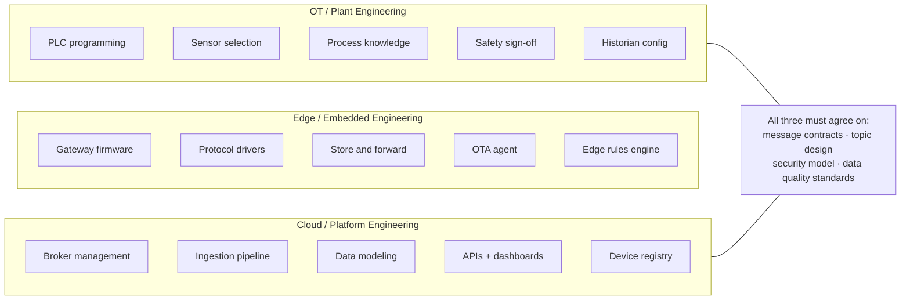

# Industrial IoT Platform Engineering

**Production-grade reference architecture for connected industrial systems**

> Platform-agnostic · Battle-tested · Production-derived · v2.0

Every pattern in this guide has been derived from real deployments across factory floors, oil & gas sites, water utilities, and logistics networks — not from vendor documentation.

---

## What's Covered

-   :material-cpu-64-bit:{ .lg .middle } **Hardware & Protocols**

    ---
    PLCs, RTUs, smart sensors, edge gateways, and the full protocol stack —
    Modbus, OPC-UA, MQTT, LoRaWAN, PROFINET, EtherCAT.

    [:octicons-arrow-right-24: Hardware & Protocols](hardware/)

-   :material-swap-horizontal:{ .lg .middle } **Data & Contracts**

    ---
    Schema versioning, D2C telemetry, C2D commands, device provisioning
    (PKI / X.509), ingestion pipelines, and TimescaleDB modeling.

    [:octicons-arrow-right-24: Data & Contracts](data/)

-   :material-cog-outline:{ .lg .middle } **Platform Engineering**

    ---
    Unified Namespace, OTA firmware, IEC 62443 security zones, observability
    with the four IoT golden signals.

    [:octicons-arrow-right-24: Platform Engineering](platform/)

-   :material-sitemap:{ .lg .middle } **Reference Architectures**

    ---
    Eight production-ready patterns: greenfield, brownfield, remote assets,
    predictive maintenance, smart building, fleet, water utility, SaaS.

    [:octicons-arrow-right-24: Reference Architectures](architectures/)

-   :material-wrench-outline:{ .lg .middle } **Operations**

    ---
    Day-2 runbooks, digital twin & ISA-95 asset hierarchy, edge ML deployment,
    and fleet management at scale.

    [:octicons-arrow-right-24: Operations](operations/)

-   :material-shield-check-outline:{ .lg .middle } **Advanced Topics**

    ---
    Multi-tenancy, disaster recovery with failback, regulatory compliance
    (IEC 62443 · FDA 21 CFR 11 · NERC CIP · ISO 27001 · SOC 2), and FinOps.

    [:octicons-arrow-right-24: Advanced Topics](advanced/)

---

## How to Use This Guide

!!! tip "Jump in anywhere"
    Each section is self-contained but builds on prior sections.

    - **Designing from scratch?** Read sequentially, starting with Hardware.
    - **Troubleshooting a specific issue?** Jump directly to the relevant section or runbook.
    - **Evaluating a decision?** Use the reference architectures and decision trees.

---

## Industries & Domains

| Industry | Primary IoT Use Cases | Scale | Dominant Protocols |
|---|---|---|---|
| **Discrete Manufacturing** | OEE monitoring, predictive maintenance, quality traceability | 100s–10,000s devices/plant | OPC-UA, EtherNet/IP, PROFINET |
| **Process / Chemicals** | Process optimisation, emissions monitoring, safety compliance | 1,000s of sensors/site | HART, FOUNDATION Fieldbus, OPC-UA |
| **Oil & Gas** | Pipeline integrity, well monitoring, tank gauging, HSE | Remote, solar-powered, low bandwidth | Modbus, DNP3, LoRaWAN, Satellite |
| **Utilities (Power/Water)** | SCADA modernisation, demand response, outage detection | Grid-scale, millions of endpoints | DNP3, IEC 60870-5, IEC 61968 |
| **Pharma / Life Sciences** | Environmental monitoring, batch traceability, cold chain | Strict compliance (21 CFR Part 11) | OPC-UA, Modbus, ISA-88 |
| **Smart Buildings / HVAC** | Energy management, occupancy, predictive maintenance | 100s–1,000s per building | BACnet, Modbus, Zigbee, KNX |
| **Logistics / Cold Chain** | Asset tracking, temperature monitoring, dock management | Mobile, GPS-dependent | BLE, LoRaWAN, LTE-M, MQTT |
| **Mining** | Equipment health, ventilation, blasting control | Harsh, underground, intermittent | Modbus, PROFIBUS, private LTE |

---

## Why Industrial IoT Is Hard

Before diving into protocols and schemas, it is worth grounding this in business reality. Industrial IoT sits at the intersection of two worlds that were never designed to work together — and the gap between them is where most projects stall.

!!! danger "The OT/IT culture gap is the #1 project killer"
    OT teams (plant engineers, process engineers) have operated independently for decades.
    They are rightly cautious about any change to systems that control physical processes.
    IT teams move fast and break things — a philosophy that will cause actual broken things
    in an industrial environment.

    Successful projects establish clear ownership boundaries early:
    **OT owns the control layer; IT/cloud owns the data layer.**
    The edge gateway is the demilitarised zone between them.

!!! warning "Legacy equipment does not disappear"
    A plant built in 1995 has PLCs from 1995. A refinery has instruments that predate
    the internet. Budget decisions rarely allow full hardware replacement. Any IoT platform
    that cannot integrate with Modbus, PROFIBUS, and HART from day one will fail to get
    traction. **The real world is brownfield, not greenfield.**

!!! note "Data quality, not data volume, is the actual problem"
    Most teams start by thinking "how do we get more data to the cloud?" The harder question
    is "how do we know the data is correct?" A temperature sensor with a failed heater tracing
    reads 18°C in a process that should be at 80°C. Without quality codes, alarm management,
    and sensor health monitoring, dashboards display wrong numbers with high confidence.

!!! info "Compliance and safety are non-negotiable constraints"
    IoT projects in regulated industries (pharma, nuclear, oil & gas) must satisfy auditors,
    not just engineers. Data integrity, audit trails, access control, and change management
    are not optional features — they are launch blockers. Build them in from the start.

!!! abstract "The total cost of operations is underestimated"
    A pilot with 50 devices looks easy. A production deployment with 5,000 devices across
    10 sites creates firmware version sprawl, certificate expiry incidents, connectivity
    monitoring, per-device configuration drift, and remote troubleshooting workflows.
    OTA, observability, and fleet management are what separates a pilot from a product.

---

## Typical Team Structure & Ownership

---

## The Full Stack

Industrial IoT systems span five distinct layers. Each has its own failure modes, latency requirements, and operational concerns. **Never conflate them** — the most common architectural mistakes come from blurring these boundaries.

### Why Layer Separation Matters in Production

In real factory deployments a critical lesson repeats itself: teams collapse the edge layer and cloud layer into a single "IoT platform" and then discover that:

- The factory loses internet for 4 hours and all sensor data disappears — because there was no store-and-forward at the edge
- A cloud rule engine fires a command to a PLC 800 ms after the sensor condition, but the PLC scan cycle is 10 ms — the response arrived 80 cycles too late
- A firmware bug in the gateway bricks 200 devices simultaneously because there was no staged rollout

**The layers are not just logical — they map to physical failure domains, ownership boundaries, and latency contracts.**

### Key Architectural Tensions

| Tension | Industrial Default | Naive Default | Why It Matters |
|---|---|---|---|
| Latency vs. throughput | Low latency at edge, batch at cloud | Everything to cloud first | Control loops cannot tolerate cloud round-trips |
| Online vs. offline | Must work fully offline | Always-connected assumption | Factory floors lose connectivity — plan for 72 h outages |
| Open vs. proprietary | Both coexist permanently | Standardise everything | Modbus from 1979 is still on your factory floor |
| Push vs. poll | Event-driven push | Polling everything | Polling at scale kills network and battery |
| Schema flexibility vs. contract | Strict contracts + versioning | Schema-on-read / loose JSON | Loose schemas cause silent data corruption at scale |
| Edge compute vs. cloud compute | Edge for latency, cloud for analytics | Cloud for everything | Edge ML inference is real — cloud round-trips for classification are not |

---

*Audience: senior engineers and architects designing, integrating, or operating industrial IoT systems at scale.*
