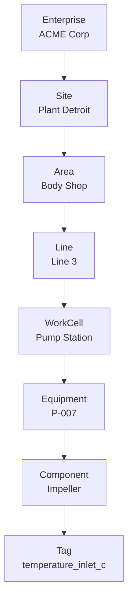
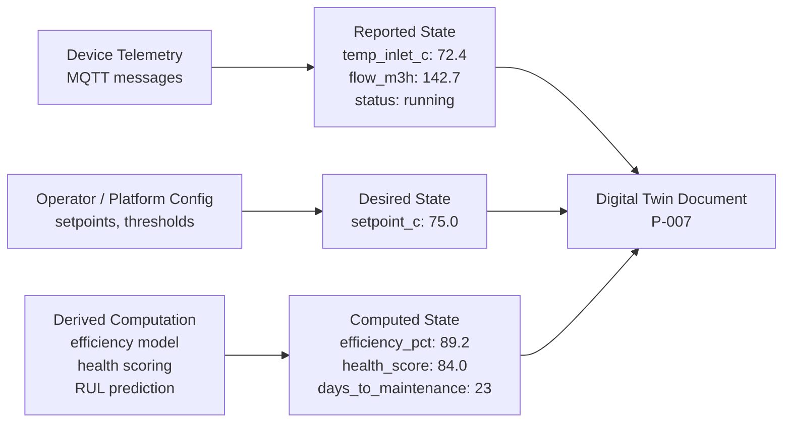

# Digital Twin & Asset Modeling

Digital twins are the semantic layer above raw telemetry — they define what a device IS (equipment class, location, relationships) not just what it measures. Without an asset model, dashboards show tag names; with one, they show "Pump P-007 on Line 3 feeding Reactor R-02." The asset model also drives maintenance scheduling, spare parts management, and fault isolation. Raw telemetry is meaningless without context: a temperature reading of 72.4°C is just a number until the asset model tells you it is the inlet temperature of a centrifugal pump running in a body shop, rated at 160 m³/h, with a health score of 84 and 23 days to its next scheduled maintenance.

### 17.1 Asset Hierarchy — ISA-95 / ISO 14224

ISA-95 (and its industrial maintenance cousin ISO 14224) define a standard equipment hierarchy that maps naturally to MQTT topic structure and database schemas. The hierarchy has six levels: Enterprise (the company), Site (a physical location), Area (a functional zone within a site), WorkCell (a production cell), WorkUnit (a specific machine or unit), and Equipment (a physical component). This structure is not academic — it is the basis for maintenance scheduling, spare parts inventory, fault isolation, and regulatory reporting in every major industrial organisation.



The MQTT topic structure mirrors this hierarchy directly: `acme/plant-detroit/body-shop/line-3/pump-station/P-007/telemetry`. This means any system consuming MQTT messages can extract the full asset context from the topic string without a database lookup — the topic is self-describing. When designing your topic structure, include at least Site, Area, and Device ID in every topic — these three levels are sufficient for routing, ACL enforcement, and dashboard filtering in most deployments.

**ISA-95 level mapping to architecture:** Enterprise-level queries aggregate across sites (total OEE for the company). Site-level queries drive site dashboards and energy reporting. Area and Line levels drive production scheduling and OEE calculation. Equipment-level queries drive maintenance scheduling and predictive models. Tag-level is the raw telemetry — it should almost never be queried directly in a dashboard without aggregation.

### 17.2 Digital Twin State Model

A digital twin is not a static metadata record. It has three dynamic state layers that must be tracked and kept in sync: Reported state (what the device is actually doing, from telemetry), Desired state (what the operator or platform wants the device to do), and Computed state (derived values calculated from telemetry — efficiency, health score, remaining useful life). The separation between Reported and Desired state is the foundation of the device shadow/twin pattern used by AWS IoT, Azure IoT Hub, and Eclipse Ditto. When they diverge, the platform must reconcile them — either by sending a command to the device or by alerting the operator.



A digital twin document for an individual asset combines all three state layers with static nameplate data:

```json
{
  "asset_id": "P-007",
  "asset_class": "centrifugal_pump",
  "location": {"site": "plant-detroit", "area": "body-shop", "line": "line-3"},
  "nameplate": {"manufacturer": "Grundfos", "model": "CM5-6", "rated_flow_m3h": 160},
  "reported": {"temp_inlet_c": 72.4, "flow_m3h": 142.7, "status": "running"},
  "desired": {"setpoint_c": 75.0},
  "computed": {"efficiency_pct": 89.2, "health_score": 84.0, "days_to_maintenance": 23}
}
```

The `reported` section is written by the ingestion pipeline every time telemetry arrives. The `desired` section is written by operators via the API. The `computed` section is written by the analytics pipeline on a scheduled or event-driven basis. All three writes must be atomic-per-section (not replacing the whole document) to avoid race conditions — use patch semantics (JSON Merge Patch or JSON Patch) rather than full document replacement.

### 17.3 Digital Twin Tool Options

| Tool | Type | Ontology Support | Real-Time Sync | Cost Model |
|---|---|---|---|---|
| **Azure Digital Twins** | Managed (Azure) | DTDL (Digital Twin Definition Language) | Event-driven via Event Grid | Per-query + per-operation |
| **AWS IoT TwinMaker** | Managed (AWS) | Custom entity-component model | Scene + time-series integration | Per-entity + data connector cost |
| **AVEVA Asset Strategy** | Managed/On-prem | ISO 14224 native, CMMS integration | Near real-time via historian | License per site |
| **Eclipse Ditto (OSS)** | Open-source | WoT (W3C Thing Description) | MQTT / WebSocket live sync | Infrastructure cost only |
| **Custom TimescaleDB + JSON** | Custom | Your schema, full control | Write on ingest | Storage + compute cost |
| **Bentley iTwin** | Managed | Infrastructure / civil focus (IFC) | BIM + sensor overlay | Per-user + data volume |

Eclipse Ditto is the recommended open-source starting point for teams that want digital twin functionality without managed cloud lock-in. It provides device shadow semantics (reported/desired/computed separation), a REST API, WebSocket push, and MQTT integration out of the box. For heavy CMMS (Computerized Maintenance Management System) integration, AVEVA Asset Strategy or a commercial CMMS with an IoT connector is more appropriate — the ISO 14224 equipment taxonomy is built in, and work order generation from health scores is a standard feature.

---
