# Edge ML & Inference

Moving ML inference to the edge eliminates cloud round-trip latency for time-critical predictions, reduces bandwidth (send anomaly alerts not raw waveforms), and enables operation during connectivity outages. The challenge is managing the model lifecycle — versioning, deployment, monitoring, and retraining — alongside firmware. Edge ML is not a single product or framework: it is an operational discipline that requires treating ML models as first-class deployable artefacts with the same rigour applied to firmware.

### 18.1 Edge ML Use Cases by Latency Requirement

Not every ML use case belongs at the edge. The primary driver for edge inference is latency — if the prediction must trigger an action faster than the cloud round-trip allows, it must run on-device. Bandwidth is a secondary driver: sending raw 20 kHz vibration waveforms to the cloud for every bearing is impractical at scale, so the edge classifies the waveform and sends only the result.

| Use Case | Latency Requirement | Inference Location | Rationale |
|---|---|---|---|
| Vibration anomaly detection | < 100 ms | Edge required | Must trigger alert before damage; waveform too large to stream |
| Visual quality inspection | < 500 ms | Edge required | Camera frame rate; reject/accept decision drives conveyor |
| Predictive maintenance score | Minutes | Cloud acceptable | Updated hourly; no real-time action required |
| Process optimisation | Hours | Cloud only | Batch optimisation; runs on historical data |
| Energy demand forecasting | Hours | Cloud only | External data needed (weather); no latency constraint |

### 18.2 Model Deployment Pipeline

The model deployment pipeline is analogous to the OTA firmware pipeline (§12) but has different artefact types and validation steps. A model file is a binary blob (ONNX, TFLite, or OpenVINO IR format) that must be versioned, signed, validated against a held-out test set before deployment, and deployed via the same OTA infrastructure used for firmware.

```mermaid
graph LR
    TRAIN["Cloud Training<br/>Jupyter / MLflow<br/>on labelled dataset"]
    EXPORT["Model Export<br/>ONNX / TFLite<br/>quantised for target HW"]
    REGISTRY["Model Registry<br/>MLflow / custom S3<br/>versioned + signed"]
    OTA_PUSH["OTA-Style Model Push<br/>same infra as firmware OTA<br/>separate campaign type"]
    RUNTIME["Edge Runtime<br/>ONNX Runtime / TFLite<br/>loads new model version"]
    INFER["Inference Result<br/>anomaly score<br/>classification label"]
    PUBLISH["MQTT Publish<br/>inference topic<br/>not raw waveform"]
    MONITOR["Cloud Monitoring<br/>drift detection<br/>accuracy tracking"]
    RETRAIN["Retrain Trigger<br/>when accuracy drops<br/>or data distribution shifts"]

    TRAIN --> EXPORT --> REGISTRY --> OTA_PUSH --> RUNTIME --> INFER --> PUBLISH --> MONITOR --> RETRAIN --> TRAIN
```



### 18.3 Runtime Choices

| Runtime | Target Hardware | Model Formats | RAM Footprint | Typical Inference Latency |
|---|---|---|---|---|
| **ONNX Runtime** | CPU / GPU, cross-platform | ONNX | 50–200 MB | 5–50 ms (CPU, mid-range IPC) |
| **TensorFlow Lite** | ARM-optimised, microcontrollers | TFLite (FlatBuffer) | 1–20 MB | 10–100 ms (Cortex-M to ARM A-series) |
| **OpenVINO** | Intel x86 / VPU (Myriad) | ONNX, PaddlePaddle, OpenVINO IR | 100–500 MB | 2–20 ms on Intel hardware |
| **NVIDIA Triton** | NVIDIA GPU (Jetson AGX / Orin) | TensorRT, ONNX, TFLite | 500 MB–2 GB | < 5 ms on Jetson Orin |
| **Edge Impulse** | Embedded MCU to Linux | EON Compiler (C++ output) | 10 KB–10 MB | 1–50 ms depending on MCU |

ONNX Runtime is the default choice for Intel/AMD x86 edge IPCs — it accepts models trained in PyTorch or TensorFlow after export, runs on Linux without GPU, and has a Python and C API. TensorFlow Lite is the default for ARM-based devices (Raspberry Pi CM4, Moxa UC-8100) where RAM is constrained. OpenVINO delivers the best performance on Intel-specific hardware including the Movidius Neural Compute Stick and Intel integrated graphics.

### 18.4 Model Versioning alongside Firmware

Model version must be tracked separately from firmware version in the device registry. A firmware update does not change the ML model, and a model update does not require a firmware update. Conflating the two creates unnecessary coupling — a model improvement is blocked waiting for a firmware release cycle, or a firmware security patch is delayed because the model team is not ready.

The device registry should track both independently:

```json
{
  "device_id": "GW-004-A7",
  "fw_version": "3.2.1",
  "model_versions": {
    "vibration_anomaly": "1.4.2",
    "quality_classifier": "2.1.0"
  },
  "hw_platform": "moxa-uc8100"
}
```

Model updates use the same OTA infrastructure as firmware (§12) but with a `campaign_type: model_update` field that routes to the model download handler rather than the firmware update handler. The model update handler: downloads the model file, validates the signature, runs a quick inference test against a stored test vector (checking the output matches the expected result), and atomically swaps the model file. The old model file is retained for one version to enable immediate rollback without a re-download.

**Key difference for rollback:** Model rollback is safe and stateless — swapping back to the previous model file has no side effects. Firmware rollback may be risky (bootloader state, partition table changes, EEPROM writes). This means model rollback can be triggered automatically by the platform on accuracy degradation, while firmware rollback requires a deliberate operator action.

---
