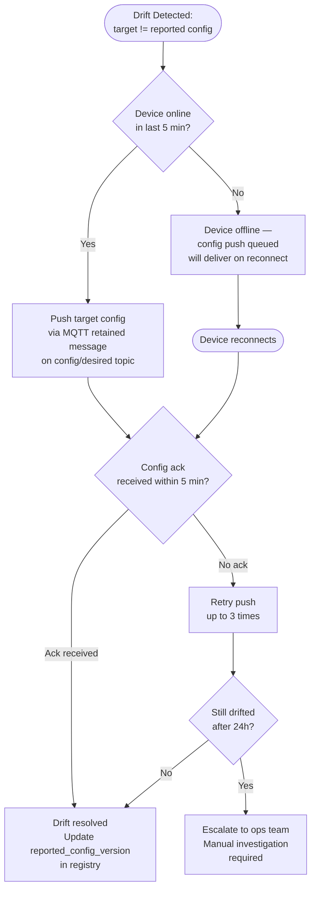
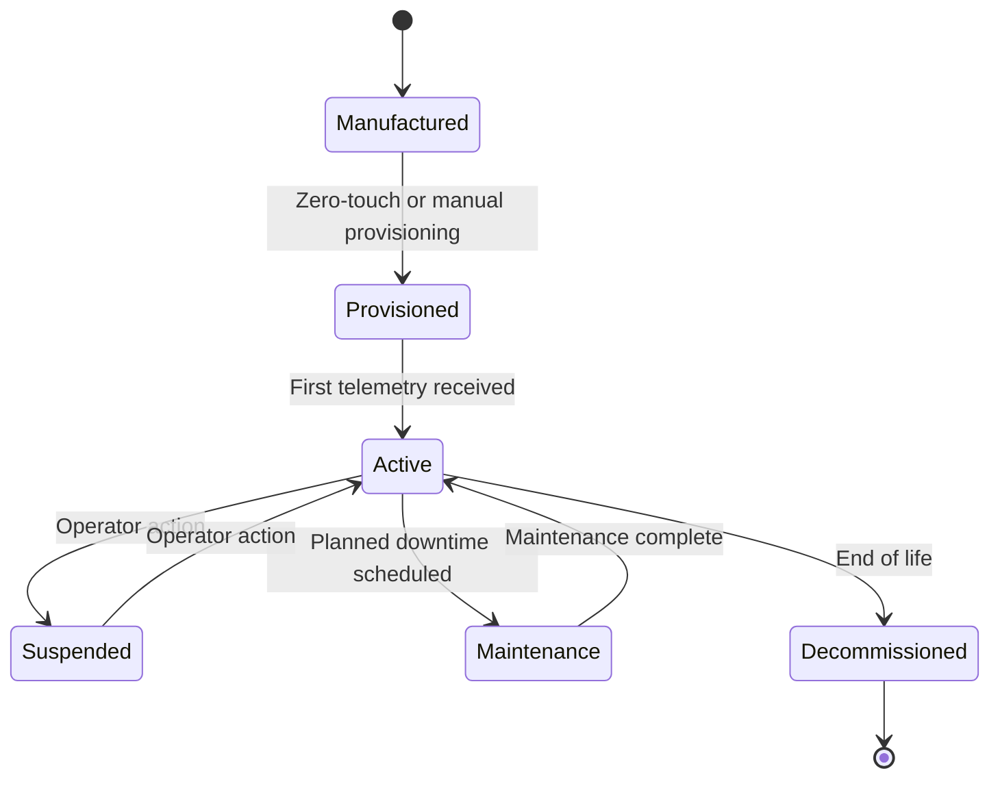

# Fleet Management at Scale

Managing 100 devices is manual. Managing 10,000 devices requires systematic fleet management — not just OTA (§12), but configuration drift detection, remote diagnostics, device lifecycle tracking, and bulk operations. Fleet management is what separates an IoT pilot from a production platform. The transition from pilot to production almost always surfaces the same problems: devices that drifted from their intended configuration, devices that have been physically moved but not updated in the registry, certificate expiry surprise incidents, and the inability to quickly determine the state of the entire fleet without querying thousands of individual devices.

### 19.1 Configuration Drift Detection

Every device has a target configuration version stored in the registry — the version of the config the platform intends the device to be running. A drift detection job compares this against the `reported_config_version` that devices publish in their status messages. Any mismatch is drift. The goal is that drift is detected and remediated automatically within hours, without human intervention.

```sql
-- Find all drifted devices (run hourly by drift detection job)
SELECT
    d.device_id,
    d.target_config_version,
    d.reported_config_version,
    d.last_seen_at,
    d.site,
    EXTRACT(EPOCH FROM (NOW() - d.last_seen_at)) / 3600 AS hours_since_seen
FROM devices d
WHERE d.target_config_version != d.reported_config_version
  AND d.status != 'decommissioned'
ORDER BY d.last_seen_at DESC;
```

When drift is detected, the remediation flow is:



### 19.2 Remote Diagnostics over MQTT

Remote diagnostics allow operators to pull logs, metrics, and test connectivity from a device without physical access. All diagnostic operations use a request-response pattern over MQTT. The platform publishes a request to a device-specific diagnostic topic; the device publishes the response to a corresponding response topic. Diagnostic payloads must be chunked for large log files — MQTT has a maximum message size of 256 MB but brokers typically enforce a much lower limit (128 KB is common).

**Diagnostic topic patterns:**
- `{device_id}/diagnostics/log-request` → platform sends request; device publishes last N lines of its application log
- `{device_id}/diagnostics/metrics` → platform requests; device responds with CPU %, RAM used/total, disk used/total, uptime seconds, active MQTT connection count
- `{device_id}/diagnostics/ping` → platform sends ping with timestamp; device echoes back to measure round-trip latency

**Request format:**
```json
{
  "request_id": "diag-20260319-001",
  "operation": "log-request",
  "params": {"lines": 200, "level": "error"},
  "requested_by": "ops-engineer-1",
  "expires_at": "2026-03-19T15:00:00Z"
}
```

**Response format (chunked for large payloads):**
```json
{
  "request_id": "diag-20260319-001",
  "chunk": 1,
  "total_chunks": 3,
  "payload": "2026-03-19T10:23:11Z ERROR MQTT reconnect failed: connection refused...",
  "device_ts": "2026-03-19T14:32:01Z"
}
```

The platform reassembles chunks in order using `chunk` and `total_chunks`. Set a 30-second timeout per chunk — if a chunk does not arrive, the device may have disconnected mid-response. Log the incomplete response for investigation.

### 19.3 Device Lifecycle States

Every device progresses through a defined lifecycle from manufacture to decommission. Encoding these states in the registry and defining the transitions explicitly is critical for operational clarity — it determines what actions are valid at each stage, when billing starts and stops, and what data retention policy applies.



**Transition actions:**
- **Manufactured → Provisioned:** Certificate issued (manufacturing cert → operational cert), device registered in registry, initial configuration pushed, device added to monitoring scope.
- **Provisioned → Active:** Billing start recorded, device appears in fleet dashboard, default alert rules enabled.
- **Active → Maintenance:** Alerts suppressed for the device during the maintenance window, data continues to be collected and stored, maintenance record created in CMMS.
- **Active → Suspended:** Billing stopped, data collection continues (device may still transmit), alerts suppressed, device flagged in dashboard.
- **Active → Decommissioned:** Billing stopped, operational certificate revoked, data retention policy changed to long-term archive, device removed from monitoring scope. Raw telemetry retained per regulatory requirement (often 7 years for regulated industries).

### 19.4 Bulk Operations

| Operation | Implementation Approach | Considerations |
|---|---|---|
| Config push to device group | MQTT retained message per device on `config/desired` topic; track acks in registry | Use group queries to identify target devices; monitor ack rate |
| Firmware campaign | §12 OTA process with group targeting | Stagger deployments; use canary group first |
| Tag renaming (metadata) | Registry update only; no device impact | Update all dashboards and alerts that reference old tag names |
| Site-wide restart (maintenance) | Staggered MQTT restart commands; 30 s delay between devices | Prevents all devices reconnecting simultaneously (broker overload); sequence by device group |
| Certificate rotation (fleet-wide) | Rolling renewal over 30 days; start with oldest-expiry devices | Never rotate entire fleet simultaneously; broker cannot handle mass reconnect |
| Decommission batch | Registry state transition + certificate revocation | Verify data export complete before decommission; check for active alert rules referencing device |

---
