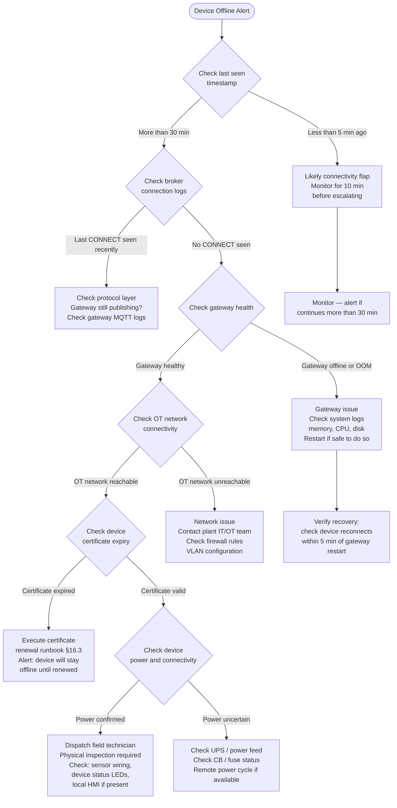
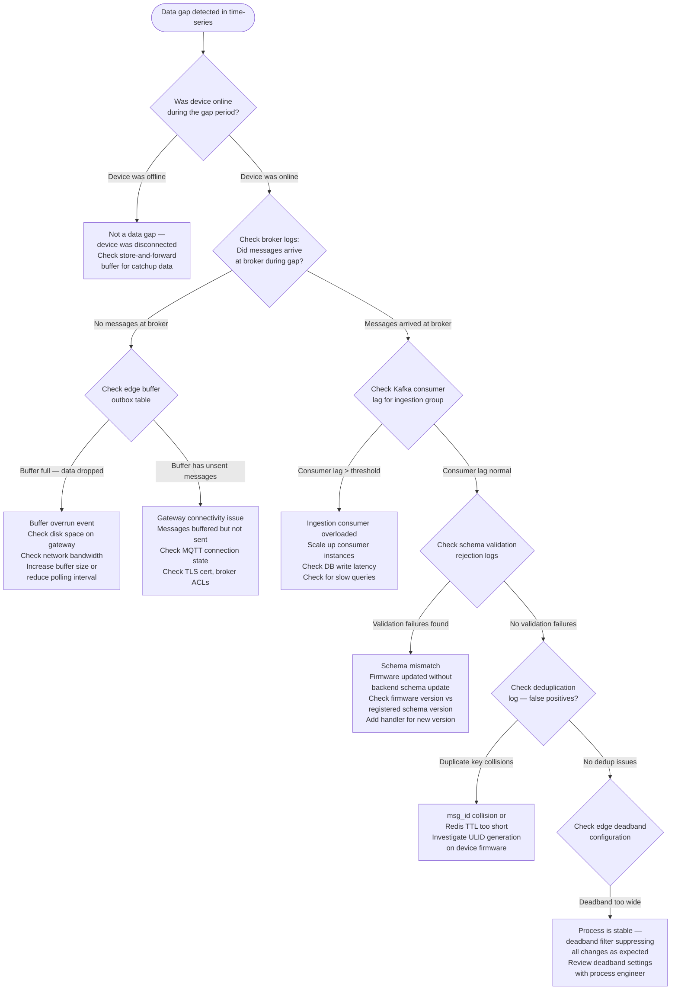

# Operational Runbooks

Runbooks are as much a part of a reference architecture as diagrams and code. Design knowledge tells engineers how to build the system; operational knowledge tells them how to keep it running. The patterns in this section capture the most common failure scenarios in production IoT fleets and the diagnosis paths for each. Including them in the architecture document ensures they are written by the people who designed the system (when the failure modes are still fresh) rather than discovered under pressure during an incident.

### 16.1 Device Goes Offline — Diagnosis Flow

A device that stops publishing data is the most common operational event in an IoT fleet. The cause is almost never what you first suspect. Work through the flowchart below in order — skipping steps leads to wasted time and incorrect diagnosis. The most common root causes in production, in order of frequency: network change at the plant (firewall rule, VLAN reconfiguration), certificate expiry, gateway crash or OOM, PLC communication fault, and actual device power loss.

### 16.2 Data Gap Investigation

A data gap is a period where a device was online (last seen timestamps show connectivity) but no telemetry rows exist in the time-series database. This is more subtle than a device going offline — the device and broker appear healthy, but data is silently lost somewhere in the pipeline. The most common causes: ingestion consumer lag (Kafka consumer group fell behind), schema validation rejection (firmware updated without schema update on backend), deduplication false positive, or edge deadband misconfiguration causing no data to be forwarded.

### 16.3 Certificate Expiry Response

Certificate expiry is a predictable, scheduled event that should never cause an unplanned outage. If it does, the monitoring and auto-renewal system has failed. The steps below cover both the automated renewal path (which should handle 99% of cases) and the manual recovery path for devices that were offline during their renewal window.

**Step 1 — Detection (automated, 90 days before expiry)**
The daily certificate monitoring job flags all devices with `cert_expiry < NOW() + 90 days`. Infra team receives a digest notification. No action required at 90 days — this is an awareness alert.

**Step 2 — Automated renewal initiation (60 days before expiry)**
The provisioning service issues a new certificate and publishes it to the device via the secure config channel (`{device}/config/desired`). The device downloads the new certificate, tests it against the test endpoint, and reports success via `{device}/config/reported`. On success, the device switches to the new certificate. The old certificate remains valid for a 7-day overlap period.

**Step 3 — Manual follow-up for offline devices (30 days before expiry)**
For devices that did not acknowledge the renewal (offline at Step 2): send a high-priority alert to the ops team with the list of affected device IDs and their expiry dates. Schedule a maintenance window or dispatch a technician if the device is expected to remain offline past the expiry date.

**Step 4 — Emergency recovery (certificate already expired)**
1. Check whether the device can still reach the provisioning service (provisioning service accepts the manufacturing cert, not just the operational cert).
2. If yes: trigger a re-provisioning flow — device connects to provisioning endpoint and receives a fresh operational certificate.
3. If the device cannot connect at all: physical access is required. Technician connects via local console or USB, loads a pre-generated emergency certificate, and confirms reconnection.
4. After recovery: conduct a post-mortem on why auto-renewal failed. Update monitoring to alert earlier.

**Prevention checklist:**
- [ ] Certificate monitoring job runs daily and pages on `< 30 days` remaining
- [ ] Auto-renewal configured for all device types that support it
- [ ] Offline device renewal backlog reviewed weekly
- [ ] Provisioning service accessible from manufacturing cert even after operational cert expiry
- [ ] Emergency certificate pre-generated and accessible to field technicians

---
