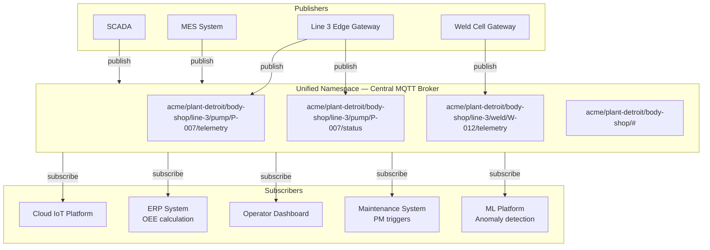
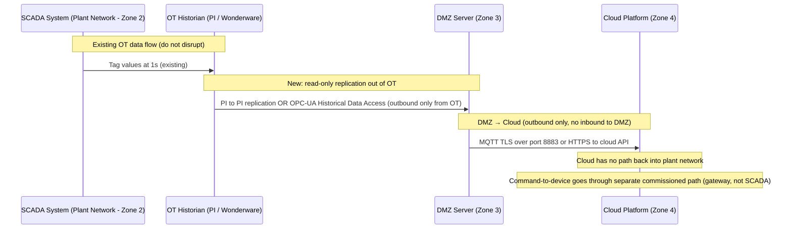

# Integration Patterns

### 11.1 Unified Namespace (UNS) — The ISA-95 Pattern in Practice



**Why UNS beats point-to-point integration:**
```
Before UNS (typical enterprise):
  SCADA → (custom adapter) → Historian
  SCADA → (OPC-DA bridge) → MES
  SCADA → (FTP export) → ERP
  Gateway → (REST API) → Cloud
  Gateway → (ODBC) → Local SQL
  = 5 integrations, each with its own failure modes, auth, versioning

  Adding a new consumer (ML platform): build a 6th integration
  SCADA change: update all 5 integrations

After UNS:
  SCADA → MQTT → UNS (one integration)
  All consumers subscribe independently
  Adding ML platform: subscribe to UNS, no producer changes
  SCADA change: update SCADA → UNS adapter (one point)
```

### 11.2 OT/IT Data Bridge — What Actually Works in Production

The OT/IT boundary is where most industrial IoT projects fail politically even when they succeed technically. OT teams have legitimate concerns about any new system that touches their network — a misconfigured gateway can disrupt SCADA communications, which can halt production. The pattern below is the one that consistently gets OT sign-off: read-only access through the existing historian, outbound-only data flow, no direct connections from IT systems into the OT network. The key principle is that the IT/cloud layer receives a copy of the data, never the original, and has no path back into the control network.



**Data diode pattern for air-gapped OT:**
```
Hardware data diode (e.g., Waterfall Security, Owl Cyber Defense):
  - Physical one-way fiber — electrically impossible to send back
  - OT side: UDP transmitter
  - IT side: UDP receiver (no TCP — no SYN/ACK possible)
  - Protocol: custom UDP-based streaming, no acknowledgement
  - Use for: nuclear, defence, utilities where regulations require air-gap

Software data diode (for less strict requirements):
  - Firewall rules: OT → DMZ allowed, DMZ → OT blocked
  - DMZ server has no route to OT network
  - But: software can be misconfigured; not a true air-gap
```

---
