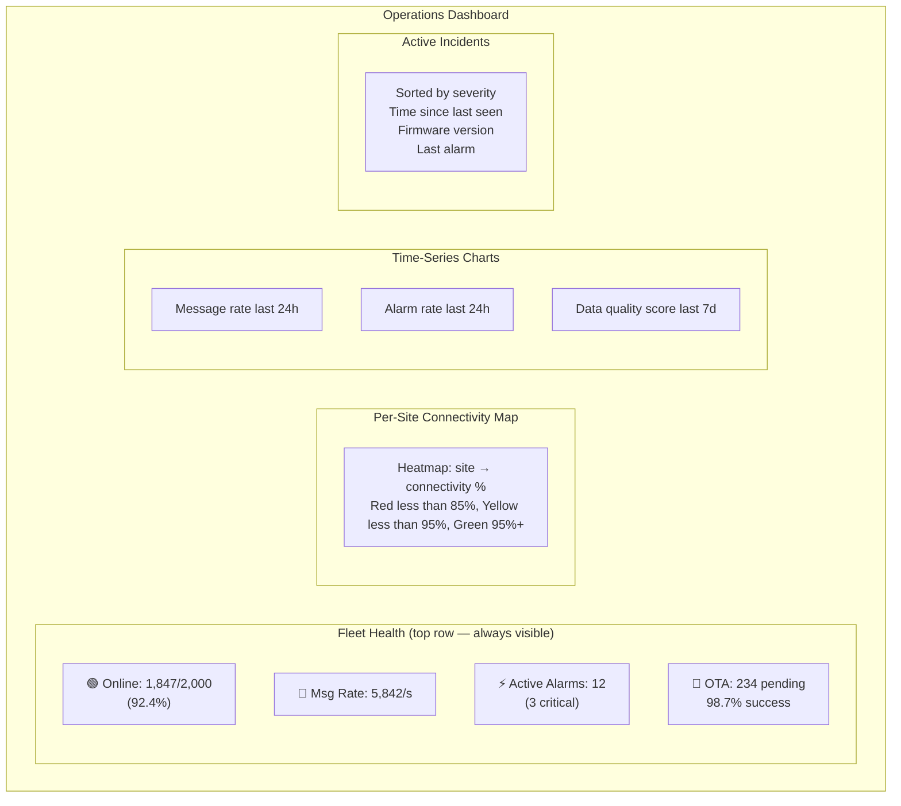

# Observability & Operations

### 14.1 The Four Signals for IoT

Adapt Google SRE's four golden signals to IoT. The SRE framework (latency, traffic, errors, saturation) does not map cleanly to IoT operations — you cannot measure latency for a device that is offline, and traffic rate is less important than data freshness. The adapted signals below reflect what actually predicts an IoT operational incident. Connectivity rate dropping is often the first signal of a broker or network problem. Data freshness degrading — devices still connected but not sending — often indicates a deadlocking bug in firmware or an edge rules engine overload. Track all four on the same operations dashboard so you can correlate them.

```
1. CONNECTIVITY (replaces latency for IoT)
   - fleet_connectivity_rate = online_devices / total_devices
   - per_device_last_seen_gap
   - reconnect_rate (high reconnect = network instability)

2. THROUGHPUT (replaces traffic)
   - messages_per_second ingested
   - bytes_per_second
   - message_drop_rate (broker or consumer)

3. ERRORS
   - schema_validation_failures_rate
   - bad_quality_reading_pct
   - command_failure_rate
   - OTA_rollback_rate

4. DATA FRESHNESS (replaces saturation for IoT)
   - per_device: age of last reading vs. expected interval
   - fleet: % of devices with data fresher than 2× their interval
   - stale_device_count (readings > 5× expected interval old)
```

### 14.2 Operational Dashboard — What to Show

An operations dashboard that requires an operator to click through to find problems has already failed. The layout below puts fleet health status at the top row — always visible, no scrolling — with connectivity rate, message throughput, active alarm count, and OTA campaign status as persistent KPIs. The hierarchy below that (site map, then time-series, then active incidents) is ordered by scope: site-level problems first, then trends, then specific device issues. Build this before you build device-level dashboards — the fleet view is what on-call engineers use at 3am, and it should require no more than three seconds to determine whether a fleet-wide incident is happening.



### 14.3 Alerting Rules — Production-Proven Thresholds

The thresholds below are not arbitrary — they have been calibrated against real fleets where lower thresholds caused alert fatigue and higher thresholds let real incidents go undetected. The tiering (immediate page vs. team notification vs. daily digest) is as important as the thresholds: an on-call engineer who receives 50 pages per night will start ignoring them, which means the critical alarm that matters gets the same treatment as the noisy low-severity one. Review and adjust these thresholds after your first 90 days in production — every fleet has different baseline connectivity rates and alarm patterns.

```yaml
# AlertManager / PagerDuty rules

alerts:

  # Immediate page
  - name: fleet_connectivity_critical
    condition: fleet_connectivity_rate < 0.85
    duration: 5m
    severity: critical
    page: true
    message: "Fleet connectivity dropped to {value}%. Check broker and network."

  - name: broker_down
    condition: broker_connections_active == 0
    duration: 1m
    severity: critical
    page: true

  - name: ingestion_lag_critical
    condition: kafka_consumer_lag > 100000
    duration: 3m
    severity: critical
    page: true

  # Team notification (business hours OK)
  - name: device_offline_extended
    condition: device_last_seen > 30m AND device.criticality == 'high'
    severity: high
    notify: ops_team_channel

  - name: cert_expiry_warning
    condition: device.cert_expiry_days < 30
    severity: medium
    notify: infra_team

  - name: ota_rollback_rate_elevated
    condition: ota_rollback_rate_1h > 0.05  # > 5% rollback
    severity: high
    notify: firmware_team
    message: "OTA rollback rate elevated: {value}. Pause campaign."

  # Daily digest
  - name: firmware_version_drift
    condition: devices_not_on_target_fw / total_devices > 0.1
    severity: low
    notify: daily_digest
```

---
