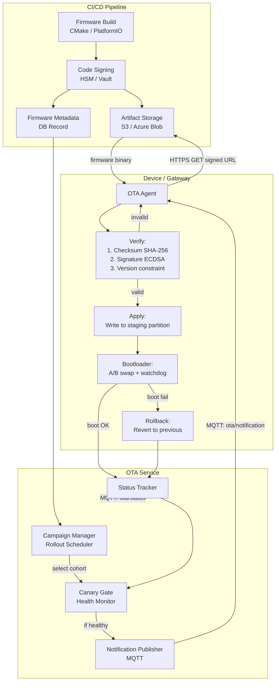
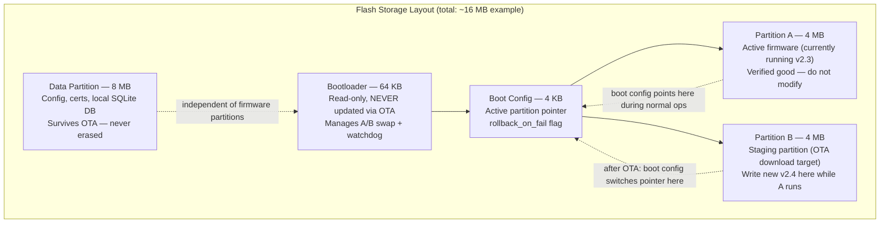
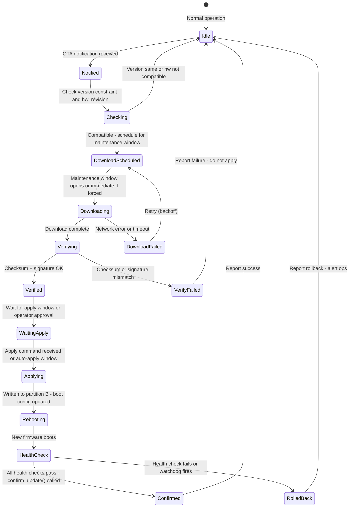

# OTA Firmware Updates: End-to-End

This is where industrial IoT deployments go wrong most often. A poorly designed OTA system can brick thousands of devices simultaneously. Every element below has been learned from real incidents.

### 12.1 OTA System Architecture



### 12.2 Firmware Signing — Non-Negotiable in Industrial IoT

Firmware signing is the security control that makes OTA safe to operate at fleet scale. Without it, a compromised OTA service or a MITM attack can push arbitrary code to every device on your platform simultaneously — a single point of failure with catastrophic physical consequences for an industrial deployment. ECDSA P-256 is the recommended algorithm for constrained devices: it provides strong security with much faster verification than RSA (critical on MCUs without hardware crypto acceleration). The signing key must live in an HSM, never on a CI/CD server. Treat the signing key compromise as a Tier 1 security incident requiring full fleet re-provisioning.

```
Threat: attacker pushes malicious firmware to 10,000 devices.
Without signing: impossible to detect until after deployment.
With signing: firmware rejected at device before any execution.

Signing process (use ECDSA P-256 — faster verification than RSA on constrained devices):

1. Build produces: firmware.bin (raw binary)

2. Sign:
   # Using OpenSSL
   openssl dgst -sha256 -sign firmware_signing.key \
     -out firmware.sig firmware.bin

   # Verify locally before publishing
   openssl dgst -sha256 -verify firmware_signing.pub \
     -signature firmware.sig firmware.bin

3. Package (OTA manifest):
{
  "firmware_id": "fw-pump-monitor-2.4.0",
  "version": "2.4.0",
  "device_type": "pump_monitor_v2",
  "min_hw_revision": "Rev-B",
  "binary_url": "https://ota.acme.com/fw/pump-monitor-2.4.0.bin",
  "binary_size_bytes": 524288,
  "checksum_sha256": "a3b4c5d6...",
  "signature_ecdsa": "3046022100...",
  "signing_cert_id": "fw-signing-cert-2026-01",
  "release_notes_url": "https://...",
  "rollback_version": "2.3.1",
  "published_at": "2026-03-19T10:00:00Z"
}

4. Device verification (C pseudocode):
   uint8_t fw_signing_pubkey[] = { /* baked into firmware */ };

   bool verify_firmware(uint8_t* fw_data, size_t fw_size,
                        uint8_t* signature, size_t sig_size) {
       // Step 1: checksum
       uint8_t actual_hash[32];
       sha256(fw_data, fw_size, actual_hash);
       if (memcmp(actual_hash, expected_hash, 32) != 0) {
           LOG_ERROR("Firmware checksum mismatch");
           return false;
       }
       // Step 2: signature
       if (!ecdsa_verify(fw_signing_pubkey, actual_hash, signature, sig_size)) {
           LOG_ERROR("Firmware signature invalid");
           return false;
       }
       return true;
   }
```

### 12.3 A/B Partition — The Only Safe OTA for Industrial

A/B partition (dual-bank) firmware is the only OTA approach that is safe for unattended industrial devices. Without it, a power failure during a firmware write produces a device with corrupted firmware and no recovery path — the only fix is a field visit. With A/B partitioning, the active firmware continues running on partition A while the new firmware downloads to partition B. The boot only switches after a successful download and verification. If the new firmware fails to boot healthy, the bootloader automatically reverts to the known-good partition. This makes OTA failures self-healing at the device level, which is what enables fleet-scale rollouts without field technician standby.

Flash layout (embedded Linux / RTOS):



Update sequence:
  1. Download v2.4 to Partition B (Partition A still running)
  2. Verify checksum + signature of Partition B
  3. Set boot config: next_boot = B, rollback_on_fail = true
  4. Set watchdog timer: 120s (if new fw doesn't check in, watchdog reboots)
  5. Reboot
  6. Bootloader reads boot config → boots Partition B (v2.4)
  7. New firmware starts, runs health checks
  8. If healthy: call confirm_update() → set boot config: active = B, permanent
  9. If unhealthy: watchdog fires OR firmware calls rollback()
     → bootloader boots Partition A (v2.3)
     → device publishes: ota/status {status: rolled_back, reason: "health check failed"}

What "healthy" means — device must validate:
  - Connects to MQTT broker within 30s
  - All required drivers initialize
  - Configuration loaded successfully
  - First telemetry message published
  - No hard faults in first 60s
```

### 12.4 OTA State Machine — Full Device Lifecycle



### 12.5 Rollout Campaigns — Safe Deployment at Fleet Scale

At fleet scale, a firmware update is a distributed systems operation, not a simple file push. The phased rollout approach below is designed to catch firmware regressions before they reach the full fleet, with each phase acting as a gate that must pass before the next opens. The critical operational discipline is automatic rollback: the campaign manager must monitor health signals and pause the campaign automatically, not wait for a human to notice a problem. By the time an on-call engineer manually notices an elevated rollback rate at 3am, hundreds more devices may have already been enrolled.

```
Rollout phases for a 5,000-device fleet:

Phase 0 — Lab / Staging (before any production device):
  Target:    Test bench devices (not production)
  Duration:  24h burn-in
  Criteria:  Zero crashes, all telemetry nominal, command round-trip < 500ms

Phase 1 — Canary (1%, ~50 devices):
  Target:    Non-critical devices with human oversight
  Duration:  48h
  Auto-rollback triggers:
    - OTA success rate < 95%
    - Post-update crash rate > 2%
    - Telemetry gap rate > 5%
    - Any device permanently bricked (requires manual recovery)
  Proceed criteria: all triggers green for 48h

Phase 2 — Early adopters (10%, ~500 devices):
  Target:    Mix of criticality levels
  Duration:  72h
  Monitor: same triggers, expand crash monitoring to memory/CPU trends

Phase 3 — General rollout (50% → 100%):
  Batch size: 500 devices/hour (don't blast all at once)
  Stagger: different sites in different hours (follow sun)
  Skip: devices actively executing critical processes (interlock)

  Scheduling logic:
    - Check device.is_in_active_process() before scheduling OTA
    - Prefer: weekends, nights, planned maintenance windows
    - Maintenance window config per device/site:
      "ota_window": "Sun 02:00-06:00 UTC"

Post-rollout:
  - 7-day observation window before closing campaign
  - Compare: MTBF before vs. after update
  - Energy consumption delta (firmware bugs can cause CPU spin)
  - Telemetry quality score before vs. after
```

### 12.6 Delta OTA — When Bandwidth Is Constrained

For LoRaWAN, satellite, or metered cellular devices, full firmware downloads may be physically impossible or economically prohibitive. Delta OTA (binary patching) transmits only the differences between firmware versions, typically achieving 85–95% size reduction for incremental updates. This comes with significant operational complexity: you must maintain a delta catalog for every supported upgrade path, and the device must have sufficient RAM to hold three firmware copies simultaneously during reconstruction. Add this complexity only when bandwidth genuinely constrains your deployment — on Wi-Fi or wired Ethernet, full image OTA is simpler and more reliable.

For LoRaWAN, satellite, or metered cellular devices:

```
Binary delta generation (bsdiff / xdelta3):

  xdelta3 -e -s old_firmware.bin new_firmware.bin delta.patch
  # old: 512KB, new: 524KB, delta: typically 20-80KB (90% reduction)

  Device reconstruction:
    xdelta3 -d -s current_firmware.bin delta.patch new_firmware.bin
    # Verify new_firmware.bin checksum before applying

  Constraints:
    - Device must have enough RAM/storage for 3 copies during reconstruction
    - Delta is FROM-version specific — need delta for every upgrade path
    - Keep delta catalog: v2.1→v2.2, v2.2→v2.3, v2.1→v2.3, etc.
    - Maintain for N-2 versions minimum

  When to use delta vs. full:
    Full bandwidth headroom > 10x firmware size: use full (simpler)
    LoRaWAN (< 250 bytes/message): delta mandatory + chunking
    LTE-M on data plan: delta if firmware > 100KB
    Wi-Fi / Ethernet: full image almost always
```

### 12.7 OTA Failure Recovery Playbook

Every OTA failure mode in the playbook below has been observed in production fleets. The most important operational discipline is treating any automatic rollback as a production incident requiring immediate investigation — not as a successful safety mechanism to be acknowledged and forgotten. A rollback means real firmware that passed your CI/CD pipeline and canary phase failed in the field, which means your canary criteria missed something. Understanding why is more important than the rollback itself. The Scenario 4 case (bricked device) should be treated as a bootloader bug — a/b partition design makes bricking via OTA theoretically impossible, so any brick indicates a gap in your invariants.

```
Scenario 1: Device fails to download (network timeout)
  Automatic: retry with exponential backoff (max 6h between attempts)
  After 3 failed attempts: alert operations team
  Manual: operator can force-retry or defer campaign

Scenario 2: Verification failure (checksum mismatch)
  Automatic: delete partial download, alert immediately
  Cause: corrupted download (most common), or wrong firmware served
  Manual: check artifact storage checksum, re-serve

Scenario 3: New firmware boot fails (watchdog fires, rollback)
  Automatic: device rolls back to last good firmware, reports status
  Alert: immediate — paged to on-call (any rollback is a production incident)
  Root cause: new firmware incompatible with device state/config
  Manual: investigate logs, fix firmware, re-test on canary before re-campaign

Scenario 4: Device bricked (doesn't boot after OTA, no rollback)
  Cause: bootloader corruption (should be impossible with A/B, means bootloader bug)
        or hardware failure triggered during reboot
  Manual: field technician physical recovery or RMA
  Prevention: never OTA the bootloader via the same OTA channel as application

Scenario 5: Mass rollback (>5% of campaign devices rolled back)
  Automatic: campaign paused, no further devices enrolled
  Alert: escalate to engineering lead, not just ops
  Manual: investigate with devices in Phase 1/2 before proceeding
```

---
