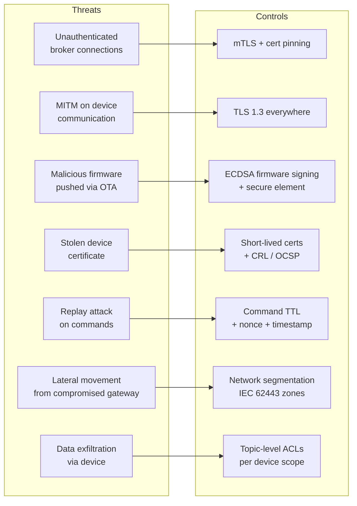
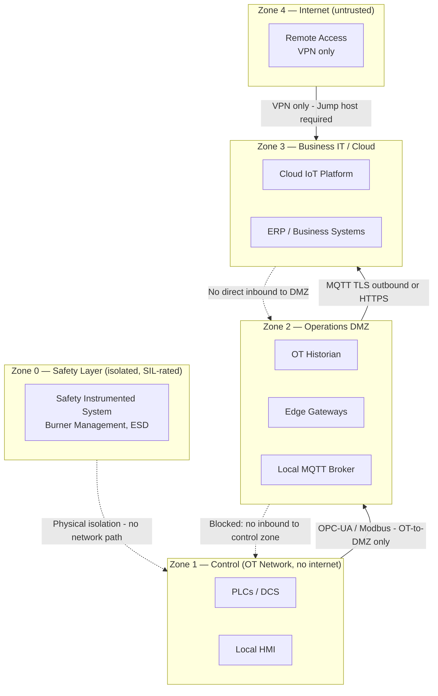

# Security Architecture

### 13.1 Threat Model



### 13.2 Network Zone Architecture (IEC 62443)

IEC 62443 defines the zone-and-conduit model that is the basis for industrial cybersecurity architecture. The key principle is that every zone boundary is a trust boundary: traffic crossing a zone boundary must be explicitly authorized, and the direction of trust matters — higher-trust zones (cloud) must never be able to initiate connections into lower-trust zones (OT). The diagram below shows the standard four-zone model; pay attention to Zone 0 (safety systems), which must be physically isolated — no network path exists to or from it, by design. Any architecture that touches Zone 0 from a network connection is non-compliant with IEC 61511 safety requirements.



### 13.3 Certificate Lifecycle Management

Certificate expiry is the most common operational security incident in IoT fleets — more common than actual attacks. A device with an expired certificate cannot authenticate to the broker, which means it silently stops sending data. At fleet scale with certificates expiring on different schedules, this creates a rolling pattern of unexplained device offline events that consumes significant operations time. The workflow below implements a 90-day advance warning with automated renewal, which means no device should ever expire as a surprise. The overlap period (old and new certs both valid) is essential: it allows rollback if the new cert has a problem, and accommodates devices that are offline during the renewal window.

```
Certificate states and operations:

  ISSUED → ACTIVE → EXPIRING (30 days) → EXPIRED → REVOKED
                                ↓
                          AUTO-RENEW
                          (if device online)

Rotation workflow:
  1. Monitor cert expiry: daily job checks all devices
     SELECT device_id, cert_expiry, (cert_expiry - NOW()) as days_left
     FROM devices
     WHERE cert_expiry < NOW() + INTERVAL '90 days'
     ORDER BY cert_expiry ASC;

  2. 90 days before expiry: issue new cert, push via secure channel
  3. Device stores new cert alongside old cert
  4. Device tests new cert (connects to test endpoint)
  5. On success: device switches to new cert, reports cert_id
  6. Old cert revoked after 7-day overlap

  Revocation for compromised cert:
    CRL: update CRL, distribute to all brokers (max 24h propagation)
    OCSP: real-time revocation check (preferred, adds latency)

    Industrial reality: many devices cannot do OCSP (no internet, constrained MCU)
    Solution: CRL distribution to edge gateway (gateway validates on behalf of device)
```

---
